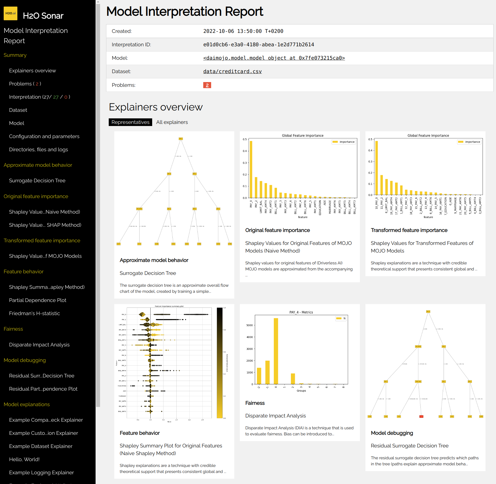
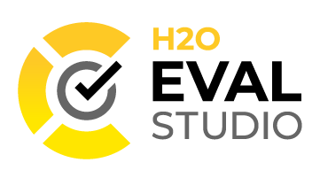
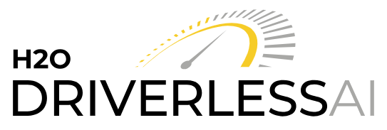
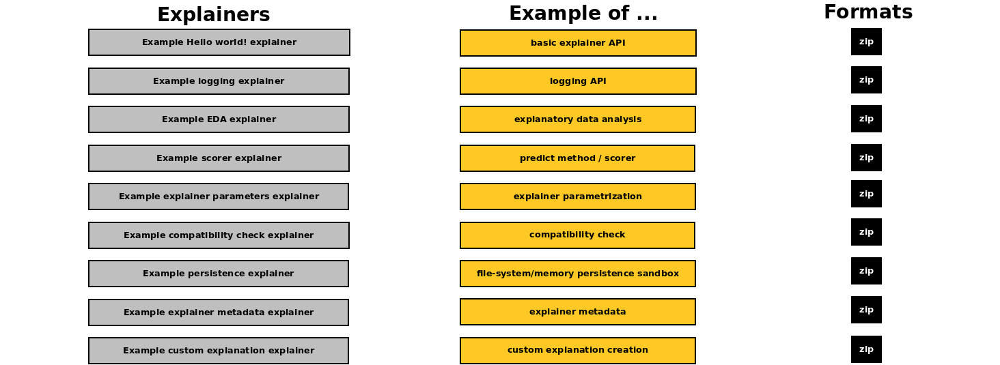
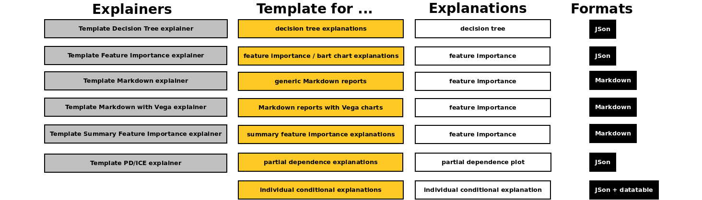
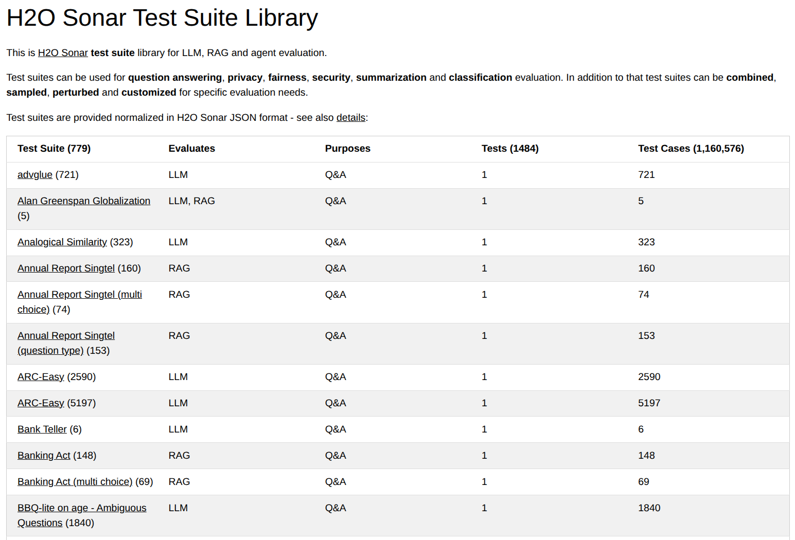
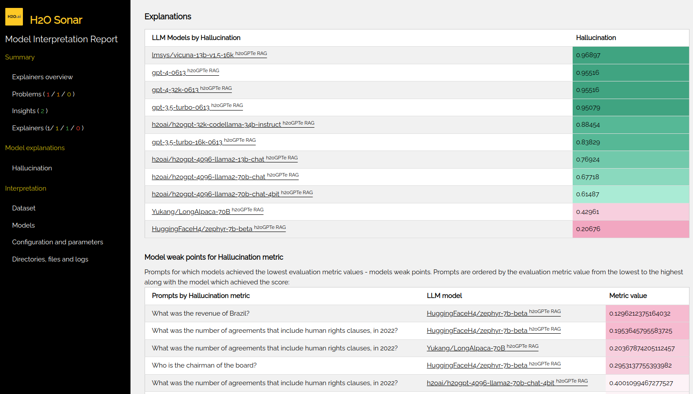
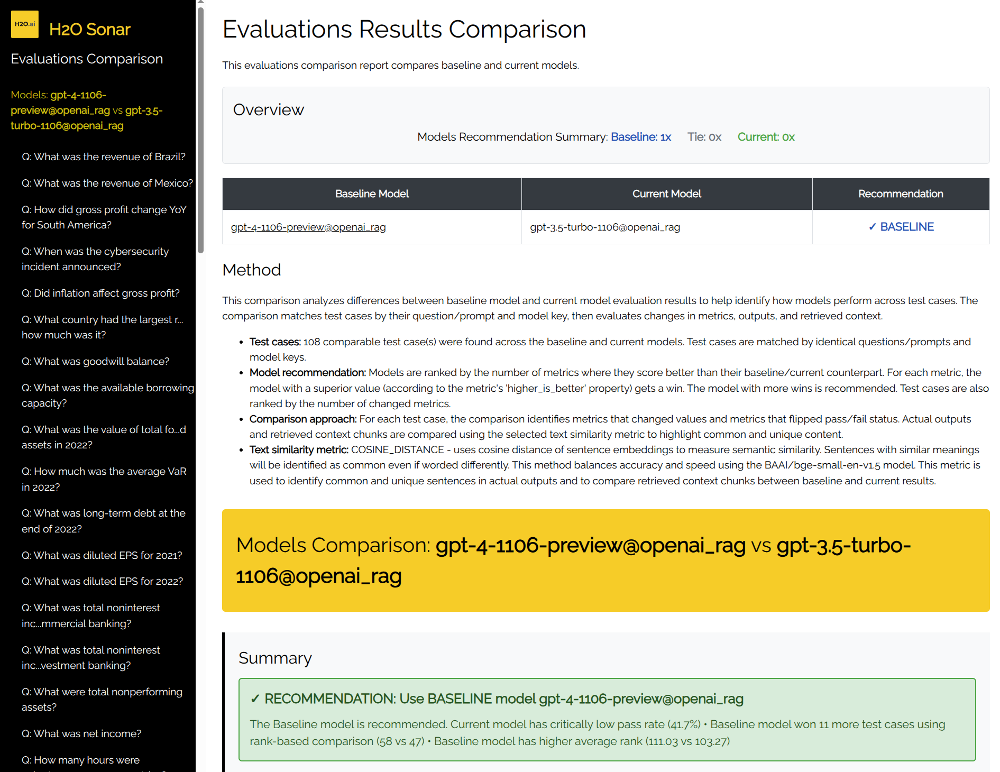

# H2O Sonar

<p align="center">
<b>Explainability Toolbox for Predictive and Generative AI</b><br/><br/>
<b><a href="#explainers">18</a></b> predictive AI <b>explainers</b>.<br/>
<b><a href="#evaluators">44</a></b> generative AI <b>evaluators</b>.<br/>
<b><a href="#evals-library">1,000,000+</a></b> curated eval <b>prompts</b>.<br/>
Automatic <b><a href="#auto-best-model-selection">best model</a></b> selection.<br/>
Used by <a href="https://h2o.ai/platform/enterprise-h2ogpte/eval-studio/">H2O Eval Studio</a> and <a href="https://h2o.ai/h2o-driverless-ai">H2O Driverless AI</a>.<br/>
<br/>
</p>



<!--
[](https://github.com/h2oai/h2o-sonar/actions/workflows/build.yaml)
-->
<!-- [](https://github.com/h2oai/h2o-sonar/issues) -->
<a href="https://h2oai.github.io/h2o-sonar/" target="_blank"></img></a>
[](https://github.com/h2oai/h2o-sonar/releases)
[](https://github.com/h2oai/h2o-sonar/blob/master/LICENSE)

**H2O Sonar** is a Python library for AI model risk management (MRM) across predictive and generative systems. It provides explainers and evaluators that validate models, detect bias, assess fairness and privacy, and generate audit documentation. Built for regulated industries, H2O Sonar enables risk, compliance, and validation teams to quantify model risk, meet regulatory requirements, and maintain robust governance throughout the models lifecycle.

* [Predictive AI](#predictive-ai)
    * [Explainers](#explainers)
    * [Getting Started with Predictive Models](#getting-started-with-predictive-models)
    * [Bring Your Own Explainer](#bring-your-own-explainer)
* [Generative AI](#generative-ai)
    * [Evaluators](#evaluators)
    * [Host Types](#host-types)
    * [Evals Library](#evals-library)
    * [Auto Best Model Selection](#auto-best-model-selection)
    * [Getting Started with Generative Models](#getting-started-with-generative-models)
    * [Bring Your Own Evaluator](#bring-your-own-evaluator)
* [Installation](#installation)
* [Documentation](#documentation)
* [Feature Requests and Bugs](#feature-requests-and-bugs)
* [Contribute](#contribute)
* [Credits](#credits)

H2O Sonar is **used by** the following [H2O.ai](https://h2o.ai/) products:

* [H2O Eval Studio](https://h2o.ai/platform/enterprise-h2ogpte/eval-studio)
* [H2O Driverless AI](https://h2o.ai/h2o-driverless-ai)

<table><tr><td width="50%">

<a href="https://h2o.ai/platform/enterprise-h2ogpte/eval-studio"></a>

</td><td width="50%">

<a href="https://h2o.ai/h2o-driverless-ai"></a>

</td></tr></table>


# Predictive AI

[H2O Driverless AI](https://docs.h2o.ai/driverless-ai/1-10-lts/docs/userguide/scoring-mojo-pipelines.html),
[H2O-3](https://docs.h2o.ai/h2o/latest-stable/h2o-docs/index.html) and [scikit-learn](https://scikit-learn.org/stable/)
**predictive** models can be explained by the H2O Sonar.

H2O Sonar explanation report **examples**:

* [Explainers overview](https://eval-studio-artifacts.s3.us-east-1.amazonaws.com/reports/report-examples/explainers-overview-20260130/interpretation/interpretation.html) (HTML)
* [Credit card use case](data/generative/corpus/talk2report-deepeval-20231103.pdf) (PDF)

**Examples**:

* [Hello predictive World!](examples/predictive-cli-hello-world-example)
* [Jupyter Notebooks](examples/predictive)


## Explainers

Approximate model behavior:

- **[Surrogate Decision Tree](h2o_sonar/explainers/dt_surrogate_explainer.py)**
- **[Residual Surrogate Decision Tree](h2o_sonar/explainers/residual_dt_surrogate_explainer.py)**

Feature importance:

- **[Shapley Values for Original Features (Kernel SHAP Method)](h2o_sonar/explainers/fi_kernel_shap_explainer.py)**
- **[Shapley Values for Transformed Features of MOJO Models](h2o_sonar/explainers/transformed_fi_shapley_explainer.py)**
- **[Morris Sensitivity Analysis](h2o_sonar/explainers/morris_sa_explainer.py)**

Feature behavior:

- **[Partial Dependence/Individual Conditional Expectations (PD/ICE)](h2o_sonar/explainers/pd_ice_explainer.py)**
- **[Partial Dependence for 2 Features](h2o_sonar/explainers/pd_2_features_explainer.py)**
- **[Friedman's H-statistic](h2o_sonar/explainers/friedman_h_statistic_explainer.py)**
- **[Summary SHAP](h2o_sonar/explainers/summary_shap_explainer.py)**

Fairness:

- **[Disparate Impact Analysis (DIA)](h2o_sonar/explainers/dia_explainer.py)**

Model debugging:

- **[Residual Partial Dependence/Individual Conditional Expectations (PD/ICE)](h2o_sonar/explainers/residual_pd_ice_explainer.py)**
- **[Dataset and Model Insights](h2o_sonar/explainers/dataset_and_model_insights_explainer.py)**

Model validity testing:

- **[Adversarial Similarity](h2o_sonar/explainers/adversarial_similarity_explainer.py)**
- **[Backtesting](h2o_sonar/explainers/backtesting_explainer.py)**
- **[Calibration Score](h2o_sonar/explainers/calibration_score_explainer.py)**
- **[Drift Detection](h2o_sonar/explainers/drift_explainer.py)**
- **[Segment Performance](h2o_sonar/explainers/segment_performance_explainer.py)**
- **[Size Dependency](h2o_sonar/explainers/size_dependency_explainer.py)**

Supported environments & Python version(s):

 OS / Python | Python 3.11
 --- | ---
 **Linux x86 64b** | [Driverless AI MOJO](https://docs.h2o.ai/driverless-ai/1-10-lts/docs/userguide/scoring-mojo-pipelines.html), [Driverless AI REST](https://h2oai.github.io/dai-deployment-templates/local-rest-scorer/), [H2O-3](https://docs.h2o.ai/h2o/latest-stable/h2o-docs/index.html), [scikit-learn](https://scikit-learn.org/stable/)


## Getting Started with Predictive Models
Explain your **predictive** model by running an interpretation from Python or Jupyter Notebook:

```python
# dataset

import pandas

dataset = pandas.read_csv(dataset_path)
(X, y) = dataset.drop(target_column, axis=1), dataset[target_column]

# model

from sklearn import ensemble

model = ensemble.GradientBoostingClassifier(learning_rate=0.1)
model.fit(X, y)

# interpretation

from h2o_sonar import interpret

interpretation = interpret.run_interpretation(
    dataset=dataset_path,
    model=model,
    used_features=list(X.columns),
    target_col=target_column,
    results_location=results_path,
)

# interpretation result

print(interpretation)

# get explanation created by the first explainer of the interpretation
explanation = interpretation.get_explainer_result(
    interpretation.get_finished_explainer_ids()[0]
)

# show explanation summary
print(explanation.summary())
# show explanation data
print(explanation.data(feature_name="EDUCATION", category="disparity"))
# get explanation plot
explanation.plot(feature_name="EDUCATION")
# show explainer log
print(explanation.log(path=results_path))
# store all explanation artifacts as ZIP archive
explanation.zip(file_path=archive_path)
```

Alternatively, you can run the interpretation using the **command line interface** - check help:

```sh
h2o-sonar --help
```

Explain your model:

```sh
h2o-sonar run interpretation \
  --dataset dataset.csv \
  --model model.mojo \
  --target-col SATISFACTION
```

Checkout the interpretation report and explanations:


## Bring Your Own Explainer
The set of techniques and methods provided by H2O Sonar can be extended with
custom explainers as H2O Sonar supports **BYOE** recipes - the ability to
**Bring Your Own Explainer**. BYOE recipe is a **Python** code snippet. With BYOE recipe,
you can use your explainers in combination with or instead of H2O Sonar built-in
explainers.



Open source [recipe examples](tests/explainers/examples) - which are used also in the documentation to
demonstrate H2O Sonar explainer API - can be found in:

* `examples/predictive/byoe/examples` H2O Sonar distribution directory



Open source [recipe templates](tests/explainers/templates) - which can be used to create quickly
new explainers just by choosing the desired explainer type / explanation type
(like feature importance, decision tree, or partial dependence) and
replacing mock data with a calculation - can be found in:

* `examples/predictive/byoe/templates` H2O Sonar distribution directory

See [documentation](https://h2oai.github.io/h2o-sonar/byoe.html) for more details.


# Generative AI

[h2oGPTe](https://h2o.ai/platform/enterprise-h2ogpte/), [h2oGPT](https://github.com/h2oai/h2ogpt), H2O LLMOps/MLOps, [OpenAI](https://platform.openai.com/docs/overview), [Microsoft Azure Open AI](https://azure.microsoft.com/en-us/products/ai-services/openai-service), [Anthropic Claude](https://www.anthropic.com/), [Amazon Bedrock](https://aws.amazon.com/bedrock/), and [ollama](https://ollama.com/) RAG and LLM hosts are supported by the H2O Sonar.

H2O Sonar evaluation report **examples**:

* [h2oGPTe's LLMs comparison](https://eval-studio-artifacts.s3.us-east-1.amazonaws.com/reports/report-examples/h2oGPTe-benchmark-20260130/interpretation.html) (HTML)
* [SR 11-7 English embedding models evaluation report](https://eval-studio-artifacts.s3.us-east-1.amazonaws.com/reports/benchmark-embeddings-2026-01-22/results/sr/h2ogpte-azure-joby/en/h2o-sonar.html) (HTML)
* [SR 11-7 multilingual embedding models evaluation report](https://eval-studio-artifacts.s3.us-east-1.amazonaws.com/reports/benchmark-embeddings-2026-01-22/results/sr/h2ogpte-azure-joby/multilingual/h2o-sonar.html) (HTML)

**Examples**:

* [Hello generative World!](examples/generative-cli-hello-world-example)


## Evaluators

Agent:

- **[Agent Sanity Check](h2o_sonar/evaluators/agent_sanity_check_evaluator.py)**

Generation:

- **[Answer Accuracy (Semantic Similarity)](h2o_sonar/evaluators/answer_accuracy_evaluator.py)**
- **[Answer Correctness](h2o_sonar/evaluators/rag_answer_correctness_evaluator.py)**
- **[Answer Relevancy](h2o_sonar/evaluators/rag_answer_relevancy_evaluator.py)**
- **[Answer Relevancy (Sentence Similarity)](h2o_sonar/evaluators/rag_answer_relevancy_no_judge_evaluator.py)**
- **[Answer Semantic Sentence Similarity](h2o_sonar/evaluators/answer_semantic_similarity_per_sentence_evaluator.py)**
- **[Answer Semantic Similarity](h2o_sonar/evaluators/rag_answer_similarity_evaluator.py)**
- **[Fact-Check (Agent-based)](h2o_sonar/evaluators/agentic_fact_check_evaluator.py)**
- **[Faithfulness](h2o_sonar/evaluators/rag_faithfulness_evaluator.py)**
- **[Groundedness (Semantic Similarity)](h2o_sonar/evaluators/rag_groundedness_evaluator.py)**
- **[Hallucination](h2o_sonar/evaluators/rag_hallucination_evaluator.py)**
- **[JSON Schema](h2o_sonar/evaluators/json_schema_evaluator.py)**
- **[Language Mismatch (Judge)](h2o_sonar/evaluators/language_mismatch_byop_evaluator.py)**
- **[Looping Detection](h2o_sonar/evaluators/looping_detection_evaluator.py)**
- **[Machine Translation (GPTScore)](h2o_sonar/evaluators/gptscore_machine_translation_evaluator.py)**
- **[Parameterizable BYOP](h2o_sonar/evaluators/parameterizable_byop_evaluator.py)**
- **[Perplexity](h2o_sonar/evaluators/perplexity_evaluator.py)**
- **[Questions Drift](h2o_sonar/evaluators/questions_drift_evaluator.py)**
- **[Question Answering (GPTScore)](h2o_sonar/evaluators/gptscore_question_answering_evaluator.py)**
- **[RAGAS](h2o_sonar/evaluators/rag_ragas_evaluator.py)**
- **[Self-Consistency](h2o_sonar/evaluators/self_consistency_evaluator.py)**
- **[Step Alignment and Completeness](h2o_sonar/evaluators/procedure_evaluator.py)**
- **[Text Matching](h2o_sonar/evaluators/rag_tokens_presence_evaluator.py)**

Retrieval:

- **[Context Mean Reciprocal Rank](h2o_sonar/evaluators/rag_context_mean_reciprocal_rank_evaluator.py)**
- **[Context Precision](h2o_sonar/evaluators/rag_context_precision_evaluator.py)**
- **[Context Recall](h2o_sonar/evaluators/rag_context_recall_evaluator.py)**
- **[Context Relevancy](h2o_sonar/evaluators/rag_context_relevancy_evaluator.py)**
- **[Context Relevancy (Soft Recall and Precision)](h2o_sonar/evaluators/rag_chunk_relevancy_evaluator.py)**

Privacy:

- **[Contact Information](h2o_sonar/evaluators/contact_information_byop_evaluator.py)**
- **[PII Leakage](h2o_sonar/evaluators/pii_leakage_evaluator.py)**
- **[Encoding Guardrail](h2o_sonar/evaluators/encoding_guardrail_evaluator.py)**
- **[Sensitive Data Leakage](h2o_sonar/evaluators/sensitive_data_leakage_evaluator.py)**

Fairness:

- **[Fairness Bias](h2o_sonar/evaluators/fairness_bias_evaluator.py)**
- **[Sexism (Judge)](h2o_sonar/evaluators/sexism_byop_evaluator.py)**
- **[Stereotypes (Judge)](h2o_sonar/evaluators/stereotype_byop_evaluator.py)**
- **[Toxicity](h2o_sonar/evaluators/toxicity_evaluator.py)**

Summarization:

- **[BERTScore](h2o_sonar/evaluators/bertscore_evaluator.py)**
- **[BLEU](h2o_sonar/evaluators/bleu_evaluator.py)**
- **[ROUGE](h2o_sonar/evaluators/rouge_evaluator.py)**
- **[Summarization (Completeness and Faithfulness)](h2o_sonar/evaluators/summarization_evaluator.py)**
- **[Summarization (Judge)](h2o_sonar/evaluators/summarization_byop_evaluator.py)**
- **[Summarization with reference (GPTScore)](h2o_sonar/evaluators/gptscore_summary_with_reference_evaluator.py)**
- **[Summarization without reference (GPTScore)](h2o_sonar/evaluators/gptscore_summary_without_reference_evaluator.py)**

Classification:

- **[Classification](h2o_sonar/evaluators/classification_evaluator.py)**


## Evals Library


H2O Sonar provides a comprehensive library featuring **1,000,000+ curated prompts** specifically designed for **LLM**, **RAG**, and **AI Agent** evaluation.

* **[H2O Sonar Evals Library](https://eval-studio-artifacts.s3.us-east-1.amazonaws.com/h2o-eval-studio-suite-library/index.html)**

The library includes ready-to-use versions of the trusted **industry benchmarks** like:

* **[MMLU](https://eval-studio-artifacts.s3.us-east-1.amazonaws.com/h2o-eval-studio-suite-library/mmlu-all_test_suite.json)** (Massive Multitask Language Understanding)
* **[ARC](https://eval-studio-artifacts.s3.us-east-1.amazonaws.com/h2o-eval-studio-suite-library/arc-challenge_test_suite.json)** (AI2 Reasoning Challenge)
* **[CUAD](https://eval-studio-artifacts.s3.us-east-1.amazonaws.com/h2o-eval-studio-suite-library/cuad_test_suite_510t_19700p.json)** (Contract Understanding Atticus Dataset)
* **[HellaSwag](https://eval-studio-artifacts.s3.us-east-1.amazonaws.com/h2o-eval-studio-suite-library/hellaswag_test_suite.json)** (Common Sense Reasoning)
* **[GSM8K](https://eval-studio-artifacts.s3.us-east-1.amazonaws.com/h2o-eval-studio-suite-library/gsm8k_test_suite.json)** (Grade School Math 8K)

The library's **700+ test suites** cover key domains including **Question Answering, Privacy, Fairness, Security, Summarization,** and **Classification**.

* **Standardized format:**
  * All data is provided in a normalized H2O Sonar JSON format.
* **Flexible workflows:**
  * Test suites can be **combined**, **sampled**, **perturbed**, and **customized** to meet your specific evaluation requirements.


## Host Types

H2O Sonar can evaluate standalone LLMs and LLMs used by RAG systems hosted by the following products and services:

RAG:

- **[Amazon Bedrock](https://aws.amazon.com/bedrock/)**
- **[h2oGPTe](https://h2o.ai/platform/enterprise-h2ogpte/)**
- **[OpenAI](https://platform.openai.com/docs/overview) Assistants with File Search Tool**

LLM:

- **[Amazon Bedrock](https://aws.amazon.com/bedrock/)**
- **[Anthropic Claude](https://www.anthropic.com/) Chat**
- **[h2oGPT](https://github.com/h2oai/h2ogpt)**
- **[h2oGPTe](https://h2o.ai/platform/enterprise-h2ogpte/)**
- **H2O LLMOps**
- **[Microsoft Azure OpenAI](https://azure.microsoft.com/en-us/products/ai-services/openai-service) Chat**
- **[ollama](https://ollama.com/)**
- **[OpenAI](https://platform.openai.com/docs/overview) Chat**
- **[OpenAI Chat API](https://platform.openai.com/docs/api-reference/chat) Compatible Hosts**


## Getting Started with Generative Models
Explain your **generative** model(s) by running an evaluation from Python or Jupyter Notebook:

```python
# LLM models to be evaluated

model_host = h2o_sonar_config.ConnectionConfig(
    connection_type=h2o_sonar_config.ConnectionConfigType.H2O_GPT_E.name,
    name="H2O GPT Enterprise",
    description="H2O GPT Enterprise model host.",
    server_url="https://h2ogpte.h2o.ai/",
    token="YOUR_API_TOKEN_HERE",
    token_use_type=h2o_sonar_config.TokenUseType.API_KEY.name,
)
llm_models = genai.H2oGpteRagClient(model_host).list_llm_model_names()

# evaluation dataset

# test suite: RAG corpus, prompts, expected answers
rag_test_suite = testing.RagTestSuiteConfig.load_from_json(
    test_utils.find_locally("data/generative/demo_doc_test_suite.json")
)
# test lab: resolved test suite w/ actual values from the LLM models host
test_lab = testing.RagTestLab.from_rag_test_suite(
    rag_connection=model_host,
    rag_test_suite=rag_test_suite,
    rag_model_type=models.ExplainableModelType.h2ogpte,
    llm_model_names=llm_models,
    docs_cache_dir=tmp_path,
)
# deploy the test lab: upload corpus and create RAG collections/knowledge bases
test_lab.build()
# complete the test lab: actual values - answers, duration, cost, ...
test_lab.complete_dataset()

# EVALUATION

evaluation = evaluate.run_evaluation(
    # test lab as the evaluation dataset (prompts, expected and actual answers)
    dataset=test_lab.dataset,
    # models to be evaluated ~ compared in the evaluation leaderboard
    models=test_lab.evaluated_models.values(),
    # evaluators
    evaluators=[
	rag_hallucination_evaluator.RagHallucinationEvaluator().evaluator_id()
    ],
    # where to save the report
    results_location=tmp_path,
)

# HTML report and the evaluation data (JSon, CSV, data frames, ...)

print(f"HTML report: file://{evaluation.result.get_html_report_location()}")
```

Checkout the evaluation report:




## Auto Best Model Selection


The H2O Sonar **evaluations comparator** is a decision-support tool designed to streamline **LLM**, **RAG**, and **Agent** selection and **automated best-model selection**. It allows you to move beyond raw numbers by providing side-by-side analysis and automated **model recommendations** based on your specific evaluation data - **examples**:

* [Call Center use case embedding models comparison](https://eval-studio-artifacts.s3.us-east-1.amazonaws.com/reports/benchmark-embeddings-2026-01-22/results/call-center/h2ogpte-azure-joby/en/diff_cosine_distance.html) (HTML)
* [SR 11-7 use case embedding models comparison](https://eval-studio-artifacts.s3.us-east-1.amazonaws.com/reports/benchmark-embeddings-2026-01-22/results/sr/h2ogpte-azure-joby/multilingual/diff_cosine_distance.html) (HTML)

The tool performs intelligent cross-model comparison by identifying "comparable models" via **intersection of evaluation data**, ensuring your benchmarks are sound:

* **Prompt Alignment:** Matches models that share the same questions / prompts.
* **Metric Consistency:** Identifies common metric scores to ensure an "apples-to-apples" comparison.

The evaluations comparator performs **automated best-model selection** by applying multi-objective optimization to:

* **Rank Performance:** Automatically suggest the "best model" based on weighted priority of your chosen metrics.
* **Identify Strengths:** Pinpoint which model excels at retrieval (RAG) vs. reasoning (agents).
* **Detect Regressions:** Compare new model versions against your established baselines to prevent quality drift.

The evaluations comparator brings also **exportable insight reports** allowing to transform complex evaluation data into stakeholder-ready assets. The tool generates comprehensive reports in two standard formats:

* **HTML**
    - Leaderboards, color-coded heatmaps, and detailed per-test case visualizations.
* **JSON**
    - Machine-readable data structure for CI/CD pipelines, custom dashboards, and archival.


## Bring Your Own Evaluator
The set of techniques and methods provided by H2O Sonar for the **generative AI** models
evaluation can be extended with
custom evaluators as H2O Sonar supports **BYOE** recipes - the ability to
**Bring Your Own Evaluator**. BYOE recipe is a **Python** code snippet. With BYOE recipe,
you can use your evaluators in combination with or instead of H2O Sonar built-in
evaluators.


# Installation
Prepare prerequisites:

- Operating system: Linux
- Python 3.11
- Pip 25.0+
- CUDA-compatible GPU, NVIDIA drivers (**optional** - speed up generative evaluations)
- Java 1.7+ (**optional** - needed for predictive H2O-3 backend **only**)
- Graphviz (**optional** - needed for predictive visualizations **only**)

GPU acceleration (**optional**):
* GPU support accelerates certain evaluators like BERTScore, GPTScore or Perplexity.
* CUDA runtime provided via PyTorch/ONNX dependencies - installed automatically with `[evaluators]` extras.
* Configure via environment variable: `H2O_SONAR_CFG_DEVICE="gpu"` (default: auto-detect).
* Not supported on Linux (x86) **only**.

Download distribution or Python wheels:

* [Releases](https://github.com/h2oai/h2o-sonar/releases)

Install Python wheel with **only core dependencies** for your platform:

* Download the appropriate wheel file for your platform from the [Releases](https://github.com/h2oai/h2o-sonar/releases) page.
* Install using: `pip install h2o_sonar-<version>.whl`

Package **extras**:

* install H2O Sonar with **all** dependencies:
    * `pip install h2o_sonar-<version>.whl[explainers,evaluators]`
* install H2O Sonar with **predictive** models **explainers** dependencies:
    * `pip install h2o_sonar-<version>.whl[explainers]`
* install H2O Sonar with **generative** models **evaluators** dependencies:
    * `pip install h2o_sonar-<version>.whl[evaluators]`
* install H2O Sonar **Generative AI clients** package only:
    * `pip install h2o_sonar-<version>.whl[genaiclient]`
* install H2O Sonar **core** package only:
    * `pip install h2o_sonar-<version>.whl`

Troubleshooting:

* You may need to upgrade `pip` using `python -m pip install --upgrade pip` or `curl -sS https://bootstrap.pypa.io/get-pip.py | python3.11` in case an H2O Sonar dependency installation fails.


# Documentation
H2O Sonar resources:

* Documentation:
   * [User documentation](https://h2oai.github.io/h2o-sonar/) ([ZIP](https://github.com/h2oai/h2o-sonar/releases/download/v3.2.0/h2o-sonar-3.2.0-documentation.zip))

* Examples:
   * [Example Jupyter notebooks](https://github.com/h2oai/h2o-sonar/tree/main/examples/predictive)
   * [Bring Your Own Explainer examples](tests/explainers/examples)


# Feature Requests and Bugs
https://github.com/h2oai/h2o-sonar/issues/new/choose


# Contribute
Do not hesitate to contribute - join us in evolving H2O Sonar and helping the AI/ML community thrive!

Prerequisites:

* See [Installation](#installation) section.

Build project `.whl`:

```sh
git clone git@github.com:h2oai/h2o-sonar.git
cd h2o-sonar
make clean setup TARGET_PYTHON_VERSION=3.11
. .venv/bin/activate
make help
make diagnostics
make clean dist_src
```

H2O Sonar `.whl` can be found in the `dist/` directory.

Contribute from [H2O.ai](https://github.com/h2oai/mli-product/blob/master/development/H2O_SONAR_DEV_GUIDE_H2OAI.md)


# Credits
Key H2O Sonar contributors:

* **[Munish Bhardwaj](https://github.com/itsmunishbhardwaj)**
    * Predictive AI testing (Quality Assurance Engineer).
* **[Martin Dvorak](https://github.com/dvorka)**
    * Predictive AI explainers and Generative AI evaluators (Software Engineer).
* **[Mateusz Dymczyk](https://github.com/mdymczyk)**
    * Predictive AI methods (Software Engineer and Data Scientist).
* **[Tomas Fryda](https://github.com/tomasfryda)**
    * Generative AI evaluators (Data Scientist and Software Engineer).
* **[Navdeep Gill](https://github.com/navdeep-G)**
    * Predictive AI methods (Data Scientist and Software Engineer).
* **[Patrick Hall](https://github.com/jphall663)**
    * Predictive AI data science vision and methods (Data Scientist).
* **[Kim Montgomery](https://www.kaggle.com/dynamic24)**
    * Generative AI methods (Kaggle Grand Master Data Scientist).
* **[Erik Stoklasa](https://github.com/erikstoklasa)**
    * Generative AI methods (Software Engineer/internship).
* **[Agus Sudjianto](https://sds.charlotte.edu/people/agus-sudjianto/)**
    * Generative AI data science vision and methods (Data Science geek who can speak).
