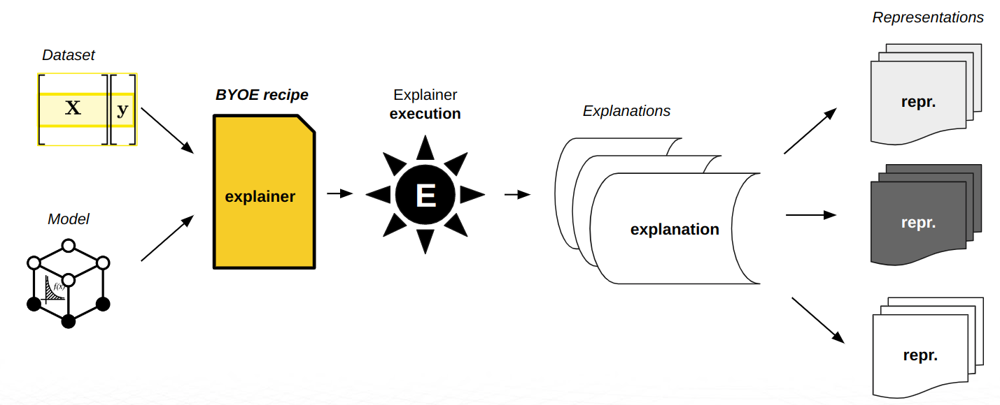
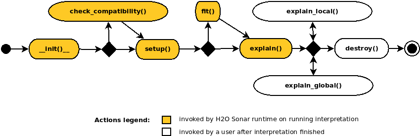

Getting Started with BYOE Recipes
=================================
H2O Sonar enables you to build an **extensible** platform of **custom** explainers.
H2O Sonar users can implement their own methods to get custom insights or
determine model behavior, use their domain expertise or customize existing explainers.

H2O Sonar uses the concept of **recipes** which allows for adding and developing custom
explainers - you can **bring your own explainer** (BYOE).

- `Introduction to Bring Your Own Example recipes <#introduction-to-bring-your-own-explainer-recipes>`__
   - `How do recipes work? <#how-do-recipes-work>`__
   - `What is the role of recipes? <#what-is-the-role-of-recipes>`__
   - `Where can you find open-source recipes? <#where-can-you-find-open-source-recipe-examples-and-templates>`__
- `Explainer <#explainer>`__
   - `Morris sensitivity analysis <#morris-sensitivity-analysis>`__
   - `Create <#create>`__
      - `Constructor <#constructor>`__
      - `setup() <#setup>`__
      - `explain() <#explain>`__
   - `Register <#register>`__
   - `Run <#run>`__
   - `Debug <#debug>`__
   - `Result <#result>`__
      - `Plot <#plot>`__
      - `Data <#data>`__
      - `Archive <#archive>`__
- `Conclusion <#conclusion>`__
- `Morris sensitivity analysis explainer source code <#morris-sensitivity-analysis-explainer-source-code>`__
- `Running BYOE recipe source code <#running-byoe-recipe-source-code>`__
- `Resources <#resources>`__

Introduction to Bring Your Own Explainer recipes
------------------------------------------------

H2O Sonar brings **interpretability** to machine learning models to explain
modeling results in a human-readable format. H2O Sonar provides different
techniques and methods for interpreting and explaining model results.

The set of techniques and methods can be extended with custom explainers
as H2O Sonar supports **BYOE** recipes - the ability to Bring Your Own Explainer.
BYOE recipe is **Python** code snippet. With BYOE recipe, you can
use your own explainers in combination with or instead of all built-in explainers.
This allows you to further extend H2O Sonar explainers in addition to out-of-the-box
methods.

BYOE recipes can be registered as explainers in H2O Sonar runtime - just like a plugin.

How do recipes work?
^^^^^^^^^^^^^^^^^^^^
When H2O Sonar user starts interpretation, model compatible explainers
(from the available set of out-of-the-box and custom explainers) are selected
and executed. Explainers create model explanations that are might be visualized
using H2O Sonar and/or can be found on the filesystem:

1. explainer execution
2. explanation creation
3. optional explanation normalization

What is the role of recipes?
^^^^^^^^^^^^^^^^^^^^^^^^^^^^
BYOE allows H2O Sonar users to bring their **own recipes** or leverage the existing,
**open-source** recipes to explain models. In this way, the expertise of those creating
and using the recipes is leveraged to focus on domain-specific functions to
build customizations.

Where can you find open-source recipe examples and templates?
^^^^^^^^^^^^^^^^^^^^^^^^^^^^^^^^^^^^^^^^^^^^^^^^^^^^^^^^^^^^^

.. image:: images/explainers-examples-overview.png
  :alt: Explainer examples

Open source **recipe examples** - which are used also in the documentation to
demonstrate H2O Sonar explainer API - can be found in:

* ``examples/predictive/byoe/examples`` H2O Sonar distribution directory
* `H2O Sonar GitHub repository <https://github.com/h2oai/h2o-sonar/tree/main/examples/predictive/byoe/examples>`__

.. image:: images/explainers-templates-overview.png
  :alt: Explainer templates

Open source **recipe templates** - which can be used to create quickly new explainers
just by choosing desired explainer type / explanation (like feature importance,
a decision tree or partial dependence) and replacing mock data with a calculation - can
be found in:

* ``examples/predictive/byoe/templates`` H2O Sonar distribution directory
* `H2O Sonar GitHub repository <https://github.com/h2oai/h2o-sonar/tree/main/examples/predictive/byoe/templates>`__

Explainer
---------
This section describes how to create a new **explainer** from your method or
3rd party library using **BYOE recipes**.

Morris sensitivity analysis
^^^^^^^^^^^^^^^^^^^^^^^^^^^
Explainer which will be created leverages
`Morris sensitivity analysis <https://github.com/interpretml/interpret#supported-techniques>`__
technique from 3rd-party Microsoft **open source** interpretation library:

- `InterpretML <https://interpret.ml/>`__
- `interpretml/interpret GitHub repository <https://github.com/interpretml/interpret#supported-techniques>`__

**Source code** of the explainer which will be created:

- `Morris sensitivity analysis explainer <#morris-sensitivity-analysis-explainer-source-code>`__ example

Similarly, you can create a new explainer using **your** favorite responsible AI library or
your own method.

Create
^^^^^^
Custom BYOE recipe explainer is **Python class** whose parent class
is :ref:`Explainer <h2o_sonar.lib.api.explainers module>`.

::

   class ExampleMorrisSensitivityExplainer(Explainer):
       ...

Explainer declares its display name (shown in reports and API), description, and supported
experiments (regression, binomial classification, or multinomial classification),
explanations scope (global, local), explanations types (like feature importance),
required Python library dependencies and other metadata as **class field**.

::

   class ExampleMorrisSensitivityExplainer(Explainer):

       _display_name = "Example Morris Sensitivity Analysis"
       _regression = True
       _binary = True
       _global_explanation = True
       _explanation_types = [GlobalFeatImpExplanation]
       _modules_needed_by_name = ["gevent==1.5.0", "interpret==0.1.20"]

       ...

Morris sensitivity analysis explainer will support global feature importance
explanations for regression and binomial experiments and it depends on
Microsoft ``interpret`` library (``pip`` package name).

When implementing an explainer, the following methods are invoked through
the explainer **life-cycle**:

- ``__init__()`` … **MUST** be implemented

   - Explainer class constructor which takes no parameters and calls parent
     constructor(s).

- ``check_compatibility() -> bool`` … **OPTIONAL**

   - Compatibility check which can be used to indicate that the explainer is
     or is not compatible with the given model, dataset, parameters, etc. apart
     to automatic explainer metadata-based compatibility check performed by H2O Sonar
     runtime.

- ``setup()`` … **MUST** be implemented

   - Explainer initialization which gets various arguments allowing to
     get enough information for the compatibility check and actual
     explanations calculation.

-  ``fit()`` … **OPTIONAL**

   -  Method which can pre-compute explainer artifacts like (surrogate)
      models to be subsequently used by the ``explain*()`` methods. This method is
      invoked only once in the lifecycle of the explainer.

-  ``explain() -> List`` … **MUST** be implemented

   -  The most important method which creates and persists **global** and **local**
      explanations on running interpretation.

-  ``explain_local() -> list`` … **OPTIONAL**

   -  Method which creates **local** explanations. Local explanations is used after
      the interpretation finishes. Local explanations can be either calculated
      on demand or use cached artifacts previously prepared by ``fit()`` and
      ``explain()`` methods.

-  ``explain_global() -> list`` … **OPTIONAL**

   -  Method which creates or updates **global** explanations. This method is after
      the interpretation finishes. Global explanations can be either calculated
      on demand or use cached artifacts previously prepared by ``fit()`` and
      ``explain()`` methods.

-  ``destroy()`` … **OPTIONAL**

   -  Post explainer explain method to clean up resources, files, and artifacts which
      are no longer needed.

These methods are invoked by recipe runtime through the explainer **life-cycle**.

Constructor
~~~~~~~~~~~
Explainer **must** implement default constructor which **cannot** have required
parameters:

::

       def __init__(self):
           Explainer.__init__(self)

setup()
~~~~~~~
The explainer must implement ``setup()`` method with the following signature:

::

       def setup(self, model, persistence, key=None, params=None, **explainer_params):
           """Set explainer fields needed to execute `fit()` and `explain()` methods.

           Parameters
           ----------
           model : ExplainableModel | None
             Model to be explained.
           persistence : CustomExplainerPersistence
             Persistence API allows safe saving and loading of explanations to
             desired storage (file system, memory, database).
           key : str
             Optional (given) explanation key (generated otherwise).
           params : CommonInterpretationParams
             Common explainer parameters specified on explainer run.
           explainer_params :
             Other explainer parameters, options, and configuration.

           """

           CustomExplainer.setup(self, model, persistence, key, params, **explainer_params)

The implementation must invoke the parent class ``setup()`` method which sets the following
class instance fields:

-  ``self.model``

   -  Instance of :ref:`ExplainableModel <h2o_sonar.lib.api.models module>` class
      which represents **the model to be explained**. The explainable model provides
      **metadata** (like features used by the model) as well as **predict** method
      (scorer) of the model.

-  ``self.dataset_meta``

   - Instance of :ref:`ExplainableDataset <h2o_sonar.lib.api.datasets module>` class
     which represents the **dataset** that is used to explain the model. It provides
     both dataset metadata as well as handle to the ``datatable`` data frame.

-  ``self.persistence``

   -  Instance of ``ExplainerPersistence`` class which provides explainer API
      to conveniently persist data created by the explainer e.g. to its working
      directory.

-  ``self.params``

   -  Common **interpretation** parameters specified on explainer run like model's
      target column or columns to drop.

-  ``self.logger``

   -  Logger which can be used to print info, debug, warning, error or
      debug messages to explainer’s log - to be used e.g. for debugging.

-  ``self.config``

   -  Global H2O Sonar :ref:`configuration <h2o_sonar.config module>`.

Instance attributes listed above can be subsequently used in all methods invoked
after the ``setup()``.

explain()
~~~~~~~~~
Finally the explainer must implement ``explain()`` method which is supposed to
**create** and **persist** both **global** and **local** explanations:

::

       def explain(self, X, y=None, explanations_types: list = None, **kwargs) -> List:
        """Invoke this method to calculate and persist global, local, or both type
        of explanation(s) for given model and data(set).

        X: datatable.Frame
          Dataset frame.
        y: datatable.Frame | Any | None
          Labels.
        explanations_types: List[Type[Explanation]]
          Optional explanation types to be built.

        Returns
        -------
        List[Explanation]:
          Explanations descriptors.

        """
           ...

``explain()`` method typically has the following steps:

1. **dataset** preparation
2. **predict method** creation
3. explanation(s) **calculation**
4. optional explanation **normalization**

**Dataset** preparation is performed using H2O Sonar utility method which
is able to preprocess the dataset as 3rd party Morris sensitivity analysis
implementation works on datasets and models **with numerical features
only** i.e.it cannot be run on a dataset with e.g. string categorical features.
The utility method automatically detects non-numeric features, performs label
encoding (returns the encoder for subsequent use - decoding in predict method)
and drops all N/A dataset rows:

::

       def explain(...) -> List:
           ...
          (x, _, self.model.label_encoder, _) = explainable_x.prepare(
              le_cat_variables=True,
              used_features=self.model.meta.used_features,
              cleaned_frame_type=pandas.DataFrame,
          )

If the explainer uses a 3rd party library, it typically must create
**predict method** which is suited for the 3rd party library. In this case,
Morris sensitivity analysis expects predict method input and output data to be
``numpy`` arrays. Therefore the default predict method of the explainable
model (``self.model.predict()``) must be customized:

::

        def predict_function(dataset: numpy.ndarray):
            preds = self.model.predict(
                datasets.ExplainableDataset.frame_2_datatable(
                    dataset,
                    columns=self.model.meta.used_features,
                )
            )
            return datasets.ExplainableDataset.frame_2_numpy(preds, flatten=True)

Explanation **calculation** is straightforward - Morris sensitivity analysis
is imported and invoked:

::

        from interpret.blackbox import MorrisSensitivity

        sensitivity: MorrisSensitivity = MorrisSensitivity(
            predict_fn=predict_function, data=x, feature_names=list(x.columns)
        )
        morris_explanation = sensitivity.explain_global(name=self.display_name)

``morris_explanation`` is a third-party/proprietary explanation. Explainer can:

-  persist explanation and make it available for **download**
-  **optionally normalize** the explanation to enable the use of H2O Sonar
   library functions for data **visualization**, **processing** and
   **conversion** - ``get_result()`` method can return an instance of ``Result``
   class which provides ``help``, ``data()``, ``plot()``, ``log()``, ``summary()``, ``params()`` and ``zip()`` methods to
   get machine processable explanation, visualized explanation, explainer log, summary of the explanation,
   explainer parameters and archive with all files created by the explainer:

::

    def get_result(
        self,
    ) -> results.FeatureImportanceResult:
        return results.FeatureImportanceResult(
            persistence=self.persistence,
            explainer_id=ExampleMorrisSensitivityAnalysisExplainer.explainer_id(),
            chart_title=ExampleMorrisSensitivityAnalysisExplainer._display_name,
            h2o_sonar_config=self.config,
            logger=self.logger,
        )

Finally ``explain()`` method must return explanations declared by the
custom explainer:

::

       explanations = [self._normalize_to_gom(morris_explanation)]
       return explanations

Check `Morris sensitivity analysis explainer source code <#morris-sensitivity-analysis-explainer-source-code>`__
listing.

Register
^^^^^^^^
BYOE recipe explainer must be registered in H2O Sonar runtime before it can be run
in the interpretation.

**Prerequisites**:

* the explainer must be installed and/or available on the ``PYTHONPATH``.

Register using Python API
~~~~~~~~~~~~~~~~~~~~~~~~~
When using Python API the explainer can be **registered** as follows:

::

    from h2o_sonar import interpret

    from example_morris_sa_explainer import ExampleMorrisSensitivityExplainer

    explainer_id: str = interpret.register_explainer(
        explainer_class=ExampleMorrisSensitivityExplainer,
    )

Registration method returns ``explainer_id`` which can be subsequently used in
``interpret.run_interpretation()`` to run and parameterize the custom explainer.

Register using Command Line Interface
~~~~~~~~~~~~~~~~~~~~~~~~~~~~~~~~~~~~~
When using CLI the explainer can be **registered** as follows:

1. Make sure that the explainer is (installed) on ``PYTHONPATH``.

2. Create H2O Sonar configuration file with BYOE recipe explainer **locator**
   (explainer packages and module name, ``::`` separator, explainer class ):

::

    {
        "custom_explainers": [
            "example_morris_sa_explainer::ExampleMorrisSensitivityAnalysisExplainer"
        ]
    }

3. Store above configuration to ``h2o-sonar-config.json`` file
   (see also :ref:`Library Configuration`).

4. Use the configuration file when you will run configuration, list explainers
   or use any other ``h2o-sonar`` command.

H2O Sonar will load the configuration and automatically register the explainer.

Run
^^^
To run a custom BYOE recipe explainer, run the interpretation and specify
explainer ID assigned to it on **registration**.

Run using Python API
~~~~~~~~~~~~~~~~~~~~
When using Python API the explainer can be **run** as follows:

::

    # register the explainer
    explainer_id: str = interpret.register_explainer(...)

    # run the explainer
    interpretation = interpret.run_interpretation(
        dataset=dataset_path,
        model=model_to_be_explained,
        target_col=target_col,
        explainers=[explainer_id],
    )

Please note that only basic set of explainers is run by default - in order to run
**new** BYOE recipe explainer you can use one of the following options:

- use ``explainers=[explainer_id]`` to run **only new explainer** - the explainer
  is identified by ID created during its registration
- use ``explainer_keywords=[interpret.KEYWORD_FILTER_ALL]`` parameter to run
  **all** compatible explainers

Run using Command Line Interface
~~~~~~~~~~~~~~~~~~~~~~~~~~~~~~~~
When using CLI the explainer can be **run** as follows:

::

    $ h2o-sonar run interpretation \
        --dataset=dataset.csv \
        --model=model-to-be-explained.pkl \
        --target-col=TARGET \
        --config-path=h2o-sonar-config.json
        --all-explainers

This shell command will use ``h2o-sonar-config.json`` configuration file
(created in the
`explainer registration step <#register-using-command-line-interface>`__), register
the custom explainer and run **all** explainers compatible with the model. Please
note that only basic set of explainers is run by default - in order to run
**new** BYOE recipe explainer you can use one of the following options:

- use ``--all-explainers`` parameter to run **all** compatible explainers
  (which is used in the example above)
- use ``--explainer-ids=example_morris_sa_explainer.ExampleMorrisSensitivityAnalysisExplainer``
  to run **only new explainer** - the explainer is identified by ID created
  during its registration - simply replace ``::`` with ``.`` in the locator to get ID

Debug
^^^^^
To debug an explainer, you can use ``self.logger`` instance attribute and log
debugging messages, exceptions, and values:

::

    def explain(...):
        ...
        self.logger.debug("This is a debug message.")

These log messages are stored in **explainer’s log** which can be found in:

- ``$RESULTS_DIRECTORY/h2o-sonar/mli_experiment_<UUID>/explainer_<explainer ID>_<UUID>/log``

Where ``$RESULT_DIRECTORY`` is the current directory, or ``result_dir`` is specified
in the interpretation parameter. You may also check **H2O Sonar log** with runtime
and interpretations' log messages, which can be found in:

- ``$RESULTS_DIRECTORY/h2o-sonar/h2o-sonar.log``

Use both logs to determine the root cause of the failure, fix it and simply re-register
and re-run the explainer in the same way.

Result
^^^^^^
The explainer creates and persists :ref:`explanations <h2o_sonar.lib.api.explanations module>`:

::

    .
    ├── h2o-sonar
    │   └── mli_experiment_<UUID>
    │       ├── explainers_parameters.json
    │       ├── explainer_tests_explainers_doc_example_morris_sa_explainer_ExampleMorrisSensitivityAnalysisExplainer_<UUID>
    │       │   ├── global_feature_importance
    │       │   │   ├── application_json
    │       │   │   │   ├── explanation.json
    │       │   │   │   └── feature_importance_class_0.json
    │       │   │   ├── application_json.meta
    │       │   │   ├── application_vnd_h2oai_json_datatable_jay
    │       │   │   │   ├── explanation.json
    │       │   │   │   └── feature_importance_class_0.jay
    │       │   │   └── application_vnd_h2oai_json_datatable_jay.meta
    │       │   ├── log
    │       │   │   └── explainer_run_<UUID>.log
    │       │   ├── result_descriptor.json
    │       │   └── work
    │       ├── interpretation.html
    │       └── interpretation.json
    ├── h2o-sonar.html
    └── h2o-sonar.log

After the interpretation finishes, you can check out explanations on the filesystem
(see interpretation directory structure). The best location where to start is
the **interpretation HTML report** which can be found in
``h2o-sonar/mli_experiment_<UUID>/interpretation.html``:

.. image:: images/interpretation-html-report.png
  :alt: Interpretation HTML report

Alternatively, you can use Python API to get normalized data, visualize explanations,
or archive all artifacts created by the explainer (see :ref:`h2o_sonar.lib.api.commons module`).

Data
~~~~
When using Python API you can get normalized **explanation data** as follows:

::

    # run the explainer
    interpretation = interpret.run_interpretation(...)

    # explainer result
    result = interpretation.get_explainer_result(explainer_id=explainer_id)

    # normalized explanations data
    explanation_data = result.data()

Different types of explanations may accept different parameters allowing you to
choose e.g. feature or class (which is not applicable in this case).

The above method returns the frame which looks like this:

::

       | feature    importance
       | str32         float64
    -- + ---------  ----------
     0 | ID             0.33
     1 | LIMIT_BAL      0.3285
     2 | BILL_AMT6      0.3225
     3 | AGE            0.207
     4 | EDUCATION      0.18
     5 | PAY_0          0.1485
     6 | BILL_AMT2      0.132
     7 | PAY_5          0.117
     8 | PAY_AMT2       0.111
     9 | PAY_2          0.1005
    10 | PAY_3          0.099
    11 | PAY_AMT1       0.084
    12 | BILL_AMT3      0.081
    13 | PAY_4          0.0765
    14 | PAY_AMT5       0.072
    15 | MARRIAGE       0.0705
    16 | BILL_AMT1      0.0615
    17 | PAY_AMT3       0.0525
    18 | PAY_AMT6       0.042
    19 | BILL_AMT4      0.0375
    20 | PAY_6          0.036
    21 | BILL_AMT5      0.0195
    22 | PAY_AMT4       0.0195
    23 | SEX            0.0135
    [24 rows x 2 columns]

Plot
~~~~
When using Python API you can get **explanation visualization** as follows:

::

    # run the explainer
    interpretation = interpret.run_interpretation(...)

    # explainer result
    result = interpretation.get_explainer_result(explainer_id=explainer_id)

    # visualized explanation
    result.plot(file_path="morris_sa_plot.png")

Different types of explanations may accept different parameters allowing you to
choose e.g. feature or class (which is not application in this case). Parameter
``file_path`` is optional, in case it's not specified, the explanation is rendered
so that it can be shown e.g. in Jupyter Notebook.

Archive
~~~~~~~
When using Python API you can get **archive** with all artifacts created by
the explainer as follows:

::

    # run the explainer
    interpretation = interpret.run_interpretation(...)

    # explainer result
    result = interpretation.get_explainer_result(explainer_id=explainer_id)

    # visualized explanation
    result.zip(file_path="morris_sa_archive.zip")

The explainer creates the following directory structure on the filesystem:

::

    explainer_tests_explainers_doc_example_morris_sa_explainer_ExampleMorrisSensitivityAnalysisExplainer_a89627ee-ab4e-4725-a14b-381f319b2252
    ├── global_feature_importance
    │   ├── application_json
    │   │   ├── explanation.json
    │   │   └── feature_importance_class_0.json
    │   ├── application_json.meta
    │   ├── application_vnd_h2oai_json_datatable_jay
    │   │   ├── explanation.json
    │   │   └── feature_importance_class_0.jay
    │   └── application_vnd_h2oai_json_datatable_jay.meta
    ├── log
    │   └── explainer_run_a89627ee-ab4e-4725-a14b-381f319b2252.log
    ├── result_descriptor.json
    └── work

Conclusion
----------
In this tutorial you learned how to implement, register, run, debug and get explanations
of **BYOE recipe explainers**.

Morris sensitivity analysis explainer source code
-------------------------------------------------

::

    from typing import List

    import datatable
    import numpy
    import pandas
    from h2o_sonar.explainers.commons import explainers_commons
    from h2o_sonar.lib.api import commons
    from h2o_sonar.lib.api import datasets
    from h2o_sonar.lib.api import explainers
    from h2o_sonar.lib.api import explanations as e10s
    from h2o_sonar.lib.api import formats as f5s
    from h2o_sonar.lib.api import models
    from h2o_sonar.lib.api import persistences
    from h2o_sonar.lib.api import results

    class ExampleMorrisSensitivityAnalysisExplainer(explainers.Explainer):
        """InterpretML: Morris sensitivity analysis explainer."""

        # explainer display name (used e.g. in explainer listing)
        _display_name = "Example Morris Sensitivity Analysis"
        # explainer description (used e.g. in explanations help)
        _description = (
            "Morris sensitivity analysis (SA) explainer provides Morris sensitivity "
            "analysis based feature importance which is a measure of the contribution of "
            "an input variable to the overall predictions of the model. In applied "
            "statistics, the Morris method for global sensitivity analysis is a so-called "
            "one-step-at-a-time method (OAT), meaning that in each run only one input "
            "parameter is given a new value. This explainer is based based on InterpretML "
            "library - see http://interpret.ml"
        )
        # declaration of supported experiments: regression / binary / multiclass
        _regression = True
        _binary = True
        # declaration of provided explanations: global, local or both
        _global_explanation = True
        # declaration of explanation types this explainer creates e.g. feature importance
        _explanation_types = [e10s.GlobalFeatImpExplanation]
        # required Python package dependencies (can be installed using pip)
        _modules_needed_by_name = ["gevent==1.5.0", "interpret==0.1.20"]

        # explainer constructor must not have any required parameters
        def __init__(self):
            explainers.Explainer.__init__(self)

        # setup() method is used to initialize the explainer based on provided parameters
        def setup(
            self,
            model: models.ExplainableModel | None,
            persistence: persistences.ExplainerPersistence,
            key: str | None = None,
            params: commons.CommonInterpretationParams | None = None,
            **explainer_params,
        ):
            explainers.Explainer.setup(
                self,
                model=model,
                persistence=persistence,
                key=key,
                params=params,
                **explainer_params,
            )

            self.persistence.save_explainers_params({self.explainer_id(): {}})

        # explain() method creates the explanations
        def explain(
            self,
            X,
            explainable_x: datasets.ExplainableDataset | None = None,
            y=None,
            **kwargs,
        ) -> List:
            # import 3rd party Morris Sensitivity Analysis library
            from interpret import blackbox

            # DATASET: encoding of categorical features for 3rd party library which
            # support numeric features only, filtering of rows w/ missing values, and more
            (x, _, self.model.label_encoder, _) = explainable_x.prepare(
                le_cat_variables=True,
                used_features=self.model.meta.used_features,
                cleaned_frame_type=pandas.DataFrame,
            )

            # PREDICT FUNCTION: library compliant predict function which works on numpy
            def predict_function(dataset: numpy.ndarray):
                # score
                preds = self.model.predict(
                    datasets.ExplainableDataset.frame_2_datatable(
                        dataset,
                        columns=self.model.meta.used_features,
                    )
                )

                # scoring output conversion to the frame type required by the library
                return datasets.ExplainableDataset.frame_2_numpy(preds, flatten=True)

            # CALCULATION of the Morris SA explanation
            sensitivity: blackbox.MorrisSensitivity = blackbox.MorrisSensitivity(
                predict_fn=predict_function, data=x, feature_names=list(x.columns)
            )
            morris_explanation = sensitivity.explain_global(name=self.display_name)

            # NORMALIZATION of proprietary Morris SA library data to standard format
            explanations = [self._normalize_to_gom(morris_explanation)]

            # explainer MUST return explanation(s) declared in _explanation_types
            return explanations

        #
        # optional NORMALIZATION to Grammar of MLI (GoM)
        #

        # Normalization of the data to the Grammar of MLI defined format. Normalized data
        # can be visualized using H2O Sonar components.
        #
        # This method creates explanation (data) and its representations (JSon, datatable)
        def _normalize_to_gom(self, morris_explanation) -> e10s.GlobalFeatImpExplanation:
            # EXPLANATION
            explanation = e10s.GlobalFeatImpExplanation(
                explainer=self,
                display_name=self.display_name,
                display_category=e10s.GlobalFeatImpExplanation.DISPLAY_CAT_CUSTOM,
            )

            # FORMAT: explanation representation as JSon+datatable - JSon index file which
            # references datatable frame with sensitivity values for each class
            jdf = f5s.GlobalFeatImpJSonDatatableFormat
            # data normalization: 3rd party frame to Grammar of MLI defined frame
            # conversion - see GlobalFeatImpJSonDatatableFormat docstring for format
            # documentation and source for helpers to create the representation easily
            explanation_frame = datatable.Frame(
                {
                    jdf.COL_NAME: morris_explanation.data()["names"],
                    jdf.COL_IMPORTANCE: list(morris_explanation.data()["scores"]),
                    jdf.COL_GLOBAL_SCOPE: [True] * len(morris_explanation.data()["scores"]),
                }
            ).sort(-datatable.f[jdf.COL_IMPORTANCE])
            # index file (of per-class data files) (JSon)
            (
                idx_dict,
                idx_str,
            ) = f5s.GlobalFeatImpJSonDatatableFormat.serialize_index_file(
                classes=["global"],
                doc=ExampleMorrisSensitivityAnalysisExplainer._description,
            )
            json_dt_format = f5s.GlobalFeatImpJSonDatatableFormat(explanation, idx_str)
            json_dt_format.update_index_file(
                idx_dict, total_rows=explanation_frame.shape[0]
            )
            # data file (datatable)
            json_dt_format.add_data_frame(
                format_data=explanation_frame,
                file_name=idx_dict[jdf.KEY_FILES]["global"],
            )
            # JSon+datatable format can be added as explanation's representation
            explanation.add_format(json_dt_format)

            # another FORMAT: explanation representation as JSon
            # Having JSon+datatable formats it's easy to get other formats like CSV,
            # datatable, ZIP, ... using helpers - adding JSon representation:
            explanation.add_format(
                explanation_format=f5s.GlobalFeatImpJSonFormat.from_json_datatable(
                    json_dt_format
                )
            )

            return explanation

        def get_result(
            self,
        ) -> results.FeatureImportanceResult:
            return results.FeatureImportanceResult(
                persistence=self.persistence,
                explainer_id=ExampleMorrisSensitivityAnalysisExplainer.explainer_id(),
                chart_title=ExampleMorrisSensitivityAnalysisExplainer._display_name,
                h2o_sonar_config=self.config,
                logger=self.logger,
            )

Running BYOE recipe source code
-------------------------------

::

        # BYOE recipe explainer to be run
        explainer_type = ExampleMorrisSensitivityAnalysisExplainer

        # register the explainer
        explainer_id = interpret.register_explainer(
            explainer_class=explainer_type
        )

        # run the explainer
        interpretation = interpret.run_interpretation(
            dataset=dataset_path,
            model=model_to_be_explained,
            target_col=target_col,
            explainers=[explainer_id],
        )

        # get explainer result
        result = interpretation.get_explainer_result(
            explainer_id=explainer_id
        )

        # get explanation data
        data = result.data()
        # get explanation chart
        result.plot(file_path=os.path.join(tmpdir, "morris_sa_plot.png"))
        # get explanation archive
        result.zip(file_path=os.path.join(tmpdir, "morris_sa_archive.zip"))

Resources
---------
- `H2O Sonar documentation <https://github.com/h2oai/h2o-sonar#documentation>`__
- `InterpretML <https://interpret.ml/>`__
- `interpretml/interpret GitHub repository <https://github.com/interpretml/interpret#supported-techniques>`__
