Explainers
==========

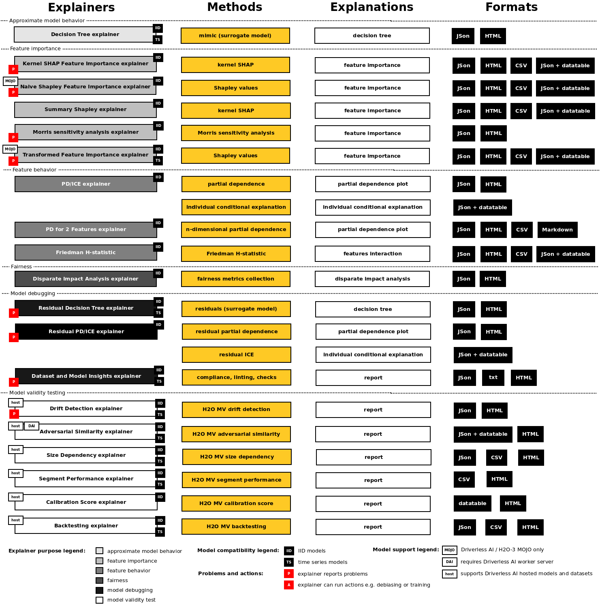

H2O Sonar explainers:

- Approximate model behavior
   - :ref:`Surrogate Decision Tree Explainer`
- Feature importance
   - :ref:`Shapley Summary Plot for Original Features (Naive Shapley Method) Explainer`
   - :ref:`Shapley Values for Original Features (Kernel SHAP Method) Explainer`
   - :ref:`Shapley Values for Original Features of MOJO Models (Naive Method) Explainer`
   - :ref:`Shapley Values for Transformed Features of MOJO Models Explainer`
   - :ref:`Morris Sensitivity Analysis Explainer`
- Feature behavior
   - :ref:`Partial Dependence/Individual Conditional Expectations (PD/ICE) Explainer`
   - :ref:`Partial Dependence for 2 Features Explainer`
   - :ref:`Friedman's H-statistic Explainer`
- Fairness
   - :ref:`Disparate Impact Analysis (DIA) Explainer`
- Model debugging
   - :ref:`Residual Surrogate Decision Tree Explainer`
   - :ref:`Residual Partial Dependence/Individual Conditional Expectations (PD/ICE) Explainer`
   - :ref:`Dataset and Model Insights Explainer`
- Model validity testing
   - :ref:`Adversarial Similarity Explainer`
   - :ref:`Backtesting Explainer`
   - :ref:`Calibration Score Explainer`
   - :ref:`Drift Detection Explainer`
   - :ref:`Segment Performance Explainer`
   - :ref:`Size Dependency Explainer`

+----------------------------------+------+-----+----+---+---+---+---+---+---------+---------+-----+--------+
| Name                             | D/M  | IID | TS | R | B | M | G | L | ``p()`` | ``r()`` | DAI | autoML |
+==================================+======+=====+====+===+===+===+===+===+=========+=========+=====+========+
| Decision Tree                    | M    | ✓   | ✓  | ✓ | ✓ | ✓ | ✓ | ✓ | ✓       | ❌      | ❌  | ❌     |
+----------------------------------+------+-----+----+---+---+---+---+---+---------+---------+-----+--------+
| Kernels SHAP Feature Importance  | M    | ✓   | ✓  | ✓ | ✓ | ✓ | ✓ | ✓ | ✓       | ❌      | ❌  | ❌     |
+----------------------------------+------+-----+----+---+---+---+---+---+---------+---------+-----+--------+
| Naive Shapley Feature Importance | M    | ✓   | ✓  | ✓ | ✓ | ✓ | ✓ | ✓ | ✓       | ❌      | ❌  | ❌     |
+----------------------------------+------+-----+----+---+---+---+---+---+---------+---------+-----+--------+
| Summary Shapley                  | M    | ✓   | ✓  | ✓ | ✓ | ✓ | ✓ | ❌| ✓       | ❌      | ❌  | ❌     |
+----------------------------------+------+-----+----+---+---+---+---+---+---------+---------+-----+--------+
| Morris Sensitivity Analysis      | M    | ✓   | ✓  | ✓ | ✓ | ❌| ✓ | ❌| ✓       | ❌      | ❌  | ❌     |
+----------------------------------+------+-----+----+---+---+---+---+---+---------+---------+-----+--------+
| Transformed Feature Importance   | M    | ✓   | ✓  | ✓ | ✓ | ✓ | ✓ | ✓ | ✓       | ❌      | ❌  | ❌     |
+----------------------------------+------+-----+----+---+---+---+---+---+---------+---------+-----+--------+
| PD/ICE                           | M    | ✓   | ✓  | ✓ | ✓ | ✓ | ✓ | ✓ | ✓       | ❌      | ❌  | ❌     |
+----------------------------------+------+-----+----+---+---+---+---+---+---------+---------+-----+--------+
| PD/ICE for 2 Features            | M    | ✓   | ✓  | ✓ | ✓ | ❌| ✓ | ❌| ✓       | ❌      | ❌  | ❌     |
+----------------------------------+------+-----+----+---+---+---+---+---+---------+---------+-----+--------+
| Friedman H-statistic             | M    | ✓   | ✓  | ✓ | ✓ | ❌| ✓ | ❌| ✓       | ❌      | ❌  | ❌     |
+----------------------------------+------+-----+----+---+---+---+---+---+---------+---------+-----+--------+
| Disparate Impact Analysis        | M    | ✓   | ✓  | ✓ | ✓ | ❌| ✓ | ❌| ✓       | ❌      | ❌  | ❌     |
+----------------------------------+------+-----+----+---+---+---+---+---+---------+---------+-----+--------+
| Residual Decision Tree           | M    | ✓   | ✓  | ✓ | ✓ | ✓ | ✓ | ✓ | ✓       | ❌      | ❌  | ❌     |
+----------------------------------+------+-----+----+---+---+---+---+---+---------+---------+-----+--------+
| Residual PD/ICE                  | M    | ✓   | ✓  | ✓ | ✓ | ✓ | ✓ | ✓ | ✓       | ❌      | ❌  | ❌     |
+----------------------------------+------+-----+----+---+---+---+---+---+---------+---------+-----+--------+
| Dataset and Model Insights       | D+M  | ✓   | ✓  | ✓ | ✓ | ✓ | ✓ | ❌| ✓       | ❌      | ❌  | ❌     |
+----------------------------------+------+-----+----+---+---+---+---+---+---------+---------+-----+--------+
| Adversarial Similarity           | D+rD | ✓   | ✓  | ✓ | ✓ | ✓ | ✓ | ❌| ❌      | ❌      | ✓   | ✓      |
+----------------------------------+------+-----+----+---+---+---+---+---+---------+---------+-----+--------+
| Backtesting                      | rM   | ✓   | ✓  | ✓ | ✓ | ✓ | ✓ | ❌| ✓       | ✓       | ✓   | ❌     |
+----------------------------------+------+-----+----+---+---+---+---+---+---------+---------+-----+--------+
| Calibration Score                | rM   | ✓   | ✓  | ❌| ✓ | ✓ | ✓ | ❌| ✓       | ❌      | ✓   | ❌     |
+----------------------------------+------+-----+----+---+---+---+---+---+---------+---------+-----+--------+
| Drift Detection                  | D+rD | ✓   | ✓  | ✓ | ✓ | ✓ | ✓ | ❌| ❌      | ❌      | ✓   | ❌     |
+----------------------------------+------+-----+----+---+---+---+---+---+---------+---------+-----+--------+
| Segment Performance              | rM   | ✓   | ✓  | ✓ | ✓ | ✓ | ✓ | ❌| ✓       | ❌      | ✓   | ❌     |
+----------------------------------+------+-----+----+---+---+---+---+---+---------+---------+-----+--------+
| Size Dependency                  | rM   | ✓   | ✓  | ✓ | ✓ | ✓ | ✓ | ❌| ✓       | ❌      | ✓   | ❌     |
+----------------------------------+------+-----+----+---+---+---+---+---+---------+---------+-----+--------+

Legend:

- **D/M**
   - Explainer can explain local dataset (**D**), remote dataset hosted by Driverless AI (**rD**), local model (**M**) or remote model hosted by Driverless AI (**rM**).
- **IID**
   - Explainer can explain IID models (with independent and identically distributed variables).
- **TS**
   - Explainer can explain time series models.
- **R**
   - Explainer can explain models for regression problems.
- **B**
   - Explainer can explain models for binomial classification problems.
- **M**
   - Explainer can explain models for multinomial classification problems.
- **Global**
   - Explainer provides global explanations.
- **Local**
   - Explainer provides local explanations.
- **p()**
   - Model must support ``predict()`` method.
- **r()**
   - Model must support ``retrain()`` or ``refit()`` method.
- **DAI**
   - Explainer requires Driverless AI connection of the server which may host explained datasets and/or models.
- **autoML**
   - Explainer requires connection to autoML Driverless AI worker in order to run experiments.

Explainer Parameters
--------------------
Explainers can be parameterized using the parameters documented in the sections below.
These parameters are explainer specific and can be passed to explainers using
the Python API as follows:

.. code-block:: python

    interpretation = interpret.run_interpretation(
        dataset=dataset_path,
        model=mock_model,
        target_col=target_col,
        explainers=[
            commons.ExplainerToRun(
                explainer_id=explainer.PdIceExplainer.explainer_id(),
                params={
                    explainer.PdIceExplainer.PARAM_MAX_FEATURES: param_max_features,
                    explainer.PdIceExplainer.PARAM_GRID_RESOLUTION: param_bins,
                },
            )
        ],
        ...
    )

In the example above, ``max_features`` and ``grid_parameters`` parameters are passed
to the ``PdIceExplainer``. An instance of the ``ExplainerToRun`` class is used
to specify explainer ID and its parameters, which are passed in a dictionary,
where the key is string identifier of the parameter and value is the parameter value.

Similarly parameters can be passed to the explainers using the command line (CLI) interface:

.. code-block:: text

  h2o-sonar run interpretation
    --dataset=dataset.csv
    --model=model.pickle
    --target-col=PROFIT
    --explainers=h2o_sonar.explainers.pd_ice_explainer.PdIceExplainer
    --explainers-pars=
      "{'h2o_sonar.explainers.pd_ice_explainer.PdIceExplainer':{'max_features': 5}}"

Surrogate Decision Tree Explainer
---------------------------------
The decision tree surrogate is an approximate overall flow chart of the model,
created by training a simple decision tree on the original inputs and the predictions
of the model.

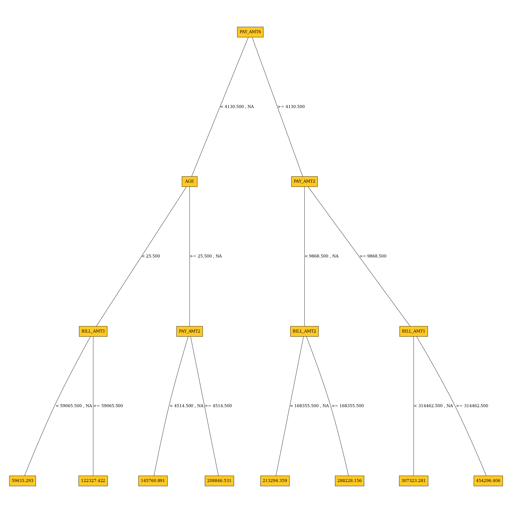

Explainer **parameters**:

- ``debug_residuals``
   - Debug model residuals.
- ``debug_residuals_class``
   - Class for debugging classification model ``logloss`` residuals, empty string for
     debugging regression model residuals.
- ``dt_tree_depth``
   - Decision tree depth.
- ``nfolds``
   - Number of CV folds.
- ``qbin_cols``
   - Quantile binning columns.
- ``qbin_count``
   - Quantile bins count.
- ``categorical_encoding``
   - Categorical encoding - specify one of the following encoding schemes for handling of categorical features:
      - ``AUTO``: 1 column per categorical feature.
      - ``Enum Limited``: Automatically reduce categorical levels to
        the most prevalent ones during training and only keep the top 10 most
        frequent levels.
      - ``One Hot Encoding``: N+1 new columns for categorical features with
        N levels.
      - ``Label Encoder``: Convert every enum into the integer of its index
        (for example, level 0 -> 0, level 1 -> 1, etc.).
      - ``Sort by Response``: Reorders the levels by the mean response
        (for example, the level with lowest response -> 0, the level
        with second-lowest response -> 1, etc.).

Explainer **result** directory description:

.. code-block:: text

    explainer_h2o_sonar_explainers_dt_surrogate_explainer_DecisionTreeSurrogateExplainer_89c7869d-666d-4ba2-ba84-cf1aa1b903bd
    ├── global_custom_archive
    │   ├── application_zip
    │   │   └── explanation.zip
    │   └── application_zip.meta
    ├── global_decision_tree
    │   ├── application_json
    │   │   ├── dt_class_0.json
    │   │   └── explanation.json
    │   └── application_json.meta
    ├── local_decision_tree
    │   ├── application_json
    │   │   └── explanation.json
    │   └── application_json.meta
    ├── log
    │   └── explainer_run_89c7869d-666d-4ba2-ba84-cf1aa1b903bd.log
    ├── result_descriptor.json
    └── work
        ├── dtModel.json
        ├── dtpaths_frame.bin
        ├── dtPathsFrame.csv
        ├── dtsurr_mojo.zip
        ├── dtSurrogate.json
        └── dt_surrogate_rules.zip

- ``explainer_.../work/dtSurrogate.json``
   - Decision tree in JSon format.
- ``explainer_.../work/dt_surrogate_rules.zip``
   - Decision tree rules (in Python and text format) stored in ZIP archive.
- ``explainer_.../work/dtpaths_frame.bin``
   - Decision tree paths stored as ``datatable`` frame.
- ``explainer_.../work/dtPathsFrame.csv``
   - Decision tree paths stored as CSV file.
- ``explainer_.../work/dtsurr_mojo.zip``
   - Decision tree model stored as zipped H2O-3 MOJO.
- ``explainer_.../work/dtModel.json``
   - Decision tree model in JSon format.

**Explanations** created by the explainer:

- ``global_custom_archive``
   - ZIP archive with explainer artifacts.
- ``global_decision_tree``
   - Decision tree explanation in the JSon format.
- ``local_decision_tree``
   - Local (per dataset row) decision tree explanations in the JSon format.

See also:

- :ref:`Decision Tree Surrogate Explainer Demo`
- :ref:`Explainer Parameters`

Residual Surrogate Decision Tree Explainer
------------------------------------------
The residual surrogate decision tree predicts which paths in the tree (paths explain
approximate model behavior) lead to highest or lowest error.
The residual surrogate decision tree is created by training a
simple decision tree on the residuals of the predictions of the model.
Residuals are differences between observed and predicted values which can be
used as targets in surrogate models for the purpose of model debugging.
The method used to calculate residuals varies depending on the type of
problem. For classification problems, ``logloss`` residuals are calculated for
a specified class. For regression problems, residuals are determined by
calculating the square of the difference between targeted and predicted
values."

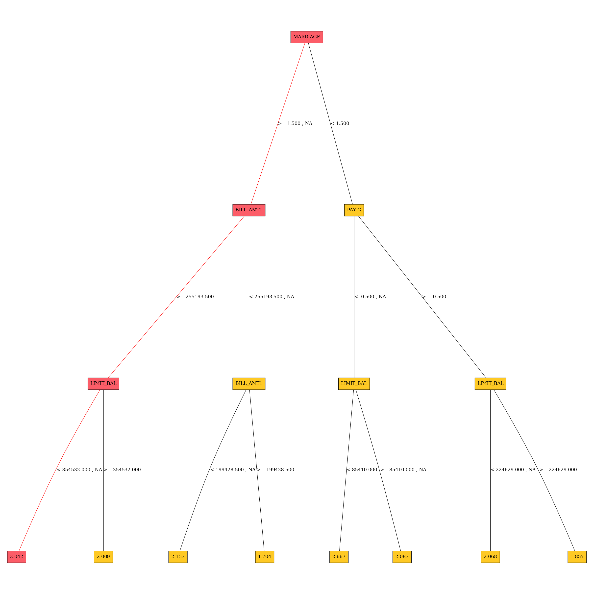

Explainer **parameters**:

- ``debug_residuals_class``
   - Class for debugging classification model ``logloss`` residuals, empty string for
     debugging regression model residuals.
- ``dt_tree_depth``
   - Decision tree depth.
- ``nfolds``
   - Number of CV folds.
- ``qbin_cols``
   - Quantile binning columns.
- ``qbin_count``
   - Quantile bins count.
- ``categorical_encoding``
   - Categorical encoding - specify one of the following encoding schemes for handling
     of categorical features:

     - ``AUTO``: 1 column per categorical feature.
     - ``Enum Limited``: Automatically reduce categorical levels to
       the most prevalent ones during training and only keep the top 10 most
       frequent levels.
     - ``One Hot Encoding``: N+1 new columns for categorical features with
       N levels.
     - ``Label Encoder``: Convert every enum into the integer of its index
       (for example, level 0 -> 0, level 1 -> 1, etc.).
     - ``Sort by Response``: Reorders the levels by the mean response
        (for example, the level with lowest response -> 0, the level
        with second-lowest response -> 1, etc.).

Explainer **result** directory description:

.. code-block:: text

    explainer_h2o_sonar_explainers_residual_dt_surrogate_explainer_ResidualDecisionTreeSurrogateExplainer_606aa553-e0f4-4a6f-a6b6-366955ca938d
    ├── global_custom_archive
    │   ├── application_zip
    │   │   └── explanation.zip
    │   └── application_zip.meta
    ├── global_decision_tree
    │   ├── application_json
    │   │   ├── dt_class_0.json
    │   │   └── explanation.json
    │   └── application_json.meta
    ├── global_html_fragment
    │   ├── text_html
    │   │   ├── dt-class-0.png
    │   │   └── explanation.html
    │   └── text_html.meta
    ├── local_decision_tree
    │   ├── application_json
    │   │   └── explanation.json
    │   └── application_json.meta
    ├── log
    │   └── explainer_run_606aa553-e0f4-4a6f-a6b6-366955ca938d.log
    ├── result_descriptor.json
    └── work
        ├── dt-class-0.dot
        ├── dt-class-0.dot.pdf
        ├── dtModel.json
        ├── dtpaths_frame.bin
        ├── dtPathsFrame.csv
        ├── dtsurr_mojo.zip
        ├── dtSurrogate.json
        └── dt_surrogate_rules.zip

- ``explainer_.../work/dtSurrogate.json``
   - Decision tree in JSon format.
- ``explainer_.../work/dt_surrogate_rules.zip``
   - Decision tree rules (in Python and text format) stored in ZIP archive.
- ``explainer_.../work/dtpaths_frame.bin``
   - Decision tree paths stored as ``datatable`` frame.
- ``explainer_.../work/dtPathsFrame.csv``
   - Decision tree paths stored as CSV file.
- ``explainer_.../work/dtsurr_mojo.zip``
   - Decision tree model stored as zipped H2O-3 MOJO.
- ``explainer_.../work/dtModel.json``
   - Decision tree model in JSon format.

**Explanations** created by the explainer:

- ``global_custom_archive``
   - ZIP archive with explainer artifacts.
- ``global_decision_tree``
   - Decision tree explanation in the JSon format.
- ``local_decision_tree``
   - Local (per dataset row) decision tree explanations in the JSon format.

**Problems** reported by the explainer:

- **Path leading to the highest error**
   - The explainer reports residual decision tree path that leads to the highest error.
     This path should be investigated to determine whether it indicates a problem with
     the model.
   - Problem severity: ``LOW``.

See also:

- :ref:`Residual Decision Tree Surrogate Explainer Demo`
- :ref:`Explainer Parameters`

Shapley Summary Plot for Original Features (Naive Shapley Method) Explainer
---------------------------------------------------------------------------
Shapley explanations are a technique with credible theoretical support that
presents consistent global and local feature contributions.

The Shapley Summary Plot shows original features versus their local Shapley
values on a sample of the dataset. Feature values are binned by Shapley
values and the average normalized feature value for each bin is plotted.
The legend corresponds to numeric features and maps to their normalized
value - yellow is the lowest value and deep orange is the highest. You can also
get scatter plot of the actual numeric feature values versus their corresponding
Shapley values. Categorical features are shown in grey and do not provide an
actual-value scatter plot.

Notes:

- The Shapley Summary Plot only shows original features that are used in the model.
- The dataset sample size and the number of bins can be updated in the interpretation
  parameters.
- If feature engineering is turned off and there is no sampling, then the
  Naive Shapley values should match the transformed Shapley values.

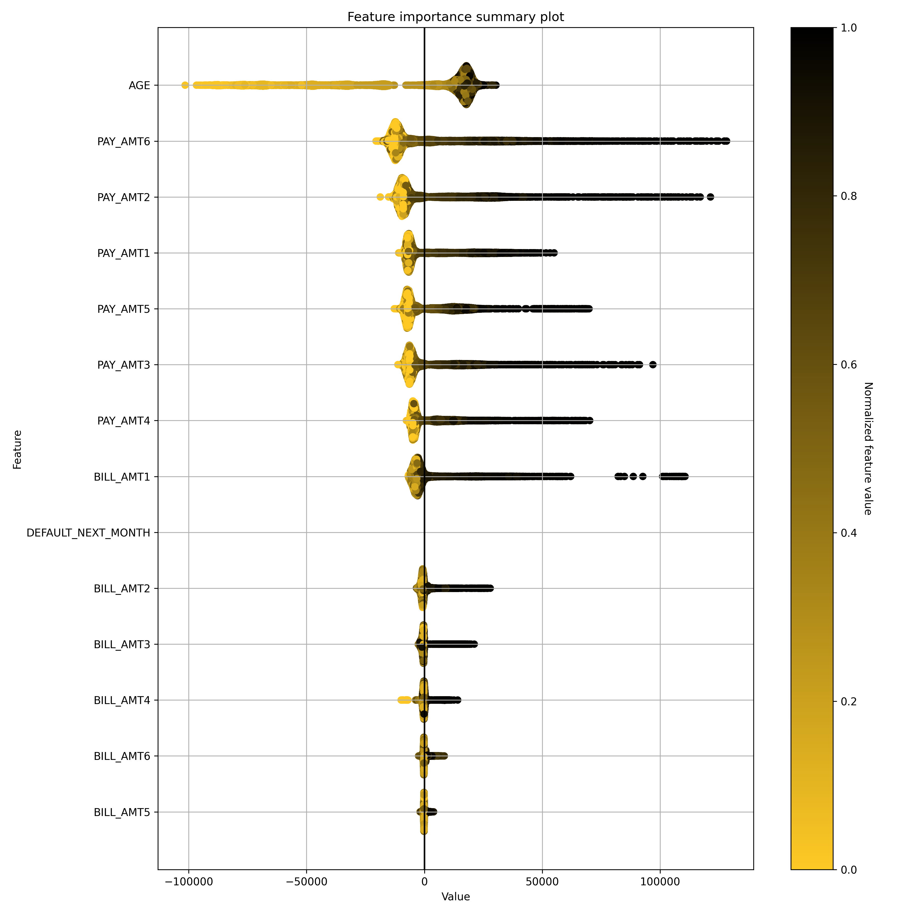

Explainer **parameters**:

- ``sample_size``
   - Sample size (default is ``100 000``).
- ``max_features``
   - Maximum number of features to be shown in the plot.
- ``x_shapley_resolution``
   - X-axis resolution (number of Shapley values bins).
- ``enable_drill_down_charts``
   - Enable creation of per-feature Shapley/feature value scatter plots.

Explainer **result** directory description:

.. code-block:: text

    explainer_h2o_sonar_explainers_summary_shap_explainer_SummaryShapleyExplainer_36d41c37-7641-4519-9358-a7ddc947f704
    ├── global_summary_feature_importance
    │   ├── application_json
    │   │   ├── explanation.json
    │   │   ├── feature_0_class_0.png
    │   │   ├── feature_10_class_0.png
    │   │   ├── feature_11_class_0.png
    │   │   ├── feature_12_class_0.png
    │   │   ├── feature_13_class_0.png
    │   │   ├── feature_14_class_0.png
    │   │   ├── feature_15_class_0.png
    │   │   ├── feature_16_class_0.png
    │   │   ├── feature_17_class_0.png
    │   │   ├── feature_18_class_0.png
    │   │   ├── feature_19_class_0.png
    │   │   ├── feature_1_class_0.png
    │   │   ├── feature_20_class_0.png
    │   │   ├── feature_21_class_0.png
    │   │   ├── feature_22_class_0.png
    │   │   ├── feature_23_class_0.png
    │   │   ├── feature_2_class_0.png
    │   │   ├── feature_3_class_0.png
    │   │   ├── feature_4_class_0.png
    │   │   ├── feature_5_class_0.png
    │   │   ├── feature_6_class_0.png
    │   │   ├── feature_7_class_0.png
    │   │   ├── feature_8_class_0.png
    │   │   ├── feature_9_class_0.png
    │   │   ├── summary_feature_importance_class_0_offset_0.json
    │   │   ├── summary_feature_importance_class_0_offset_1.json
    │   │   └── summary_feature_importance_class_0_offset_2.json
    │   ├── application_json.meta
    │   ├── application_vnd_h2oai_json_datatable_jay
    │   │   ├── explanation.json
    │   │   └── summary_feature_importance_class_0.jay
    │   ├── application_vnd_h2oai_json_datatable_jay.meta
    │   ├── text_markdown
    │   │   ├── explanation.md
    │   │   └── shapley-class-0.png
    │   └── text_markdown.meta
    ├── log
    │   └── explainer_run_36d41c37-7641-4519-9358-a7ddc947f704.log
    ├── result_descriptor.json
    └── work
        ├── raw_shapley_contribs_class_0.jay
        ├── raw_shapley_contribs_index.json
        ├── report.md
        └── shapley-class-0.png

- ``explainer_.../work/report.md``
   - Markdown report with per-class summary Shapley feature importance charts
     (``shapley-class-<class number>.png``).
- ``explainer_.../work/raw_shapley_contribs_index.json``
   - Per model class Shapley contributions JSon index - it references ``datatable``
     ``.jay`` frame with the contributions for each class of the model.

**Explanations** created by the explainer:

- ``global_summary_feature_importance``
   - Summary original feature importance explanation in Markdown (text and global chart),
     JSon (includes drill-down scatter plots) and ``datatable`` formats.

See also:

- :ref:`Summary Shapley Explainer Demo`
- :ref:`Explainer Parameters`

Shapley Values for Original Features (Kernel SHAP Method) Explainer
-------------------------------------------------------------------
Shapley explanations are a technique with credible theoretical support
that presents consistent global and local variable contributions.
Local numeric Shapley values are calculated by tracing single rows
of data through a trained tree ensemble and aggregating the
contribution of each input variable as the row of data moves through
the trained ensemble. For regression tasks, Shapley values sum to
the prediction of the Driverless AI model. For classification
problems, Shapley values sum to the prediction of the Driverless AI
model before applying the link function. Global Shapley values are
the average of the absolute Shapley values over every
row of a dataset. Shapley values for original features are calculated
with the Kernel Explainer method, which uses a special weighted
linear regression to compute the importance of each feature. More
information about Kernel SHAP is available at
`A Unified Approach to Interpreting Model Predictions <http://papers.nips.cc/paper/7062-a-unified-approach-to-interpreting-model-predictions.pdf>`_.

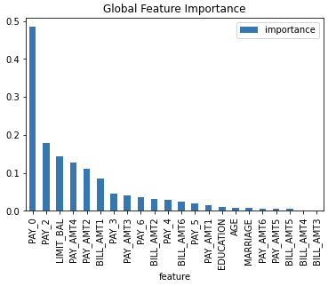

Explainer **parameters**:

- ``sample_size``
   - Sample size (default is ``100 000``).
- ``sample``
   - Whether to sample Kernel SHAP (default is ``True``).
- ``nsample``
   - Number of times to re-evaluate the model when
     explaining each prediction with Kernel Explainer.
     Default is determined internally.'auto' or int.
     Number of times to re-evaluate the model when explaining each
     prediction. More samples lead to lower variance
     estimates of the SHAP values. The 'auto' setting uses
     ``nsamples = 2 * X.shape[1] + 2048``. This setting is disabled by
     default and runtime determines the right number internally.
- ``L1``
   - L1 regularization for Kernel Explainer. "
     'num_features(int)', 'auto' (default for now, "
     but deprecated), 'aic', 'bic', or float. The L1 regularization to
     use for feature selection (the estimation procedure is based on
     a debiased lasso). The 'auto' option currently uses aic when
     less that 20% of the possible sample space is enumerated,
     otherwise it uses no regularization. The aic and bic options use
     the AIC and BIC rules for regularization. Using
     'num_features(int)' selects a fix number of top features. Passing
     a float directly sets the alpha parameter of the
     ``sklearn.linear_model.Lasso`` model used for feature selection.
- ``max_runtime``
   - Max runtime for Kernel explainer in seconds.
- ``leakage_warning_threshold``
   - Threshold for showing potential data leakage in the most important feature.
     Data leakage occurs when a feature influences the target column
     too much. High feature importance value means that the model you trained with
     this dataset will not be predicting the target based on all features
     but rather on just one. More about feature data leakage (also target
     leakage) at `Target leakage H2O.ai Wiki <https://h2o.ai/wiki/target-leakage/>`_.

Explainer **result** directory description:

.. code-block:: text

    explainer_h2o_sonar_explainers_fi_kernel_shap_explainer_KernelShapFeatureImportanceExplainer_aef847c4-9b5b-458c-a5e6-0ce7fa99748b
    ├── global_feature_importance
    │   ├── application_json
    │   │   ├── explanation.json
    │   │   └── feature_importance_class_0.json
    │   ├── application_json.meta
    │   ├── application_vnd_h2oai_json_csv
    │   │   ├── explanation.json
    │   │   └── feature_importance_class_0.csv
    │   ├── application_vnd_h2oai_json_csv.meta
    │   ├── application_vnd_h2oai_json_datatable_jay
    │   │   ├── explanation.json
    │   │   └── feature_importance_class_0.jay
    │   └── application_vnd_h2oai_json_datatable_jay.meta
    ├── local_feature_importance
    │   ├── application_vnd_h2oai_json_datatable_jay
    │   │   ├── explanation.json
    │   │   ├── feature_importance_class_0.jay
    │   │   └── y_hat.bin
    │   └── application_vnd_h2oai_json_datatable_jay.meta
    ├── log
    │   └── explainer_run_aef847c4-9b5b-458c-a5e6-0ce7fa99748b.log
    ├── result_descriptor.json
    └── work
        ├── shapley_formatted_orig_feat.zip
        ├── shapley.orig.feat.bin
        ├── shapley.orig.feat.csv
        └── y_hat.bin

- ``explainer_.../work/y_hat``
   - Prediction for the dataset.
- ``explainer_.../work/shapley.orig.feat.bin``
   - Original model features importance as ``datatable`` frame.
- ``explainer_.../work/shapley.orig.feat.csv``
   - Original model features importance as CSV file.
- ``explainer_.../work/shapley_formatted_orig_feat.zip``
   - Archive with (re)formatted original features importance.

**Explanations** created by the explainer:

- ``global_feature_importance``
   - Original feature importance in JSon, CSV and ``datatable`` formats.
- ``local_feature_importance``
   - Local (per dataset row) original feature importance in the ``datatable`` format.

**Problems** reported by the explainer:

- **Potential feature importance leak**
   - The explainer reports a column with potential feature importance leak. Such column
     should be investigated and in case of the leak either removed from the dataset
     or weighted down in the model training process.
   - Problem severity: ``HIGH``.

See also:

- :ref:`Original Feature Importance Explainer (Kernel SHAP) Demo`
- :ref:`Explainer Parameters`

Shapley Values for Original Features of MOJO Models (Naive Method) Explainer
----------------------------------------------------------------------------
Shapley values for original features of (Driverless AI) MOJO models are
approximated from the accompanying Shapley values for transformed features
with the Naive Shapley method. This method makes the assumption that input
features to a transformer are independent. For example, if the transformed
feature, ``feature1_feature2``, has a Shapley value of ``0.5``, then the
Shapley value of the original features ``feature1`` and ``feature2`` will
be ``0.25`` each.

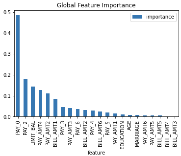

Explainer **parameters**:

- ``sample_size``
   - Sample size (default is ``100 000``).
- ``leakage_warning_threshold``
   - Threshold for showing potential data leakage in the most important feature.
     Data leakage occurs when a feature influences the target column
     too much. High feature importance value means that the model you trained with
     this dataset will not be predicting the target based on all features
     but rather on just one. More about feature data leakage (also target
     leakage) at `Target leakage H2O.ai Wiki <https://h2o.ai/wiki/target-leakage/>`_.

Explainer **result** directory description:

.. code-block:: text

    explainer_h2o_sonar_explainers_fi_naive_shapley_explainer_NaiveShapleyMojoFeatureImportanceExplainer_dbeeb343-7233-4153-a3da-8df0625b9925
    ├── global_feature_importance
    │   ├── application_json
    │   │   ├── explanation.json
    │   │   └── feature_importance_class_0.json
    │   ├── application_json.meta
    │   ├── application_vnd_h2oai_json_csv
    │   │   ├── explanation.json
    │   │   └── feature_importance_class_0.csv
    │   ├── application_vnd_h2oai_json_csv.meta
    │   ├── application_vnd_h2oai_json_datatable_jay
    │   │   ├── explanation.json
    │   │   └── feature_importance_class_0.jay
    │   └── application_vnd_h2oai_json_datatable_jay.meta
    ├── local_feature_importance
    │   ├── application_vnd_h2oai_json_datatable_jay
    │   │   ├── explanation.json
    │   │   ├── feature_importance_class_0.jay
    │   │   └── y_hat.bin
    │   └── application_vnd_h2oai_json_datatable_jay.meta
    ├── log
    │   └── explainer_run_dbeeb343-7233-4153-a3da-8df0625b9925.log
    ├── result_descriptor.json
    └── work
        ├── shapley_formatted_orig_feat.zip
        ├── shapley.orig.feat.bin
        ├── shapley.orig.feat.csv
        └── y_hat.bin

- ``explainer_.../work/y_hat``
   - Prediction for the dataset.
- ``explainer_.../work/shapley.orig.feat.bin``
   - Original model features importance as ``datatable`` frame.
- ``explainer_.../work/shapley.orig.feat.csv``
   - Original model features importance as CSV file.
- ``explainer_.../work/shapley_formatted_orig_feat.zip``
   - Archive with (re)formatted original features importance.

**Explanations** created by the explainer:

- ``global_feature_importance``
   - Original feature importance in JSon, CSV and ``datatable`` formats.
- ``local_feature_importance``
   - Local (per dataset row) original feature importance in the ``datatable`` format.

**Problems** reported by the explainer:

- **Potential feature importance leak**
   - The explainer reports a column with potential feature importance leak. Such column
     should be investigated and in case of the leak either removed from the dataset
     or weighted down in the model training process.
   - Problem severity: ``HIGH``.

See also:

- :ref:`Original Feature Importance Explainer for MOJO Models (Naive Shapley method) Demo`
- :ref:`Explainer Parameters`

Shapley Values for Transformed Features of MOJO Models Explainer
----------------------------------------------------------------
Shapley explanations are a technique with credible theoretical support
that presents consistent global and local variable contributions. Local
numeric Shapley values are calculated by tracing single rows of data
through a trained tree ensemble and aggregating the contribution of each
input variable as the row of data moves through the trained ensemble.
For regression tasks Shapley values sum to the prediction of the
(Driverless AI) MOJO model. For classification problems, Shapley values sum
to the prediction of the MOJO model before applying the link function.
Global Shapley values are the average of the absolute local Shapley values
over every row of a data set.

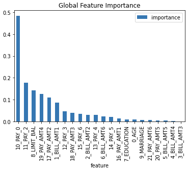

Explainer **parameters**:

- ``sample_size``
   - Sample size (default is ``100 000``).
- ``calculate_predictions``
   - Score dataset and include predictions in the explanation (local explanations
     speed-up cache).

Explainer **result** directory description:

.. code-block:: text

    explainer_h2o_sonar_explainers_transformed_fi_shapley_explainer_ShapleyMojoTransformedFeatureImportanceExplainer_3390cc51-3560-40c6-97c7-2980f2a77dae
    ├── global_feature_importance
    │   ├── application_json
    │   │   ├── explanation.json
    │   │   └── feature_importance_class_0.json
    │   ├── application_json.meta
    │   ├── application_vnd_h2oai_json_csv
    │   │   ├── explanation.json
    │   │   └── feature_importance_class_0.csv
    │   ├── application_vnd_h2oai_json_csv.meta
    │   ├── application_vnd_h2oai_json_datatable_jay
    │   │   ├── explanation.json
    │   │   └── feature_importance_class_0.jay
    │   └── application_vnd_h2oai_json_datatable_jay.meta
    ├── local_feature_importance
    │   ├── application_vnd_h2oai_json_datatable_jay
    │   │   ├── explanation.json
    │   │   └── feature_importance_class_0.jay
    │   └── application_vnd_h2oai_json_datatable_jay.meta
    ├── log
    │   └── explainer_run_3390cc51-3560-40c6-97c7-2980f2a77dae.log
    ├── result_descriptor.json
    └── work
        ├── shapley.bin
        ├── shapley.csv
        └── shapley_formatted.zip

- ``explainer_.../work/shapley.bin``
   - Transformed model features importance as ``datatable`` frame.
- ``explainer_.../work/shapley.csv``
   - Transformed model features importance as CSV file.
- ``explainer_.../work/shapley_formatted.zip``
   - Archive with (re)formatted transformed features importance.

**Explanations** created by the explainer:

- ``global_feature_importance``
   - Transformed feature importance in JSon, CSV and ``datatable`` formats.
- ``local_feature_importance``
   - Local (per dataset row) transformed feature importance in the ``datatable`` format.

**Problems** reported by the explainer:

- **Potential feature importance leak**
   - The explainer reports a column with potential feature importance leak. Such column
     should be investigated and in case of the leak associated original features analyzed.
   - Problem severity: ``HIGH``.

See also:

- :ref:`Shapley Values for Transformed Features of MOJO Models Demo`
- :ref:`Explainer Parameters`

Partial Dependence/Individual Conditional Expectations (PD/ICE) Explainer
-------------------------------------------------------------------------
Partial dependence plot (PDP) portrays the average prediction
behavior of the model across the domain of an input variable along with +/- 1
standard deviation bands. Individual Conditional Expectations plot (ICE) displays
the prediction behavior for an individual row of data when an input variable is
toggled across its domain.

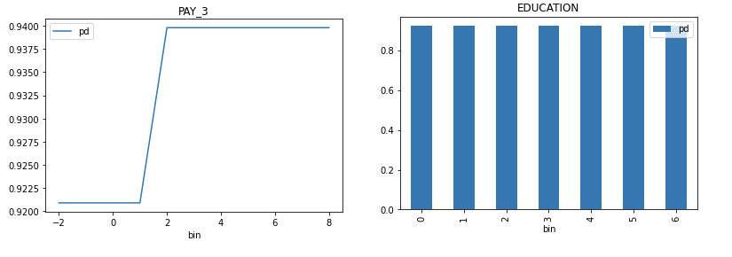

Explainer **parameters**:

- ``sample_size``
   - Sample size (default is ``100 000``).
- ``max_features``
   - Partial Dependence Plot number of features (to see all features used by model
     set to ``-1``).
- ``features``
   - Partial Dependence Plot feature list.
- ``grid_resolution``
   - Partial Dependence Plot observations per bin (number of equally spaced points
     used to create bins).
- ``oor_grid_resolution``
   - Partial Dependence Plot number of out of range bins.
- ``center``
   - Center Partial Dependence Plot using ICE centered at 0.
- ``sort_bins``
   - Ensure bin values sorting.
- ``quantile-bin-grid-resolution``
   - Partial Dependence Plot quantile binning (total quantile points used to create
     bins).
- ``quantile-bins``
   - Per-feature quantile binning.
   - Example: if choosing features ``F1`` and ``F2``, this parameter is
     ``{"F1": 2,"F2": 5}``. Note, you can set all features to use the same
     quantile binning with the "Partial Dependence Plot quantile binning" parameter
     and then adjust the quantile binning for a subset of PDP features with
     this parameter.
- ``histograms``
   - Enable or disable histograms.
- ``numcat_num_chart``
   - Unique feature values count driven Partial Dependence Plot binning and chart
     selection.
- ``numcat_threshold``
   - Threshold for Partial Dependence Plot binning and chart selection
     (<= threshold categorical, > threshold numeric).

Explainer **result** directory description:

.. code-block:: text

    explainer_h2o_sonar_explainers_pd_ice_explainer_PdIceExplainer_ee264725-cdab-476c-bad5-02cf778e1c1e
    ├── global_partial_dependence
    │   ├── application_json
    │   │   ├── explanation.json
    │   │   ├── pd_feature_0_class_0.json
    │   │   ├── pd_feature_1_class_0.json
    │   │   ├── pd_feature_2_class_0.json
    │   │   ├── pd_feature_3_class_0.json
    │   │   ├── pd_feature_4_class_0.json
    │   │   ├── pd_feature_5_class_0.json
    │   │   ├── pd_feature_6_class_0.json
    │   │   ├── pd_feature_7_class_0.json
    │   │   ├── pd_feature_8_class_0.json
    │   │   └── pd_feature_9_class_0.json
    │   └── application_json.meta
    ├── local_individual_conditional_explanation
    │   ├── application_vnd_h2oai_json_datatable_jay
    │   │   ├── explanation.json
    │   │   ├── ice_feature_0_class_0.jay
    │   │   ├── ice_feature_1_class_0.jay
    │   │   ├── ice_feature_2_class_0.jay
    │   │   ├── ice_feature_3_class_0.jay
    │   │   ├── ice_feature_4_class_0.jay
    │   │   ├── ice_feature_5_class_0.jay
    │   │   ├── ice_feature_6_class_0.jay
    │   │   ├── ice_feature_7_class_0.jay
    │   │   ├── ice_feature_8_class_0.jay
    │   │   ├── ice_feature_9_class_0.jay
    │   │   └── y_hat.jay
    │   └── application_vnd_h2oai_json_datatable_jay.meta
    ├── log
    │   └── explainer_run_ee264725-cdab-476c-bad5-02cf778e1c1e.log
    ├── result_descriptor.json
    └── work
        ├── h2o_sonar-ice-dai-model-10.jay
        ├── h2o_sonar-ice-dai-model-1.jay
        ├── h2o_sonar-ice-dai-model-2.jay
        ├── h2o_sonar-ice-dai-model-3.jay
        ├── h2o_sonar-ice-dai-model-4.jay
        ├── h2o_sonar-ice-dai-model-5.jay
        ├── h2o_sonar-ice-dai-model-6.jay
        ├── h2o_sonar-ice-dai-model-7.jay
        ├── h2o_sonar-ice-dai-model-8.jay
        ├── h2o_sonar-ice-dai-model-9.jay
        ├── h2o_sonar-ice-dai-model.json
        ├── h2o_sonar-pd-dai-model.json
        └── mli_dataset_y_hat.jay

- ``explainer_.../work/``
   - Data artifacts used to calculate PD and ICE.

**Explanations** created by the explainer:

- ``global_partial_dependence``
   - Per-feature partial dependence explanation in JSon format.
- ``local_individual_conditional_explanation``
   - Per-feature individual conditional expectation explanation in JSon
     and ``datatable`` format.

PD/ICE explainer **binning**:

- **Integer** feature:
    * bins in **numeric** mode:
        * bins are integers
        * (at most) `grid_resolution` integer values in between minimum and maximum
          of feature values
        * bin values are created as evenly as possible
        * minimum and maximum is included in bins
          (if `grid_resolution` is bigger or equal to 2)
    * bins in **categorical** mode:
        * bins are integers
        * top `grid_resolution` values from feature values ordered by frequency
          (int values are converted to strings and most frequent values are used
          as bins)
    * quantile bins in **numeric** mode:
        * bins are integers
        * bin values are created with the aim that there will be the same number of
          observations per bin
        * q-quantile used to created ``q`` bins where ``q`` is specified by PD parameter
    * quantile bins in **categorical** mode:
        * not supported
- **Float** feature:
    * bins in **numeric** mode:
        * bins are floats
        * `grid_resolution` float values in between minimum and maximum of feature
           values
        * bin values are created as evenly as possible
        * minimum and maximum is included in bins
          (if `grid_resolution` is bigger or equal to 2)
    * bins in **categorical** mode:
        * bins are floats
        * top `grid_resolution` values from feature values ordered by frequency
          (float values are converted to strings and most frequent values are used
          as bins)
    * quantile bins in **numeric** mode:
        * bins are floats
        * bin values are created with the aim that there will be the same number of
          observations per bin
        * q-quantile used to created ``q`` bins where ``q`` is specified by PD parameter
    * quantile bins in **categorical** mode:
        * not supported
- **String** feature:
    * bins in **numeric** mode:
        * not supported
    * bins in **categorical** mode:
        * bins are strings
        * top `grid_resolution` values from feature values ordered by frequency
    * quantile bins:
        * not supported
- **Date/datetime** feature:
    * bins in **numeric** mode:
        * bins are dates
        * `grid_resolution` date values in between minimum and maximum of feature
          values
        * bin values are created as evenly as possible:
            1. dates are parsed and converted to epoch timestamps i.e integers
            2. bins are created as in case of numeric integer binning
            3. integer bins are converted back to original date format
        * minimum and maximum is included in bins
          (if `grid_resolution` is bigger or equal to 2)
    * bins in **categorical** mode:
        * bins are dates
        * top `grid_resolution` values from feature values ordered by frequency
          (dates are handled as opaque strings and most frequent values are used
          as bins)
    * quantile bins:
        * not supported

PD/ICE explainer **out of range binning**:

- **Integer** feature:
    * OOR bins in **numeric** mode:

        * OOR bins are integers
        * (at most) `oor_grid_resolution` integer values are added below minimum and
          above maximum
        * bin values are created by adding/substracting rounded standard deviation
          (of feature values) above and below maximum and minimum `oor_grid_resolution`
          times

          * 1 used used if rounded standard deviation would be 0

        * if feature is of unsigned integer type, then bins below 0
          are not created

          * if rounded standard deviation and/or `oor_grid_resolution` is so high
            that it would cause lower OOR bins to be negative numbers, then standard
            deviation of size 1 is tried instead
    * OOR bins in **categorical** mode:
        * same as numeric mode
- **Float** feature:
    * OOR bins in **numeric** mode:
        * OOR bins are floats
        * `oor_grid_resolution` float values are added below minimum and above maximum
        * bin values are created by adding/substracting standard deviation
          (of feature values) above and below maximum and minimum `oor_grid_resolution`
          times
    * OOR bins in **categorical** mode:
        * same as numeric mode
- **String** feature:
    * bins in **numeric** mode:
        * not supported
    * bins in **categorical** mode:
        * OOR bins are strings
        * value `UNSEEN` is added as OOR bin
- **Date** feature:
    * bins in **numeric** mode:
        * not supported
    * bins in **categorical** mode:
        * OOR bins are strings
        * value `UNSEEN` is added as OOR bin

See also:

- :ref:`Partial dependence / Individual Conditional Expectation (PD/ICE) Explainer Demo`
- :ref:`Explainer Parameters`

Partial Dependence for 2 Features Explainer
-------------------------------------------------------------------------
Partial dependence for 2 features portrays the average
prediction behavior of a model across the domains of two input variables
i.e. interaction of feature tuples with the prediction. While PD for one feature
produces 2D plot, PD for two features produces 3D plots. This explainer plots PD for
two features using heatmap, contour 3D or surface 3D.

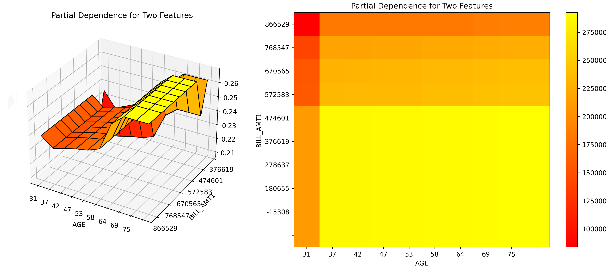

Explainer **parameters**:

- ``sample_size``
   - Sample size (default is ``100 000``).
- ``max_features``
   - Partial Dependence Plot number of features (to see all features used by model
     set to ``-1``).
- ``features``
   - Partial Dependence Plot feature list.
- ``grid_resolution``
   - Partial Dependence Plot observations per bin (number of equally spaced points
     used to create bins).
- ``oor_grid_resolution``
   - Partial Dependence Plot number of out of range bins.
- ``quantile-bin-grid-resolution``
   - Partial Dependence Plot quantile binning (total quantile points used to create
     bins).
- ``plot_type``
   - Plot type to be used for Partial Dependence rendering - ``heatmap``,
     ``contour-3d`` or ``surface-3d``.

Explainer **result** directory description:

.. code-block:: text

    explainer_h2o_sonar_explainers_pd_2_features_explainer_PdFor2FeaturesExplainer_f710d221-64dc-4dc3-8e1f-2922d5a32cab
    ├── global_3d_data
    │   ├── application_json
    │   │   ├── data3d_feature_0_class_0.json
    │   │   ├── data3d_feature_1_class_0.json
    │   │   ├── data3d_feature_2_class_0.json
    │   │   ├── data3d_feature_3_class_0.json
    │   │   ├── data3d_feature_4_class_0.json
    │   │   ├── data3d_feature_5_class_0.json
    │   │   └── explanation.json
    │   ├── application_json.meta
    │   ├── application_vnd_h2oai_json_csv
    │   │   ├── data3d_feature_0_class_0.csv
    │   │   ├── data3d_feature_1_class_0.csv
    │   │   ├── data3d_feature_2_class_0.csv
    │   │   ├── data3d_feature_3_class_0.csv
    │   │   ├── data3d_feature_4_class_0.csv
    │   │   ├── data3d_feature_5_class_0.csv
    │   │   └── explanation.json
    │   └── application_vnd_h2oai_json_csv.meta
    ├── global_html_fragment
    │   ├── text_html
    │   │   ├── explanation.html
    │   │   ├── image-0.png
    │   │   ├── image-1.png
    │   │   ├── image-2.png
    │   │   ├── image-3.png
    │   │   ├── image-4.png
    │   │   └── image-5.png
    │   └── text_html.meta
    ├── global_report
    │   ├── text_markdown
    │   │   ├── explanation.md
    │   │   ├── image-0.png
    │   │   ├── image-1.png
    │   │   ├── image-2.png
    │   │   ├── image-3.png
    │   │   ├── image-4.png
    │   │   └── image-5.png
    │   └── text_markdown.meta
    ├── log
    │   └── explainer_run_f710d221-64dc-4dc3-8e1f-2922d5a32cab.log
    ├── model_problems
    │   └── problems_and_actions.json
    ├── result_descriptor.json
    └── work
        ├── ...
        └── report.md

- ``explainer_.../work/``
   - Data artifacts used to calculate the PD for 2 features.

**Explanations** created by the explainer:

- ``global_3d_data``
   - Per-feature tuple partial dependence explanation in JSon and CSV format.
- ``global_report``
   - Per-feature tuple partial dependence report in Markdown format.
- ``global_html_fragment``
   - Per-feature tuple partial dependence report as HTML snippet.

See also:

- :ref:`Partial Dependence for 2 Features Explainer Demo`
- :ref:`Explainer Parameters`

Residual Partial Dependence/Individual Conditional Expectations (PD/ICE) Explainer
----------------------------------------------------------------------------------
The **residual** partial dependence plot (PDP) indicates which variables interact most
with the error. Residuals are differences between observed and predicted
values - the square of the difference between observed and predicted values is used.
The residual partial dependence is created using normal partial dependence algorithm,
while instead of prediction is used the residual. Individual Conditional Expectations
plot (ICE) displays the interaction with error for an individual row of data when an
input variable is toggled across its domain.

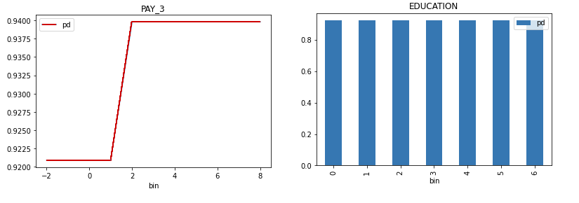

Explainer **parameters**:

- ``sample_size``
   - Sample size (default is ``100 000``).
- ``max_features``
   - Residual Partial Dependence Plot number of features (to see all features used by model
     set to ``-1``).
- ``features``
   - Residual Partial Dependence Plot feature list.
- ``grid_resolution``
   - Residual Partial Dependence Plot observations per bin (number of equally spaced points
     used to create bins).
- ``oor_grid_resolution``
   - Residual Partial Dependence Plot number of out of range bins.
- ``center``
   - Center Partial Dependence Plot using ICE centered at 0.
- ``sort_bins``
   - Ensure bin values sorting.
- ``quantile-bin-grid-resolution``
   - Residual Partial Dependence Plot quantile binning (total quantile points used to create
     bins).
- ``quantile-bins``
   - Per-feature quantile binning.
   - Example: if choosing features ``F1`` and ``F2``, this parameter is
     ``{"F1": 2,"F2": 5}``. Note, you can set all features to use the same
     quantile binning with the "Partial Dependence Plot quantile binning" parameter
     and then adjust the quantile binning for a subset of PDP features with
     this parameter.
- ``histograms``
   - Enable or disable histograms.
- ``numcat_num_chart``
   - Unique feature values count driven Partial Dependence Plot binning and chart
     selection.
- ``numcat_threshold``
   - Threshold for Partial Dependence Plot binning and chart selection
     (<= threshold categorical, > threshold numeric).

Explainer **result** directory description:

.. code-block:: text

    tree explainer_h2o_sonar_explainers_residual_pd_ice_explainer_ResidualPdIceExplainer_40eb4da9-4a68-4782-9a70-22c6f7984846
    explainer_h2o_sonar_explainers_residual_pd_ice_explainer_ResidualPdIceExplainer_40eb4da9-4a68-4782-9a70-22c6f7984846
    ├── global_html_fragment
    │   ├── text_html
    │   │   ├── explanation.html
    │   │   ├── pd-class-1-feature-10.png
    │   │   ├── pd-class-1-feature-1.png
    │   │   ├── pd-class-1-feature-2.png
    │   │   ├── pd-class-1-feature-3.png
    │   │   ├── pd-class-1-feature-4.png
    │   │   ├── pd-class-1-feature-5.png
    │   │   ├── pd-class-1-feature-6.png
    │   │   ├── pd-class-1-feature-7.png
    │   │   ├── pd-class-1-feature-8.png
    │   │   └── pd-class-1-feature-9.png
    │   └── text_html.meta
    ├── global_partial_dependence
    │   ├── application_json
    │   │   ├── explanation.json
    │   │   ├── pd_feature_0_class_0.json
    │   │   ├── pd_feature_1_class_0.json
    │   │   ├── pd_feature_2_class_0.json
    │   │   ├── pd_feature_3_class_0.json
    │   │   ├── pd_feature_4_class_0.json
    │   │   ├── pd_feature_5_class_0.json
    │   │   ├── pd_feature_6_class_0.json
    │   │   ├── pd_feature_7_class_0.json
    │   │   ├── pd_feature_8_class_0.json
    │   │   └── pd_feature_9_class_0.json
    │   └── application_json.meta
    ├── local_individual_conditional_explanation
    │   ├── application_vnd_h2oai_json_datatable_jay
    │   │   ├── explanation.json
    │   │   ├── ice_feature_0_class_0.jay
    │   │   ├── ice_feature_1_class_0.jay
    │   │   ├── ice_feature_2_class_0.jay
    │   │   ├── ice_feature_3_class_0.jay
    │   │   ├── ice_feature_4_class_0.jay
    │   │   ├── ice_feature_5_class_0.jay
    │   │   ├── ice_feature_6_class_0.jay
    │   │   ├── ice_feature_7_class_0.jay
    │   │   ├── ice_feature_8_class_0.jay
    │   │   ├── ice_feature_9_class_0.jay
    │   │   └── y_hat.jay
    │   └── application_vnd_h2oai_json_datatable_jay.meta
    ├── log
    │   └── explainer_run_40eb4da9-4a68-4782-9a70-22c6f7984846.log
    ├── model_problems
    │   └── problems_and_actions.json
    ├── result_descriptor.json
    └── work
        ├── h2o_sonar-ice-dai-model-10.jay
        ├── h2o_sonar-ice-dai-model-1.jay
        ├── h2o_sonar-ice-dai-model-2.jay
        ├── h2o_sonar-ice-dai-model-3.jay
        ├── h2o_sonar-ice-dai-model-4.jay
        ├── h2o_sonar-ice-dai-model-5.jay
        ├── h2o_sonar-ice-dai-model-6.jay
        ├── h2o_sonar-ice-dai-model-7.jay
        ├── h2o_sonar-ice-dai-model-8.jay
        ├── h2o_sonar-ice-dai-model-9.jay
        ├── h2o_sonar-ice-dai-model.json
        ├── h2o_sonar-pd-dai-model.json
        └── mli_dataset_y_hat.jay

- ``explainer_.../work/``
   - Data artifacts used to calculate residual PD and ICE.

**Explanations** created by the explainer:

- ``global_partial_dependence``
   - Per-feature residual partial dependence explanation in JSon format.
- ``local_individual_conditional_explanation``
   - Per-feature residual individual conditional expectation explanation in JSon
     and ``datatable`` format.

Residual PD/ICE explainer **binning** is the same as in case of
:ref:`Partial Dependence/Individual Conditional Expectations (PD/ICE) Explainer`.

**Problems** reported by the explainer:

- **Highest interaction between a feature and the error**
   - The explainer reports a column with highest interaction with the error. This column
     (feature) should be investigated to determine whether it indicates a problem with the model.
   - Problem severity: ``MEDIUM``.

See also:

- :ref:`Residual Partial dependence / Individual Conditional Expectation (PD/ICE) Explainer Demo`
- :ref:`Explainer Parameters`

Disparate Impact Analysis (DIA) Explainer
-----------------------------------------
Disparate Impact Analysis (DIA) is a technique that is used to evaluate fairness.
Bias can be introduced to models during the process of collecting, processing,
and labeling data as a result, it is important to determine whether a model is
harming certain users by making a significant number of biased decisions.
DIA typically works by comparing aggregate measurements of unprivileged groups to
a privileged group. For instance, the proportion of the unprivileged group
that receives the potentially harmful outcome is divided by the proportion
of the privileged group that receives the same outcome - the resulting
proportion is then used to determine whether the model is biased.

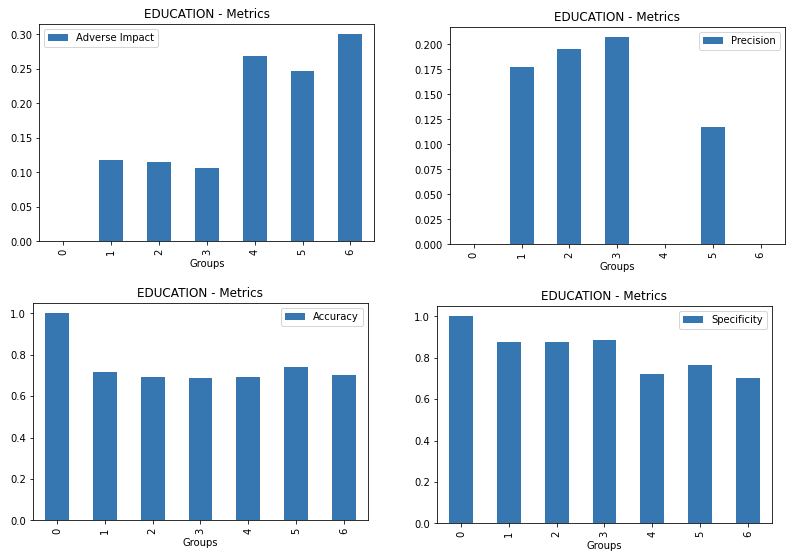

Explainer **parameters**:

- ``dia_cols``
   - List of features for which to compute DIA.
- ``cut_off``
   - Cut off.
- ``maximize_metric``
   - Maximize metric - one of ``F1``, ``F05``, ``F2``, ``MCC`` (default is ``F1``).
- ``sample_size``
   - Sample size (default is ``100 000``).
- ``max_cardinality``
   - Max cardinality for categorical variables (default is ``10``).
- ``min_cardinality``
   - Min cardinality for categorical variables (default is ``2``).
- ``num_card``
   - Max cardinality for numeric variables to be considered categorical (default is ``25``).

Explainer **result** directory description:

.. code-block:: text

    explainer_h2o_sonar_explainers_dia_explainer_DiaExplainer_f1600947-05bc-4ae0-a396-d69dfca9d7c7
    ├── global_disparate_impact_analysis
    │   ├── text_plain
    │   │   └── explanation.txt
    │   └── text_plain.meta
    ├── log
    │   └── explainer_run_f1600947-05bc-4ae0-a396-d69dfca9d7c7.log
    ├── result_descriptor.json
    └── work
        ├── dia_entity.json
        ├── EDUCATION
        │   ├── 0
        │   │   ├── cm.jay
        │   │   ├── disparity.jay
        │   │   ├── me_smd.jay
        │   │   └── parity.jay
        │   ├── 1
        │   │   ├── cm.jay
        │   │   ├── disparity.jay
        │   │   ├── me_smd.jay
        │   │   └── parity.jay
        │   ├── 2
        │   │   ├── cm.jay
        │   │   ├── disparity.jay
        │   │   ├── me_smd.jay
        │   │   └── parity.jay
        │   ├── 3
        │   │   ├── cm.jay
        │   │   ├── disparity.jay
        │   │   ├── me_smd.jay
        │   │   └── parity.jay
        │   ├── 4
        │   │   ├── cm.jay
        │   │   ├── disparity.jay
        │   │   ├── me_smd.jay
        │   │   └── parity.jay
        │   ├── 5
        │   │   ├── cm.jay
        │   │   ├── disparity.jay
        │   │   ├── me_smd.jay
        │   │   └── parity.jay
        │   ├── 6
        │   │   ├── cm.jay
        │   │   ├── disparity.jay
        │   │   ├── me_smd.jay
        │   │   └── parity.jay
        │   └── metrics.jay
        ├── MARRIAGE
        ...
        └── SEX
            ├── 0
            │   ├── cm.jay
            │   ├── disparity.jay
            │   ├── me_smd.jay
            │   └── parity.jay
            ├── 1
            │   ├── cm.jay
            │   ├── disparity.jay
            │   ├── me_smd.jay
            │   └── parity.jay
            └── metrics.jay

- ``explainer_.../work/<feature name/``
   - Per feature directory with Disparate Impact Analysis metrics family - like
     disparity, parity, SMD and CM - for each feature value (group) in ``datatable``
     format.

**Explanations** created by the explainer:

- ``global_disparate_impact_analysis``
   - Disparate impact analysis explanation.

See also:

- :ref:`Disparate Impact Analysis (DIA) Explainer Demo`
- :ref:`Explainer Parameters`

Morris sensitivity analysis Explainer
-------------------------------------
Morris sensitivity analysis (SA) explainer provides Morris sensitivity
analysis based feature importance which is a measure of the contribution of
an input variable to the overall predictions of the model. In applied
statistics, the Morris method for global sensitivity analysis is a so-called
one-step-at-a-time method (OAT), meaning that in each run only one input
parameter is given a new value. This explainer is based based on InterpretML
library - see `interpret.ml <http://interpret.ml>`_.

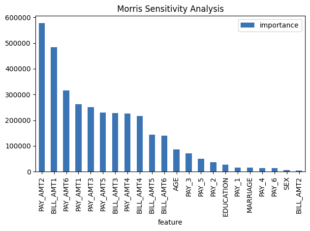

Package requirements:

* install ``interpret`` library as it is not installed with H2O Sonar by default:

.. code-block:: text

    pip install interpret

Explainer **parameters**:

- ``leakage_warning_threshold``
   - Threshold for showing potential data leakage in the most important feature.
     Data leakage occurs when a feature influences the target column
     too much. High feature importance value means that the model you trained with
     this dataset will not be predicting the target based on all features
     but rather on just one. More about feature data leakage (also target
     leakage) at `Target leakage H2O.ai Wiki <https://h2o.ai/wiki/target-leakage/>`_.

Explainer **result** directory description:

.. code-block:: text

    explainer_h2o_sonar_explainers_morris_sa_explainer_MorrisSensitivityAnalysisExplainer_f4da0294-8c2b-4195-a567-bd4b65a01227
    ├── global_feature_importance
    │   ├── application_json
    │   │   ├── explanation.json
    │   │   └── feature_importance_class_0.json
    │   ├── application_json.meta
    │   ├── application_vnd_h2oai_json_datatable_jay
    │   │   ├── explanation.json
    │   │   └── feature_importance_class_0.jay
    │   └── application_vnd_h2oai_json_datatable_jay.meta
    ├── global_html_fragment
    │   ├── text_html
    │   │   ├── explanation.html
    │   │   └── fi-class-0.png
    │   └── text_html.meta
    ├── log
    │   └── explainer_run_f4da0294-8c2b-4195-a567-bd4b65a01227.log
    ├── result_descriptor.json
    └── work

**Explanations** created by the explainer:

- ``global_feature_importance``
   - Feature interactions in JSon format.
- ``global_html_fragment``
   - Feature interactions in HTML format.

**Problems** reported by the explainer:

- **Potential feature importance leak**
   - The explainer reports a column with potential feature importance leak. Such column
     should be investigated and in case of the leak either removed from the dataset
     or weighted down in the model training process.
   - Problem severity: ``HIGH``.

See also:

- :ref:`Morris Sensitivity Analysis Explainer Demo`
- :ref:`Explainer Parameters`

Friedman's H-statistic Explainer
--------------------------------
The explainer provides implementation of Friedman's H-statistic feature interactions.
The statistic is 0 when there is no interaction at all and 1 if all the variance of
the predict function is explained by a sum of the partial dependence functions.
More information about Friedman's H-Statistic method is available
at `Theory: Friedman's H-statistic <https://christophm.github.io/interpretable-ml-book/interaction.html#theory-friedmans-h-statistic>`_.

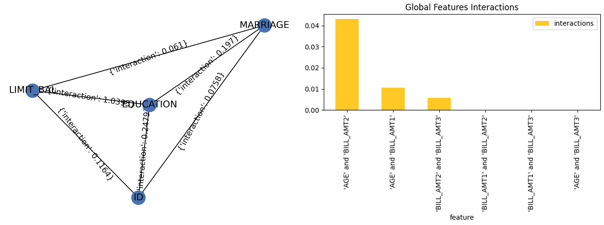

Explainer **parameters**:

- ``features_number``
   - Maximum number of features for which to calculate Friedman's H-statistic
     (must be at least ``2``).
- ``features``
   - List of features for which to calculate Friedman's H-statistic (must be at
     least ``2``, overrides ``features_number``).
- ``grid_resolution``
   - Friedman's H-statistic observations per bin (number of equally spaced points
     used to create bins).

Explainer **result** directory description:

.. code-block:: text

    explainer_h2o_sonar_explainers_friedman_h_statistic_explainer_FriedmanHStatisticExplainer_579aa93f-4f80-446f-ba21-815304ccee9c
    ├── global_feature_importance
    │   ├── application_json
    │   │   ├── explanation.json
    │   │   └── feature_importance_class_0.json
    │   ├── application_json.meta
    │   ├── application_vnd_h2oai_json_csv
    │   │   ├── explanation.json
    │   │   └── feature_importance_class_0.csv
    │   ├── application_vnd_h2oai_json_csv.meta
    │   ├── application_vnd_h2oai_json_datatable_jay
    │   │   ├── explanation.json
    │   │   └── feature_importance_class_0.jay
    │   └── application_vnd_h2oai_json_datatable_jay.meta
    ├── global_html_fragment
    │   ├── text_html
    │   │   ├── explanation.html
    │   │   └── fi-class-0.png
    │   └── text_html.meta
    ├── global_report
    │   ├── text_markdown
    │   │   ├── explanation.md
    │   │   └── image.png
    │   └── text_markdown.meta
    ├── log
    │   └── explainer_run_579aa93f-4f80-446f-ba21-815304ccee9c.log
    ├── result_descriptor.json
    └── work
        ├── image.png
        └── report.md

**Explanations** created by the explainer:

- ``global_feature_importance``
   - Feature interactions in JSon, CSV and ``datatable`` formats.
- ``global_html_fragment``
   - Feature interactions in HTML format.
- ``global_report``
   - Feature interactions in Markdown format.

See also:

- :ref:`Friedman H-statistic Explainer Demo`
- :ref:`Explainer Parameters`

Dataset and Model Insights Explainer
------------------------------------
The explainer checks the dataset and model for various issues.
For example, it provides problems and actions for missing values
in the target column and a low number of unique values across
columns of a dataset.

Explainer **result** directory description:

.. code-block:: text

     explainer_h2o_sonar_explainers_dataset_and_model_insights_DatasetAndModelInsights_e222f392-9a55-41fb-ab51-d45cc6bd35db/
     ├── global_text_explanation
     │   ├── text_plain
     │   │   └── explanation.txt
     │   └── text_plain.meta
     ├── log
     │   └── explainer_run_e222f392-9a55-41fb-ab51-d45cc6bd35db.log
     ├── model_problems
     │   └── problems_and_actions.json
     ├── result_descriptor.json
     └── work

**Problems** reported by the explainer:

- **Missing values in the target column**
   - The explainer reports missing values in the target column. Rows with the missing
     values in the target column should be removed from the dataset.
   - Problem severity: ``LOW`` - ``HIGH`` (based on the number of impacted columns).
- **Features with potentially insufficient number of unique values**
   - The explainer reports columns with 1 unique value only. Such columns should be either removed
     from the dataset or its missing values (if any) replaced with valid values.
   - Problem severity: ``LOW`` - ``HIGH`` (based on the number of impacted columns).

See also:

- :ref:`Dataset and Model Insights Explainer Demo`

Adversarial Similarity Explainer
--------------------------------
This explainer is based on the adversarial similarity `H2O Model Validation <https://docs.h2o.ai/wave-apps/h2o-model-validation/>`_ test.

Adversarial similarity refers to a validation test that assists in observing
feature distribution of two different datasets can indicate similarity
or dissimilarity. An adversarial similarity test can be performed rather
than going over all the features individually to observe the differences.
During an adversarial similarity test, decision tree algorithms are
leveraged to find similar or dissimilar rows between the train dataset
and any dataset with the same train columns.

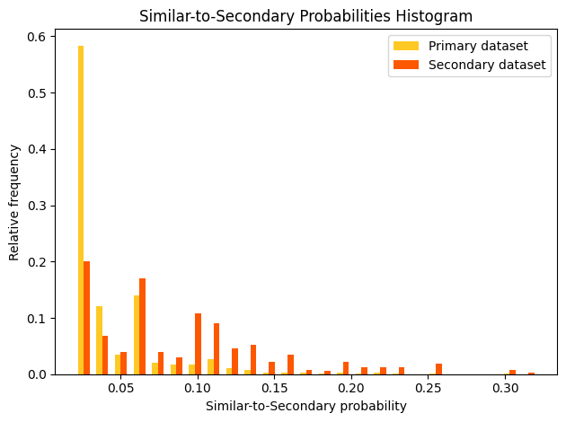

Explainer **parameters**:

- ``worker_connection_key``
   - Optional :ref:`connection ID of the Driverless AI worker<Library Configuration>`
     configured in the H2O Sonar configuration.
     Supported are Driverless AI servers hosted by H2O AIEM or H2O Enterprise Steam,
     or Driverless AI servers that use username and password authentication.
- ``shapley_values``
   - Determines whether to compute Shapley values
     for the model used to analyze the similarity between the
     Primary and Secondary Dataset. Test uses the generated Shapley
     values to create an array of visual metrics that provide valuable
     insights into the contribution of individual features to the overall
     model performance.
- ``drop_cols``
   - Defines the columns to drop during model training.

The explainer can be run using the **Python API** as follows:

.. code-block:: python

   # configure Driverless AI server to serve as a host of artifacts (datasets, models) and/or worker
   DAI_CONNECTION = h2o_sonar_config.ConnectionConfig(
      key="local-driverless-ai-server",  # ID is generated from the connection name (NCName)
      connection_type=h2o_sonar_config.ConnectionConfigType.DRIVERLESS_AI_AIEM.name,
      name="My H2O AIEM hosted Driverless AI ",
      description="Driverless AI server hosted by H2O Enterprise AIEM.",
      server_url="https://enginemanager.cloud.h2o.ai/",
      server_id="new-dai-engine-42",
      environment_url="https://cloud.h2o.ai",
      username="firstname.lastname@h2o.ai",
      token=os.getenv(KEY_AIEM_REFRESH_TOKEN_CLOUD),
      token_use_type=h2o_sonar_config.TokenUseType.REFRESH_TOKEN.name,
   )
   # add the connection to the H2O Sonar configuration
   h2o_sonar_config.config.add_connection(DAI_CONNECTION)

   # run the explainer (model and datasets provided as handles as they are hosted by the Driverless AI server)
   interpretation = interpret.run_interpretation(
      model=f"resource:connection:{DAI_CONNECTION.key}:key:7965e2ea-f898-11ed-b979-106530ed5ceb",
      dataset=f"resource:connection:{DAI_CONNECTION.key}:key:8965e2ea-f898-11ed-b979-106530ed5ceb",
      testset=f"resource:connection:{DAI_CONNECTION.key}:key:9965e2ea-f898-11ed-b979-106530ed5ceb",
      target_col="Weekly_Sales",
      explainers=[
         commons.ExplainerToRun(
               explainer_id=AdversarialSimilarityExplainer.explainer_id(),
               params={
                  "worker_connection_key": DAI_CONNECTION.key,
                  "shapley_values": False,
               },
         )
      ],
      results_location="./h2o-sonar-results",
   )

The explainer can be run using the **command line interface** (CLI) as follows:

.. code-block:: text

   h2o-sonar run interpretation
   --explainers h2o_sonar.explainers.adversarial_similarity_explainer.AdversarialSimilarityExplainer
   --explainers-pars '{
      "h2o_sonar.explainers.adversarial_similarity_explainer.AdversarialSimilarityExplainer": {
         "worker_connection_key": "local-driverless-ai-server",
         "shapley_values": false,
      }
   }'
   --model "resource:connection:local-driverless-ai-server:key:7965e2ea-f898-11ed-b979-106530ed5ceb"
   --dataset "resource:connection:local-driverless-ai-server:key:695f5d5e-f898-11ed-b979-106530ed5ceb"
   --testset "resource:connection:local-driverless-ai-server:key:695df75c-f898-11ed-b979-106530ed5ceb"
   --target-col "Weekly_Sales"
   --results-location "./h2o-sonar-results"
   --config-path "./h2o-sonar-config.json"
   --encryption-key "secret-key-to-decrypt-encrypted-config-fields"

Explainer **result** directory description:

.. code-block:: text

   explainer_h2o_sonar_explainers_adversarial_similarity_explainer_AdversarialSimilarityExplainer_d473b5c0-02a3-4971-905a-adb9841a0958
   ├── global_grouped_bar_chart
   │   ├── application_vnd_h2oai_json_datatable_jay
   │   │   ├── explanation.json
   │   │   └── feature_importance_class_0.jay
   │   └── application_vnd_h2oai_json_datatable_jay.meta
   ├── global_html_fragment
   │   ├── text_html
   │   │   ├── explanation.html
   │   │   └── fi-class-0.png
   │   └── text_html.meta
   ├── global_work_dir_archive
   │   ├── application_zip
   │   │   └── explanation.zip
   │   └── application_zip.meta
   ├── log
   │   └── explainer_run_d473b5c0-02a3-4971-905a-adb9841a0958.log
   ├── model_problems
   │   └── problems_and_actions.json
   ├── result_descriptor.json
   └── work

**Explanations** created by the explainer:

- ``global_grouped_bar_chart``
   - Similar-to-secondary probabilities histogram in the ``datatable`` format.
- ``global_html_fragment``
   - Adversarial similarity in the HTML format.
- ``global_work_dir_archive``
   - All explanations created by the explainer stored in a ZIP archive.

See also:

- `H2O Model Validation: Adversarial Similarity <https://docs.h2o.ai/wave-apps/h2o-model-validation/guide/tests/supported-validation-tests/adversarial-similarity/adversarial-similarity>`_ documentation
- :ref:`H2O Sonar Model Validation Explainers`
- :ref:`Library Configuration`

Backtesting Explainer
---------------------
This explainer is based on the backtesting `H2O Model Validation <https://docs.h2o.ai/wave-apps/h2o-model-validation/>`_ test.

A backtesting test enables you to assess the robustness of
a model using the existing historical training data through a series of iterative
training where training data is used from its recent to oldest collected values.

Explainer performs a backtesting test by fitting a predictive model with a training
dataset to later assess the model with a separate test dataset where the test
dataset does not overlap with the training data. Frequently, the training data is
collected over time and has an explicit time dimension. In such cases, utilizing
the most recent dataset points for the model test dataset is common practice,
as it better mimics a real model application.

By applying a backtesting test to a model, we can refit the model multiple times,
where every time, we use shorter time spans of the training data while using
a portion of that data as test data. As a result, the test dataset is replaced with
a series of values over time.

A backtesting test enables you to:

* Understand the variance of the model accuracy
* Understand and visualize how the model accuracy develops over time
* Identify potential reasons for any performance issues with the modeling approach
  in the past (for example, problems around data collection)

Each iteration during backtesting, the model is fully refitted, which includes
a rerun of feature engineering and feature selection. Not entirely refitting during
each iteration results in an incorrect backtesting outcome because the next iteration
would have selected features based on the entire data. An incorrect backtesting
outcome also leads to data leakage where information from the future is explicitly
or implicitly reflected in the current variables.

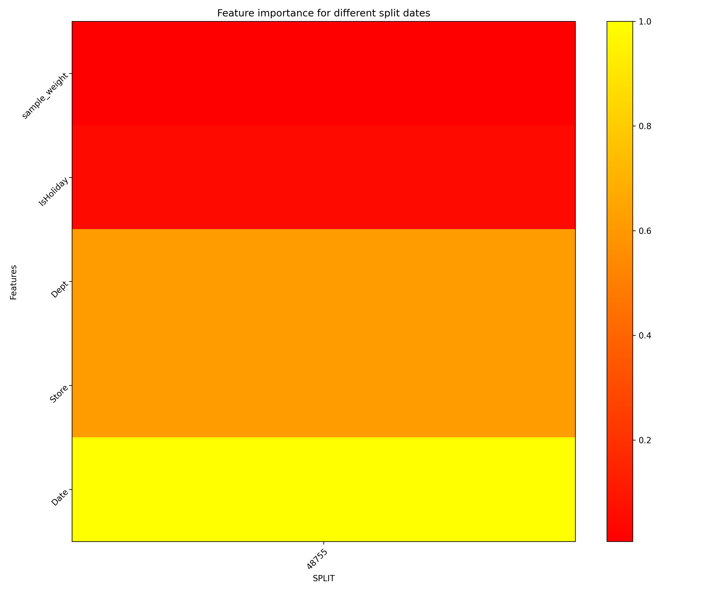

Explainer **parameters**:

- ``worker_connection_key``
   - The :ref:`connection ID of the Driverless AI worker<Library Configuration>`
     configured in the H2O Sonar configuration.
     Supported are Driverless AI servers hosted by H2O AIEM or H2O Enterprise Steam,
     or Driverless AI servers that use username and password authentication.
- ``time_col``
   - Defines the time column in the primary dataset that the explainer
     utilizes to split the primary dataset (training dataset) during
     the backtesting test.
- ``split_type``
   - Split type - either 'auto' (explainer determines the split dates,
     which create the backtesting experiments) or 'custom' (you
     determine the split dates, which create the backtesting experiments).
- ``number_of_splits``
   - Defines the number of dates (splits) the explainer utilizes for the
     dataset splitting and model refitting process during the validation
     test. The explainer sets the specified number of dates in the past
     while being equally apart from one another to generate appropriate
     dataset splits.
- ``number_of_forecast_periods``
   - Number of the forest periods.
- ``forecast_period_unit``
   - Forecast period unit.
- ``number_of_training_periods``
   - Number of training periods.
- ``training_period_unit``
   - Training period unit.
- ``custom_dates``
   - Custom dates.
- ``plot_type``
   - Plot type - one of ``heatmap``, ``contour-3d`` or ``surface-3d``.

The explainer can be run using the **Python API** as follows:

.. code-block:: python

   # configure Driverless AI server to serve as a host of artifacts (datasets, models) and/or worker
   DAI_CONNECTION = h2o_sonar_config.ConnectionConfig(
      key="local-driverless-ai-server",  # ID is generated from the connection name (NCName)
      connection_type=h2o_sonar_config.ConnectionConfigType.DRIVERLESS_AI_AIEM.name,
      name="My H2O AIEM hosted Driverless AI ",
      description="Driverless AI server hosted by H2O Enterprise AIEM.",
      server_url="https://enginemanager.cloud.h2o.ai/",
      server_id="new-dai-engine-42",
      environment_url="https://cloud.h2o.ai",
      username="firstname.lastname@h2o.ai",
      token=os.getenv(KEY_AIEM_REFRESH_TOKEN_CLOUD),
      token_use_type=h2o_sonar_config.TokenUseType.REFRESH_TOKEN.name,
   )
   # add the connection to the H2O Sonar configuration
   h2o_sonar_config.config.add_connection(DAI_CONNECTION)

   # run the explainer (model and datasets provided as handles as they are hosted by the Driverless AI server)
   interpretation = interpret.run_interpretation(
      model=f"resource:connection:{DAI_CONNECTION.key}:key:7965e2ea-f898-11ed-b979-106530ed5ceb",
      dataset=f"resource:connection:{DAI_CONNECTION.key}:key:8965e2ea-f898-11ed-b979-106530ed5ceb",
      target_col="Weekly_Sales",
      explainers=[
         commons.ExplainerToRun(
               explainer_id=BacktestingExplainer.explainer_id(),
               params={
                  "worker_connection_key": DAI_CONNECTION.key,
                  "time_col": "Date",
               },
         )
      ],
      results_location="./h2o-sonar-results",
   )

The explainer can be run using the **command line interface** (CLI) as follows:

.. code-block:: text

   h2o-sonar run interpretation
   --explainers h2o_sonar.explainers.backtesting_explainer.BacktestingExplainer
   --explainers-pars '{
      "h2o_sonar.explainers.backtesting_explainer.BacktestingExplainer": {
         "worker_connection_key": "local-driverless-ai-server",
         "shapley_values": false,
      }
   }'
   --model "resource:connection:local-driverless-ai-server:key:7965e2ea-f898-11ed-b979-106530ed5ceb"
   --dataset "resource:connection:local-driverless-ai-server:key:695f5d5e-f898-11ed-b979-106530ed5ceb"
   --target-col "Weekly_Sales"
   --results-location "./h2o-sonar-results"
   --config-path "./h2o-sonar-config.json"
   --encryption-key "secret-key-to-decrypt-encrypted-config-fields"

Explainer **result** directory description:

.. code-block:: text

   explainer_h2o_sonar_explainers_backtesting_explainer_BacktestingExplainer_ea4f567b-79e3-4295-8bb5-c0f0bb45d21b
   ├── global_3d_data
   │   ├── application_json
   │   │   ├── data3d_feature_0_class_0.json
   │   │   └── explanation.json
   │   ├── application_json.meta
   │   ├── application_vnd_h2oai_json_csv
   │   │   ├── data3d_feature_0_class_0.csv
   │   │   └── explanation.json
   │   └── application_vnd_h2oai_json_csv.meta
   ├── global_html_fragment
   │   ├── text_html
   │   │   ├── explanation.html
   │   │   └── heatmap.png
   │   └── text_html.meta
   ├── global_work_dir_archive
   │   ├── application_zip
   │   │   └── explanation.zip
   │   └── application_zip.meta
   ├── log
   │   └── explainer_run_ea4f567b-79e3-4295-8bb5-c0f0bb45d21b.log
   ├── model_problems
   │   └── problems_and_actions.json
   ├── result_descriptor.json
   └── work
      ├── explanation.html
      └── heatmap.png

**Explanations** created by the explainer:

- ``global_3d_data``
   - Feature importantance for different split dates in JSon and CSV formats.
- ``global_html_fragment``
   - Feature importantance for different split dates in the HTML format.
- ``global_work_dir_archive``
   - All explanations created by the explainer stored in a ZIP archive.

See also:

- `H2O Model Validation: Backtesting <https://docs.h2o.ai/wave-apps/h2o-model-validation/guide/tests/supported-validation-tests/backtesting/backtesting>`_ documentation
- :ref:`H2O Sonar Model Validation Explainers`
- :ref:`Library Configuration`

Calibration Score Explainer
---------------------------
This explainer is based on the calibration score `H2O Model Validation <https://docs.h2o.ai/wave-apps/h2o-model-validation/>`_ test.

A calibration score test enables you to assess how well the scores
generated by a classification model align with the model's probabilities.
In other words, the validation test can estimate how good the generated
probabilities can be for a test dataset with real-world examples.
In the case of a multi-class model, the validation test repeats the test
for each target class.

Explainer utilizes the Brier score to assess the model calibration of each
target class. The Brier score ranges from 0 to 1, where 0 indicates
a perfect calibration. After the test, explainer assigns a Brier score to
the target class (or all target classes in the case of a multi-class model).

In addition, the test generates a calibration score graph that visualizes
the calibration curves to identify the ranges, directions, and magnitudes
of probabilities that are off. H2O Model Validation adds a perfect
calibration line (a diagonal line) for reference in this calibration
score graph.
Estimating how well the model is calibrated to real-world data is
crucial when a classification model is used not only for
complex decisions but supplies the probabilities for downstream tasks,
such as pricing decisions or propensity to churn estimations.

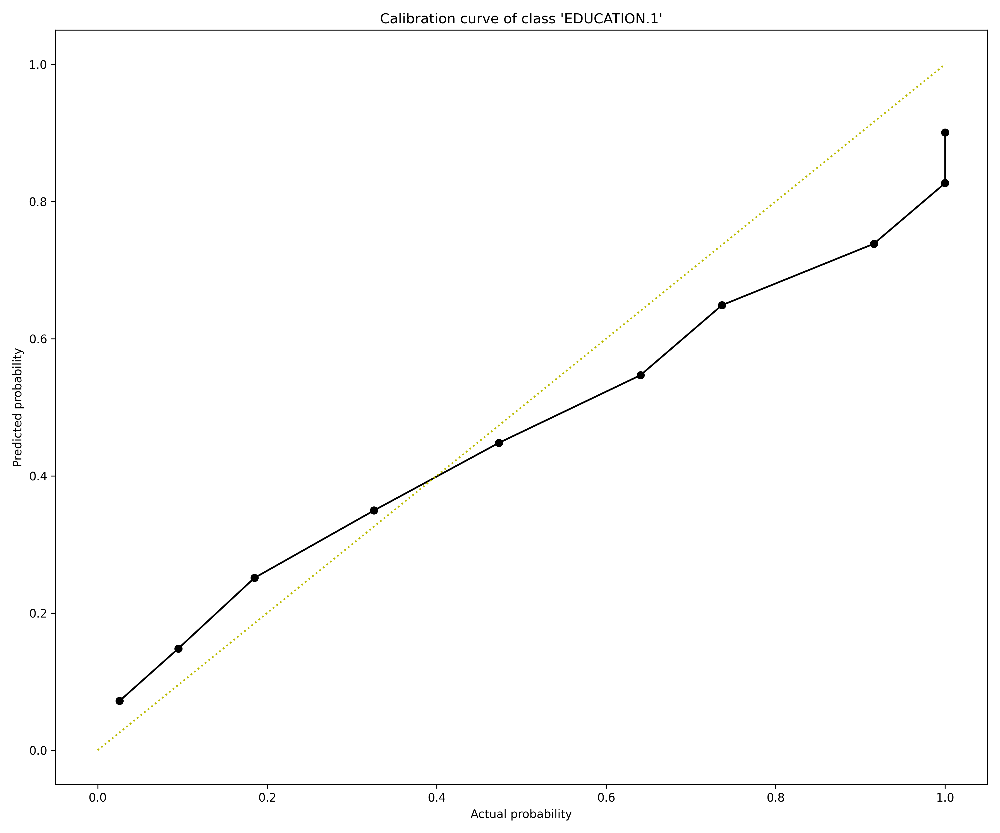

Explainer **parameters**:

- ``worker_connection_key``
   - The :ref:`connection ID of the Driverless AI worker<Library Configuration>`
     configured in the H2O Sonar configuration.
     Supported are Driverless AI servers hosted by H2O AIEM or H2O Enterprise Steam,
     or Driverless AI servers that use username and password authentication.
- ``number_of_bins``
   - Defines the number of bins the explainer utilizes to divide the primary dataset.
- ``bin_strategy``
   - Defines the binning strategy - one of ``uniform`` or ``quantile`` - the explainer
     utilizes to bin the primary dataset.

The explainer can be run using the **Python API** as follows:

.. code-block:: python

   # configure Driverless AI server to serve as a host of artifacts (datasets, models) and/or worker
   DAI_CONNECTION = h2o_sonar_config.ConnectionConfig(
      key="local-driverless-ai-server",  # ID is generated from the connection name (NCName)
      connection_type=h2o_sonar_config.ConnectionConfigType.DRIVERLESS_AI_AIEM.name,
      name="My H2O AIEM hosted Driverless AI ",
      description="Driverless AI server hosted by H2O Enterprise AIEM.",
      server_url="https://enginemanager.cloud.h2o.ai/",
      server_id="new-dai-engine-42",
      environment_url="https://cloud.h2o.ai",
      username="firstname.lastname@h2o.ai",
      token=os.getenv(KEY_AIEM_REFRESH_TOKEN_CLOUD),
      token_use_type=h2o_sonar_config.TokenUseType.REFRESH_TOKEN.name,
   )
   # add the connection to the H2O Sonar configuration
   h2o_sonar_config.config.add_connection(DAI_CONNECTION)

   # run the explainer (model and datasets provided as handles as they are hosted by the Driverless AI server)
   interpretation = interpret.run_interpretation(
      model=f"resource:connection:{DAI_CONNECTION.key}:key:7965e2ea-f898-11ed-b979-106530ed5ceb",
      dataset=f"resource:connection:{DAI_CONNECTION.key}:key:8965e2ea-f898-11ed-b979-106530ed5ceb",
      target_col="Weekly_Sales",
      explainers=[
         commons.ExplainerToRun(
               explainer_id=CalibrationScoreExplainer.explainer_id(),
               params={
                  "worker_connection_key": DAI_CONNECTION.key,
               },
         )
      ],
      results_location="./h2o-sonar-results",
   )

The explainer can be run using the **command line interface** (CLI) as follows:

.. code-block:: text

   h2o-sonar run interpretation
   --explainers h2o_sonar.explainers.calibration_score_explainer.CalibrationScoreExplainer
   --explainers-pars '{
      "h2o_sonar.explainers.calibration_score_explainer.CalibrationScoreExplainer": {
         "worker_connection_key": "local-driverless-ai-server",
      }
   }'
   --model "resource:connection:local-driverless-ai-server:key:7965e2ea-f898-11ed-b979-106530ed5ceb"
   --dataset "resource:connection:local-driverless-ai-server:key:695f5d5e-f898-11ed-b979-106530ed5ceb"
   --target-col "Weekly_Sales"
   --results-location "./h2o-sonar-results"
   --config-path "./h2o-sonar-config.json"
   --encryption-key "secret-key-to-decrypt-encrypted-config-fields"

Explainer **result** directory description:

.. code-block:: text

   explainer_h2o_sonar_explainers_calibration_score_explainer_CalibrationScoreExplainer_b02fc087-110d-4b80-b1ca-3bb801bb7b2d
   ├── global_frame
   │   ├── application_vnd_h2oai_datatable_jay
   │   │   └── explanation.jay
   │   └── application_vnd_h2oai_datatable_jay.meta
   ├── global_html_fragment
   │   ├── text_html
   │   │   ├── calibration_curve_0.png
   │   │   ├── calibration_curve_1.png
   │   │   ├── calibration_curve_2.png
   │   │   ├── calibration_curve_3.png
   │   │   ├── calibration_curve_4.png
   │   │   ├── calibration_curve_5.png
   │   │   ├── calibration_curve_6.png
   │   │   └── explanation.html
   │   └── text_html.meta
   ├── global_work_dir_archive
   │   ├── application_zip
   │   │   └── explanation.zip
   │   └── application_zip.meta
   ├── log
   │   └── explainer_run_b02fc087-110d-4b80-b1ca-3bb801bb7b2d.log
   ├── model_problems
   │   └── problems_and_actions.json
   ├── result_descriptor.json
   └── work
      ├── brier_scores.csv
      ├── calibration_curve_0.png
      ├── calibration_curve_1.png
      ├── calibration_curve_2.png
      ├── calibration_curve_3.png
      ├── calibration_curve_4.png
      ├── calibration_curve_5.png
      ├── calibration_curve_6.png
      ├── calibration_curves.csv
      ├── explanation.html
      └── mv_result.json

**Explanations** created by the explainer:

- ``global_frame``
   - Calibration curve data for all classes in the ``datatable`` format.
- ``global_html_fragment``
   - Calibration score in the HTML format.
- ``global_work_dir_archive``
   - All explanations created by the explainer stored in a ZIP archive.

See also:

- `H2O Model Validation: Calibration Score <https://docs.h2o.ai/wave-apps/h2o-model-validation/guide/tests/supported-validation-tests/calibration-score/calibration-score>`_ documentation
- :ref:`H2O Sonar Model Validation Explainers`
- :ref:`Library Configuration`

Drift Detection Explainer
-------------------------
This explainer is based on the drift detection `H2O Model Validation <https://docs.h2o.ai/wave-apps/h2o-model-validation/>`_ test.

Drift detection refers to a validation test that enables you to identify
changes in the distribution of variables in your model's input data,
preventing model performance degradation.

The explainer performs drift detection using the train and another
dataset captured at different times to assess how data has changed over time.
The Population Stability Index (PSI) formula is applied to each variable
to measure how much the variable has shifted in distribution over time.
PSI is applied to numerical and categorical columns and not date columns.

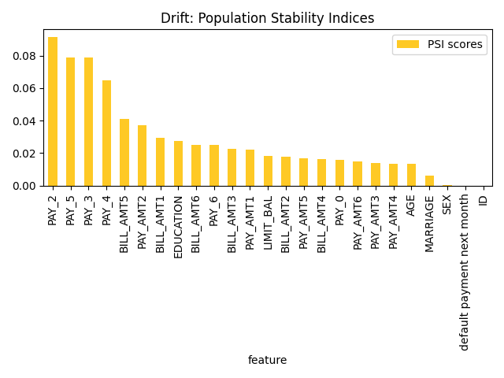

Explainer **parameters**:

- ``worker_connection_key``
   - Optional :ref:`connection ID of the Driverless AI worker<Library Configuration>`
     configured in the H2O Sonar configuration.
     Supported are Driverless AI servers hosted by H2O AIEM or H2O Enterprise Steam,
     or Driverless AI servers that use username and password authentication.
- ``drift_threshold``
   - Drift threshold - `Problem` is reported by the explainer if the drift is bigger than the threshold.
- ``drop_cols``
   - Defines the columns to drop during the validation test. Typically
     drop columns refer to columns that can indicate a drift without
     an impact on the model, like columns not used by the model,
     record IDs, time columns, etc.

The explainer can be run using the **Python API** as follows:

.. code-block:: python

   # run the explainer (model and datasets provided as handles as they are hosted by the Driverless AI server)
   interpretation = interpret.run_interpretation(
      # dataset might be either local or hosted by the Driverless AI server (model is not required)
      dataset="./dataset-train.csv",
      testset="./dataset-test.csv",
      model=None,
      target_col="PROFIT",
      explainers=[DriftDetection.explainer_id()],
      results_location="./h2o-sonar-results",
   )

The explainer, which explains Driverless AI datasets hosted by H2O AIEM, can be run using the **command line interface** (CLI) as follows:

.. code-block:: text

   # When H2O Sonar loads or saves the library configuration it uses the encryption key
   # to protect sensitive data - like passwords or tokens. Therefore it is convenient
   # to export the encryption key as an environment variable so that it can be used
   # by the library.

   export H2O_SONAR_ENCRYPTION_KEY="m1-s3cr3t-k3y"

   # h2o-sonar-config.json H2O Sonar configuration with H2O AIEM hosted Driverless AI
   # connection. Note that the "token" is encrypted using the encryption key.

   {
      "connections": [
         {
               "key": "my-aiem-hosted-dai-connection",
               "connection_type": "DRIVERLESS_AI_AIEM",
               "name": "My H2O AIEM hosted Driverless AI ",
               "description": "Driverless AI server hosted by H2O Enterprise AIEM.",
               "auth_server_url": "",
               "environment_url": "https://cloud.h2o.ai",
               "server_url": "https://enginemanager.cloud.h2o.ai/",
               "server_id": "new-dai-engine-42",
               "realm_name": "",
               "client_id": "",
               "token": {
                  "encrypted": "gAAAAABlG-UU-...Z2iriJztlEG0l2g2rPo8RIoYiNOJMQ_CLZVp"
               },
               "token_use_type": "REFRESH_TOKEN",
               "username": "firstname.lastname@h2o.ai",
               "password": {
                  "encrypted": ""
               }
         }
      ],
   }

   # h2o-sonar-args-run-interpretation.json file with CLI parameters stored as JSon file.
   # Instead of specifying many parameters on the command line interface, it is convenient
   # to store all the parameters as (reusable) JSon file.

   {
      "dataset": "resource:connection:my-aiem-hosted-dai-connection:key:fb2029e6-595d-11ee-896f-6e441ddba243",
      "testset": "resource:connection:my-aiem-hosted-dai-connection:key:gb2029e6-595d-11ee-896f-6e441ddba243",
      "model": null,
      "target_col": "Weekly_Sales",
      "explainers": [
         {
               "id": "h2o_sonar.explainers.drift_explainer.DriftDetectionExplainer",
               "params": {
                  "drift_threshold": 0.05,
                  "worker_connection_key": "my-aiem-hosted-dai-connection"
               }
         }
      ],
      "results_location": "./results"
   }

   # Interperation can be run using the h2o-sonar CLI as follows:

   h2o-sonar run interpretation \
      --args-as-json-location h2o-sonar-args-run-interpretation.json \
      --config-path h2o-sonar-config.json

Explainer **result** directory description:

.. code-block:: text

   explainer_h2o_sonar_explainers_drift_explainer_DriftDetectionExplainer_fee36f5d-64fb-46b3-a46a-7bbcb6007476
   ├── global_feature_importance
   │   ├── application_json
   │   │   ├── explanation.json
   │   │   └── feature_importance_class_0.json
   │   ├── application_json.meta
   │   ├── application_vnd_h2oai_json_datatable_jay
   │   │   ├── explanation.json
   │   │   └── feature_importance_class_0.jay
   │   └── application_vnd_h2oai_json_datatable_jay.meta
   ├── global_html_fragment
   │   ├── text_html
   │   │   ├── explanation.html
   │   │   └── fi-class-0.png
   │   └── text_html.meta
   ├── global_work_dir_archive
   │   ├── application_zip
   │   │   └── explanation.zip
   │   └── application_zip.meta
   ├── log
   │   └── explainer_run_fee36f5d-64fb-46b3-a46a-7bbcb6007476.log
   ├── model_problems
   │   └── problems_and_actions.json
   ├── result_descriptor.json
   └── work

**Explanations** created by the explainer:

- ``global_feature_importance``
   - Population stability indices in JSon and ``datatable`` format.
- ``global_html_fragment``
   - Population stability indices in the HTML format.
- ``global_work_dir_archive``
   - All explanations created by the explainer stored in a ZIP archive.

See also:

- `H2O Model Validation: Drift Detection <https://docs.h2o.ai/wave-apps/h2o-model-validation/guide/tests/supported-validation-tests/drift-detection/drift-detection>`_ documentation
- :ref:`H2O Sonar Model Validation Explainers`
- :ref:`Library Configuration`

Segment Performance Explainer
-----------------------------
This explainer is based on the segment performance `H2O Model Validation <https://docs.h2o.ai/wave-apps/h2o-model-validation/>`_ test.

A segment performance test lets you explore a model's data subsets
(segments) that diverge from average scores. In other words,
a segment performance test allows you to discover which data
points (segments) the model struggles, outperformance, and performs
with when generating accurate predictions.

To run a segment performance test on a model, explainer utilizes
a provided dataset to generate model predictions to assess their
accuracy. Explainer splits the dataset into segments
by the bins of values of every variable and every pair of variables
to generate results around the ability of the model to produce
accurate predictions with different data segments. These results
are embedded into a bubble graph that explainer generates
that enables you to observe and explore data segments the model struggles,
outperformance, and performs with when generating accurate predictions.
For each segment, explainer calculates its size of it
relative to the size of the dataset and estimates the error
the model makes on the corresponding segment.

Exploring and identifying data segments in a model that do not perform
as expected can lead to decisions on how you preprocess your data.

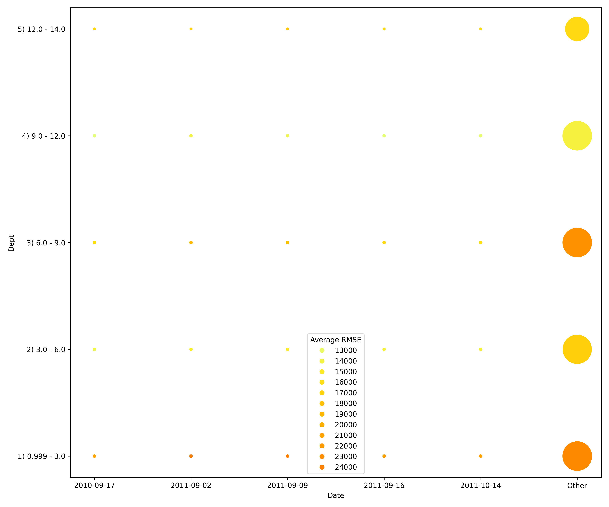

Explainer **parameters**:

- ``worker_connection_key``
   - The :ref:`connection ID of the Driverless AI worker<Library Configuration>`
     configured in the H2O Sonar configuration.
     Supported are Driverless AI servers hosted by H2O AIEM or H2O Enterprise Steam,
     or Driverless AI servers that use username and password authentication.
- ``number_of_bins``
   - Defines the number of bins the explainer utilizes to split the
     variable values of the primary dataset. In the case of a categorical
     column, the explainer utilizes the appropriate categories while
     ranging numerical columns into a specified number of bins.
     To run a segment performance test on a model, the explainer
     utilizes a provided dataset to generate model predictions to
     assess their accuracy. Explainer splits the dataset
     into segments by the bins of values of every variable and every
     pair of variables to generate results around the ability of
     the model to produce accurate predictions with different
     data segments. These results are embedded into a bubble graph
     that the explainer generates that enables you to observe and
     explore data segments the model struggles, outperformance,
     and performs with when generating accurate predictions.
     For each segment, explainer calculates its size of
     it relative to the size of the dataset and estimates the error
     the model makes on the corresponding segment.
- ``precision``
   - Precision.
- ``drop_cols``
   - Defines the columns to drop during the validation test.

The explainer can be run using the **Python API** as follows:

.. code-block:: python

   # configure Driverless AI server to serve as a host of artifacts (datasets, models) and/or worker
   DAI_CONNECTION = h2o_sonar_config.ConnectionConfig(
      key="local-driverless-ai-server",  # ID is generated from the connection name (NCName)
      connection_type=h2o_sonar_config.ConnectionConfigType.DRIVERLESS_AI_AIEM.name,
      name="My H2O AIEM hosted Driverless AI ",
      description="Driverless AI server hosted by H2O Enterprise AIEM.",
      server_url="https://enginemanager.cloud.h2o.ai/",
      server_id="new-dai-engine-42",
      environment_url="https://cloud.h2o.ai",
      username="firstname.lastname@h2o.ai",
      token=os.getenv(KEY_AIEM_REFRESH_TOKEN_CLOUD),
      token_use_type=h2o_sonar_config.TokenUseType.REFRESH_TOKEN.name,
   )
   # add the connection to the H2O Sonar configuration
   h2o_sonar_config.config.add_connection(DAI_CONNECTION)

   # run the explainer (model and datasets provided as handles as they are hosted by the Driverless AI server)
   interpretation = interpret.run_interpretation(
      model=f"resource:connection:{DAI_CONNECTION.key}:key:7965e2ea-f898-11ed-b979-106530ed5ceb",
      dataset=f"resource:connection:{DAI_CONNECTION.key}:key:8965e2ea-f898-11ed-b979-106530ed5ceb",
      testset=f"resource:connection:{DAI_CONNECTION.key}:key:9965e2ea-f898-11ed-b979-106530ed5ceb",
      target_col="Weekly_Sales",
      explainers=[
         commons.ExplainerToRun(
               explainer_id=SegmentPerformanceExplainer.explainer_id(),
               params={
                  "worker_connection_key": DAI_CONNECTION.key,
                  "number_of_bins": 10,
               },
         )
      ],
      results_location="./h2o-sonar-results",
   )

The explainer can be run using the **command line interface** (CLI) as follows:

.. code-block:: text

   h2o-sonar run interpretation
   --explainers h2o_sonar.explainers.segment_performance_explainer.SegmentPerformanceExplainer
   --explainers-pars '{
      "h2o_sonar.explainers.segment_performance_explainer.SegmentPerformanceExplainer": {
         "worker_connection_key": "local-driverless-ai-server",
         "number_of_bins": 10,
      }
   }'
   --model "resource:connection:local-driverless-ai-server:key:7965e2ea-f898-11ed-b979-106530ed5ceb"
   --dataset "resource:connection:local-driverless-ai-server:key:695f5d5e-f898-11ed-b979-106530ed5ceb"
   --testset "resource:connection:local-driverless-ai-server:key:695df75c-f898-11ed-b979-106530ed5ceb"
   --target-col "Weekly_Sales"
   --results-location "./h2o-sonar-results"
   --config-path "./h2o-sonar-config.json"
   --encryption-key "secret-key-to-decrypt-encrypted-config-fields"

Explainer **result** directory description:

.. code-block:: text

   explainer_h2o_sonar_explainers_segment_performance_explainer_SegmentPerformanceExplainer_1e0e0ee1-7a1d-44da-952f-9ac574c39545
   ├── global_html_fragment
   │   ├── text_html
   │   │   ├── explanation.html
   │   │   ├── scatter-0.png
   │   │   ├── scatter-10.png
   │   │   ├── scatter-11.png
   │   │   ├── scatter-12.png
   │   │   ├── scatter-13.png
   │   │   ├── scatter-14.png
   │   │   ├── scatter-15.png
   │   │   ├── scatter-16.png
   │   │   ├── scatter-17.png
   │   │   ├── scatter-1.png
   │   │   ├── scatter-20.png
   │   │   ├── scatter-21.png
   │   │   ├── scatter-22.png
   │   │   ├── scatter-23.png
   │   │   ├── scatter-24.png
   │   │   ├── scatter-25.png
   │   │   ├── scatter-26.png
   │   │   ├── scatter-2.png
   │   │   ├── scatter-30.png
   │   │   ├── scatter-31.png
   │   │   ├── scatter-32.png
   │   │   ├── scatter-33.png
   │   │   ├── scatter-34.png
   │   │   ├── scatter-35.png
   │   │   ├── scatter-3.png
   │   │   ├── scatter-40.png
   │   │   ├── scatter-41.png
   │   │   ├── scatter-42.png
   │   │   ├── scatter-43.png
   │   │   ├── scatter-44.png
   │   │   ├── scatter-4.png
   │   │   ├── scatter-50.png
   │   │   ├── scatter-51.png
   │   │   ├── scatter-52.png
   │   │   ├── scatter-53.png
   │   │   ├── scatter-5.png
   │   │   ├── scatter-60.png
   │   │   ├── scatter-61.png
   │   │   ├── scatter-62.png
   │   │   ├── scatter-6.png
   │   │   ├── scatter-70.png
   │   │   ├── scatter-71.png
   │   │   ├── scatter-7.png
   │   │   ├── scatter-80.png
   │   │   └── scatter-8.png
   │   └── text_html.meta
   ├── global_work_dir_archive
   │   ├── application_zip
   │   │   └── explanation.zip
   │   └── application_zip.meta
   ├── log
   │   └── explainer_run_1e0e0ee1-7a1d-44da-952f-9ac574c39545.log
   ├── model_problems
   │   └── problems_and_actions.json
   ├── result_descriptor.json
   └── work
      ├── explanation.html
      └── segment-performance.csv

**Explanations** created by the explainer:

- ``global_html_fragment``
   - Adversarial similarity in the HTML format.
- ``global_work_dir_archive``
   - All explanations created by the explainer stored in a ZIP archive.

See also:

- `H2O Model Validation: Segment Performance <https://docs.h2o.ai/wave-apps/h2o-model-validation/guide/tests/supported-validation-tests/segment-performance/segment-performance>`_ documentation
- :ref:`H2O Sonar Model Validation Explainers`
- :ref:`Library Configuration`

Size Dependency Explainer
-------------------------
This explainer is based on the size dependency `H2O Model Validation <https://docs.h2o.ai/wave-apps/h2o-model-validation/>`_ test.

A size dependency test enables you to analyze the effects
different sizes of train data will have on the accuracy of a selected model.
In particular, size dependency facilitates model stability analysis and,
for example, can answer whether augmenting an existing train data seems to be
promising in terms of model accuracy.

Explainer selects an appropriate sampling technique for the size dependency
test based on the selected model type. Available sampling techniques are as follows:

- **Random sampling**
   - Explainer uses a random sampling technique to create new sub-training
     samples for independent and **identically distributed (IID)** models
- **Expanding window sampling**
   - Explainer uses a expanding window sampling technique to create new
     sub-training samples for **time series** models while utilizing time columns to
     ensure that sub-training samples grow from recent to oldest data

For either sampling technique (random or expanding window), before it is applied,
the original train data is split using folds that improve generalization and data
balance when one of the sampling techniques is applied while using folds.

In the case of **IID models**, folds and sub-training samples are created at random,
but for **time series models**, folds and sub-training samples are created using
a time column to ensure that sub-training samples grow from the most recent to
oldest data points.

Based on the number of folds (N), explainer retrains the model N times
by only updating its training dataset with the new sub-training samples while
generating a scorer for each iteration of the retraining process for further analysis.

Sampling the original training data for a model under random or expanding window
sampling can be illustrated in the below image when N (folds) equals **4**.

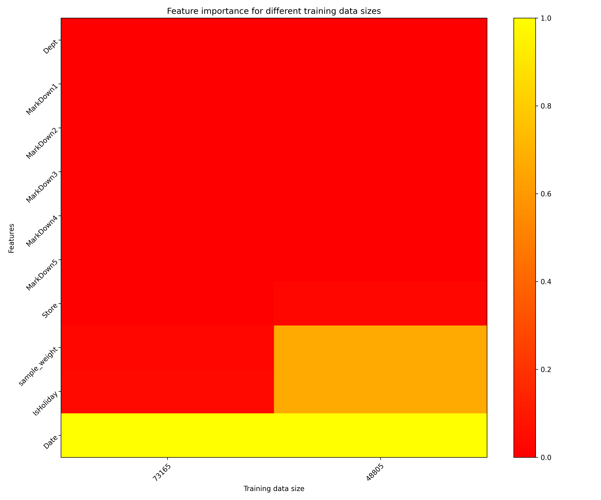

Explainer **parameters**:

- ``worker_connection_key``
   - The :ref:`connection ID of the Driverless AI worker<Library Configuration>`
     configured in the H2O Sonar configuration.
     Supported are Driverless AI servers hosted by H2O AIEM or H2O Enterprise Steam,
     or Driverless AI servers that use username and password authentication.
- ``time_col``
   - Defines the time column of the primary and secondary dataset, which
     explainer utilizes to perform time-based splits.
- ``number_of_splits``
   - Defines the number of splits that explainer performs on the primary
     dataset to assess dataset size dependency.
- ``worker_cleanup``
   - Determines if the explainer should delete the artifacts created in
     the worker. In this case, artifacts refer to experiments and
     datasets generated during the backtesting validation test.
     By default, explainer checks this setting (enables it),
     and accordingly, H2O Model Validation deletes all artifacts
     because they are no longer needed after the validation test is
     complete.
- ``plot_type``
   - Plot type to be used for Partial Dependence rendering - ``heatmap``,
     ``contour-3d`` or ``surface-3d``.

The explainer can be run using the **Python API** as follows:

.. code-block:: python

   # configure Driverless AI server to serve as a host of artifacts (datasets, models) and/or worker
   DAI_CONNECTION = h2o_sonar_config.ConnectionConfig(
      key="local-driverless-ai-server",  # ID is generated from the connection name (NCName)
      connection_type=h2o_sonar_config.ConnectionConfigType.DRIVERLESS_AI_AIEM.name,
      name="My H2O AIEM hosted Driverless AI ",
      description="Driverless AI server hosted by H2O Enterprise AIEM.",
      server_url="https://enginemanager.cloud.h2o.ai/",
      server_id="new-dai-engine-42",
      environment_url="https://cloud.h2o.ai",
      username="firstname.lastname@h2o.ai",
      token=os.getenv(KEY_AIEM_REFRESH_TOKEN_CLOUD),
      token_use_type=h2o_sonar_config.TokenUseType.REFRESH_TOKEN.name,
   )
   # add the connection to the H2O Sonar configuration
   h2o_sonar_config.config.add_connection(DAI_CONNECTION)

   # run the explainer (model and datasets provided as handles as they are hosted by the Driverless AI server)
   interpretation = interpret.run_interpretation(
      model=f"resource:connection:{DAI_CONNECTION.key}:key:7965e2ea-f898-11ed-b979-106530ed5ceb",
      dataset=f"resource:connection:{DAI_CONNECTION.key}:key:8965e2ea-f898-11ed-b979-106530ed5ceb",
      testset=f"resource:connection:{DAI_CONNECTION.key}:key:9965e2ea-f898-11ed-b979-106530ed5ceb",
      target_col="Weekly_Sales",
      explainers=[
         commons.ExplainerToRun(
               explainer_id=SizeDependencyExplainer.explainer_id(),
               params={
                  "worker_connection_key": DAI_CONNECTION.key,
                  "time_col": "Date",
               },
         )
      ],
      results_location="./h2o-sonar-results",
   )

The explainer can be run using the **command line interface** (CLI) as follows:

.. code-block:: text

   h2o-sonar run interpretation
   --explainers h2o_sonar.explainers.size_dependency_explainer.SizeDependencyExplainer
   --explainers-pars '{
      "h2o_sonar.explainers.size_dependency_explainer.SizeDependencyExplainer": {
         "worker_connection_key": "local-driverless-ai-server",
         "time_col": "Date",
      }
   }'
   --model "resource:connection:local-driverless-ai-server:key:7965e2ea-f898-11ed-b979-106530ed5ceb"
   --dataset "resource:connection:local-driverless-ai-server:key:695f5d5e-f898-11ed-b979-106530ed5ceb"
   --testset "resource:connection:local-driverless-ai-server:key:695df75c-f898-11ed-b979-106530ed5ceb"
   --target-col "Weekly_Sales"
   --results-location "./h2o-sonar-results"
   --config-path "./h2o-sonar-config.json"
   --encryption-key "secret-key-to-decrypt-encrypted-config-fields"

Explainer **result** directory description:

.. code-block:: text

   explainer_h2o_sonar_explainers_size_dependency_explainer_SizeDependencyExplainer_4d0ec4b4-38a7-4606-80a9-235e827532b7
   ├── global_3d_data
   │   ├── application_json
   │   │   ├── data3d_feature_0_class_0.json
   │   │   └── explanation.json
   │   ├── application_json.meta
   │   ├── application_vnd_h2oai_json_csv
   │   │   ├── data3d_feature_0_class_0.csv
   │   │   └── explanation.json
   │   └── application_vnd_h2oai_json_csv.meta
   ├── global_html_fragment
   │   ├── text_html
   │   │   ├── explanation.html
   │   │   └── heatmap.png
   │   └── text_html.meta
   ├── global_work_dir_archive
   │   ├── application_zip
   │   │   └── explanation.zip
   │   └── application_zip.meta
   ├── log
   │   └── explainer_run_4d0ec4b4-38a7-4606-80a9-235e827532b7.log
   ├── model_problems
   │   └── problems_and_actions.json
   ├── result_descriptor.json
   └── work
      ├── explanation.html
      └── heatmap.png

**Explanations** created by the explainer:

- ``global_3d_data``
   - Feature importance for different training data sizes in JSon, CSV and ``datatable`` formats.
- ``global_html_fragment``
   - Feature importance for different training data sizes in the HTML format.
- ``global_work_dir_archive``
   - All explanations created by the explainer stored in a ZIP archive.

See also:

- `H2O Model Validation: Size Dependency <https://docs.h2o.ai/wave-apps/h2o-model-validation/guide/tests/supported-validation-tests/size-dependency/size-dependency>`_ documentation
- :ref:`H2O Sonar Model Validation Explainers`
- :ref:`Library Configuration`
