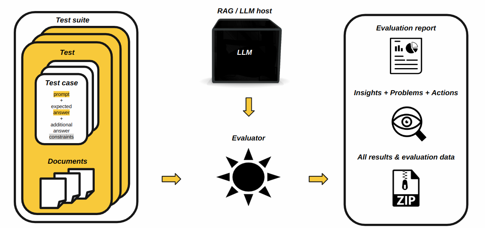

Generative Models
=================

H2O Sonar provides evaluation of **generative** machine learning models.

.. toctree::
   :maxdepth: 2
   :caption: Evaluating RAGs and LLMs

   doc.evaluations

.. toctree::
   :maxdepth: 2
   :caption: RAG and LLM Hosts

   doc.rag_llm_hosts

.. toctree::
   :maxdepth: 2
   :caption: Test Case, Suite, Lab and LLM Dataset

   doc.rag_llm_tests

.. toctree::
   :maxdepth: 5
   :caption: Evaluator Parametrization

   doc.evaluators.pars

.. toctree::
   :maxdepth: 5
   :caption: Evaluators

   doc.evaluators

.. toctree::
   :maxdepth: 2
   :caption: BYOJ: Bring Your Own Judge

   doc.byoj

.. toctree::
   :maxdepth: 2
   :caption: BYOP: Bring Your Own Prompt

   doc.byop

.. toctree::
   :maxdepth: 2
   :caption: Perturbations

   doc.perturbations
