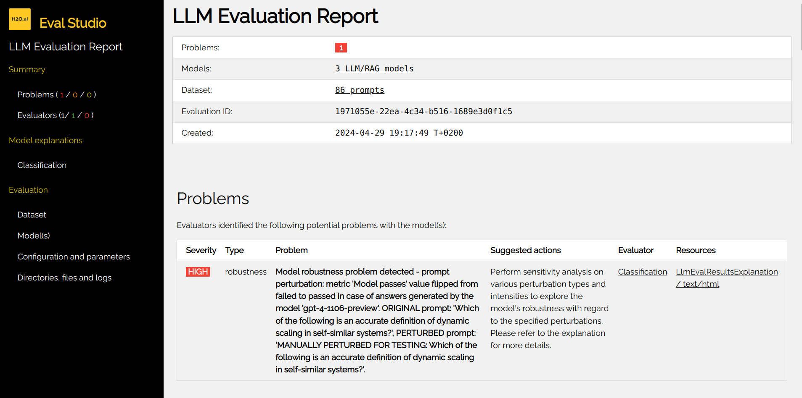

Perturbations
=============
H2O Sonar provides a way to perturb the data in order to test the **robustness** of RAG systems, LLMs
and predictive (NLP) models. The perturbations are applied to the text input and the model output
on the original input is then compared to the model output on the perturbed input. If the model output
changes significantly, the model is considered to be not robust.

The following **perturbators** are supported:

- :ref:`Antonym Perturbator`
- :ref:`Comma Perturbator`
- :ref:`Contextual Misinformation Perturbator`
- :ref:`Copy Perturbator`
- :ref:`Keyboard Typos Perturbator`
- :ref:`OCR Error Character Perturbator`
- :ref:`Random Character Deletion Perturbator`
- :ref:`Random Character Insertion Perturbator`
- :ref:`Random Character Perturbator`
- :ref:`Random Character Replacement Perturbator`
- :ref:`Synonym Perturbator`
- :ref:`Word Swap Perturbator`
- :ref:`Y/Z Perturbator`

When are perturbators be useful?

- **Chatbots and virtual assistants**: To ensure that the chatbot is robust to typos, abbreviations
  writen in lower case, missing punctuation, and other common mistakes. Perturbing prompts can help
  to ensure that the chatbot is robust and responds as expected.
- **Social media datasets analysis**: Social media text is packed with abbreviations, slang, emojis, and
  other non-standard language. Perturbing the text can help to ensure that the model is robust to
  these variations.
- **Summarization and translation**: To ensure that the model is robust to different writing styles,
  synonyms, but also aforementioned typos, abbreviations, and other common mistakes.
- **Question answering**: To ensure that the model is robust to rephrased questions, writing styles,
  synonyms and other common mistakes.

Perturbations Step-by-Step
--------------------------
Perturbations can be used to test the robustness of a model using the following steps:

- User can perturb test case, test or test suite using a sequence of perturbations.
- Test cases with perturbed prompts are added to the corresponding tests,
  relationships are used to link perturbed prompts to original prompts.
  Categories describing the perturbations methods and intensity are added to the test case categories.
- User can run any evaluator, and it will detects flip of metric(s) calculated by the evaluator.
- A metric flip is defined as follows:
   - Every metric has a threshold value, which is configurable using the evaluator parameters.
   - Each metric calculated by the evaluator has associated metadata that include information like "higher is better/worse".
   - If the metric value for the original prompt is below the threshold, while the value of the same metric is above the threshold for the perturbed prompt, then it is reported as a flip (and vice versa - original above, perturbed below)
- Metric flips are reported in the evaluation report as ``robustness`` problems.

Flip example:

- For instance hallucination metric value for a prompt might be ``0.3`` before perturbation and ``0.8`` after perturbation with threshold ``0.75``.

Random Character Perturbator
----------------------------
Perturbator that replaces random characters in a sentence. Currently, five types of character perturbations supported namely:

1. Random character replacement (default: 'random_replacement'): Randomly replace `p` percentage of characters with other characters in the input text.
2. Random keyboard typos ('random_keyboard_typos'): Randomly replace `p` percentage of characters with their neighboring characters on the QWERTY keyboard. E.g., "a" with "q", "s" with "a", etc.
3. Random character insertion ('random_insert'): Randomly insert `p` percentage characters into the input text.
4. Random character deletion ('random_delete'): Randomly delete `p` percentage characters from the input text and replace it with "X".
5. Random OCR ('random_OCR'): Randomly replace `p` percentage of characters with common OCR errors.

Antonym Perturbator
-------------------
Perturbator that replaces words with their antonyms.

Comma Perturbator
------------------
Perturbator that adds a comma after some words. It mimics a common mistake in English writing and/or typos.

Contextual Misinformation Perturbator
-------------------------------------

Contextual misinformation perturbator is agent-based perturbator that
introduces factually incorrect information within a seemingly plausible context,
aiming to mislead the model into accepting false statements - adversarial attack.

Example

- **Text**:
   - Frida Kahlo is painter.
- **Perturbed text**:
   - Frida Kahlo is a renowned sculptor, as evidenced by the numerous statues attributed to her found in various art galleries across Mexico, which were previously misattributed to other artists.

Example

- **Text**:
   - Is the capital of France Paris?
- **Perturbed text**:
   - Is the capital of France London, as evidenced by the historical documents discovered in the Bibliothèque nationale de France?

Copy Perturbator
----------------
Perturbator that returns input unchanged (no perturbation). This is useful as a baseline or control in robustness experiments to verify evaluation pipeline integrity.

Keyboard Typos Perturbator
--------------------------
Perturbator that replaces characters with their neighboring characters on the QWERTY keyboard.

OCR Error Character Perturbator
-------------------------------
Perturbator that replaces characters with common OCR errors.

Random Character Deletion Perturbator
-------------------------------------
Perturbator that deletes random characters in a sentence.

Random Character Insertion Perturbator
--------------------------------------
Perturbator that inserts random characters in a sentence.

Random Character Replacement Perturbator
----------------------------------------
Perturbator that replaces random characters in a sentence.

Synonym Perturbator
-------------------
Perturbator that replaces words with their synonyms.

Word Swap Perturbator
---------------------
Perturbator that swaps two words in a sentence.

Y/Z Perturbator
---------------
Perturbator that replaces 'y' with 'z' and vice versa.

Perturbators API
-----------------
Perturbators can be listed as follows:

.. code-block:: python

    from h2o_sonar import evaluate

    perturbator_descriptor = evaluate.list_perturbators()

    print(perturbator_descriptor)

String can be perturbed as follows:

.. code-block:: python

    from h2o_sonar import evaluate
    from h2o_sonar.utils.robustness import perturbations

    perturbed_text = evaluate.perturb(
        content=input_content,
        perturbators=[
            commons.PerturbatorToRun(
                perturbator_id=perturbations.QwertyPerturbator.perturbator_id,
                intensity=commons.PerturbationIntensity.LOW.name,
            )
        ]
    )

    print(perturbed_text)

Test case can be perturbed using multiple perturbations as follows:

.. code-block:: python

    from h2o_sonar import evaluate
    from h2o_sonar.utils.robustness import perturbations

    test_case = testing.RagTestCaseConfig(
        prompt="This is the text to be perturbed using a perturbator."
    )

    perturbed_test_case = evaluate.perturb(
        content=test_case,
        perturbators=[
            commons.PerturbatorToRun(
                perturbator_id=descriptor.perturbator_id,
            )
            for descriptor in evaluate.list_perturbators()
        ]
    )

    print(perturbed_test_case.prompt)

Using Perturbations to Assess Model Robustness
----------------------------------------------
Typical use of perturbations is to assess the robustness of a model. The following code example demonstrates how to
use perturbations to assess the robustness of a model:

.. code-block:: python

    #
    # perturb the test suite - all test cases in test suite's tests are perturbed
    #
    test_suite = testing.RagTestSuiteConfig.load_from_json("path/to/test_suite.json")

    perturbed_suite = evaluate.perturb(
        content=test_suite,
        perturbators=[
            commons.PerturbatorToRun(
                perturbator_id=perturbator_id,
                intensity=commons.PerturbationIntensity.HIGH.name,
            )
        ],
        in_place=False,
    )
    perturbed_suite.save_as_json("path/to/perturbed_test_suite.json")

    #
    # resolve the test suite to test lab - get answers from RAGs/LLMs
    #
    test_lab = testing.RagTestLab.from_rag_test_suite(
        rag_connection=target_host_connection,
        rag_test_suite=perturbed_suite,
        llm_model_names=llm_model_names,
        rag_model_type=llm_model_type,
        docs_cache_dir="path/to/docs_cache_dir",
    )
    test_lab.build()
    test_lab.complete_dataset()
    test_lab.save_as_json("path/to/test_lab.json")

    #
    # run evaluation using the test lab with perturbed test cases
    #
    evaluation = evaluate.run_evaluation(
        dataset=test_lab.dataset,
        models=list(test_lab.evaluated_models.values()),
        evaluators=evaluators,
    )

    #
    # print (robustness) problems
    #
    print(f"Problems [{len(evaluation.result.problems)}]")
    for p in evaluation.result.problems:
        print(f"  {p}")
