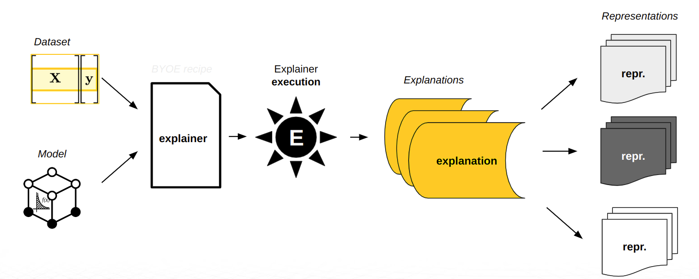

H2O Sonar Documentation
=======================

H2O Sonar provides robust interpretability of machine learning models to explain
modeling results in a human-readable format. H2O Sonar employs a host of different
techniques and methodologies for interpreting and explaining the results of the models.
A number of charts are generated (depending on experiment type), including Shapley,
Variable Importance, Decision Tree Surrogate, Partial Dependence,
Individual Conditional Expectation, and more. Additionally, you can get explanations
in various format like CSV, JSon or as ``datatable`` frames.

The techniques and methodologies used by H2O Sonar for model interpretation can be
extended with recipes (Python code snippets).

This chapter describes H2O Sonar interpretability features for both regular
and time-series experiments.

Terminology
-----------

* **interpretation** / **evaluation**
   - Execution of one or more explainers / evaluators to explain a model and create explanations.
* **explainer** / **evaluator**
   - Pluggable and configurable component which explains a specific predictive (explainer) or generative (evaluator) model using
     a specific method.
* **explanation**
   - Explanation is a description of model behavior created by the explainers and
     persisted in one or more representation.
* **representation**
   - Explainer representation is persisted explanation as JSon, CSV, ``datatable``
     frame or image.

.. toctree::
   :maxdepth: 5
   :caption: Configuration

   doc.configuration

.. toctree::
   :maxdepth: 2
   :caption: Predictive Models

   doc.predictive

.. toctree::
   :maxdepth: 2
   :caption: Generative Models

   doc.generative

.. toctree::
   :maxdepth: 2
   :caption: Result

   doc.result

.. toctree::
   :maxdepth: 2
   :caption: Talk to Report

   doc.talktoreport

