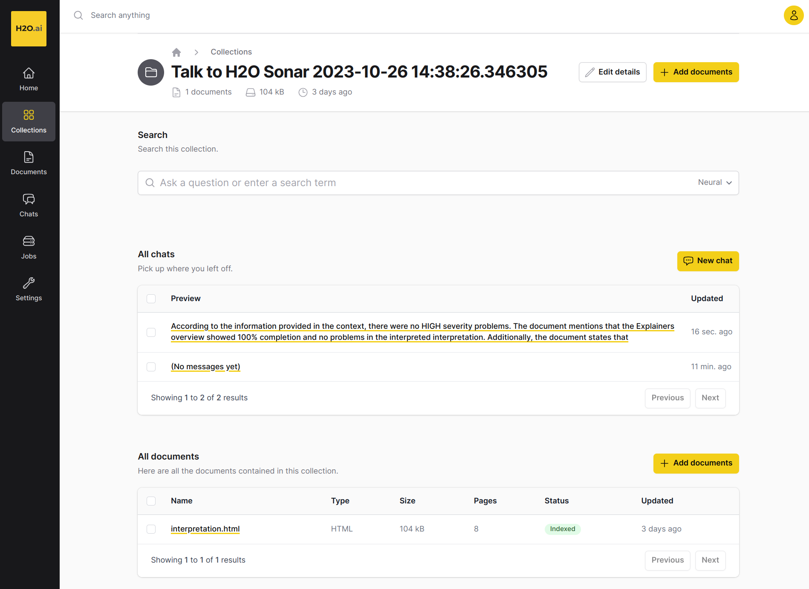

Talk to Report
==============
H2O Sonar can upload the interpretation/evaluation results to the `Enterprise h2oGPT <https://h2o.ai/platform/enterprise-h2ogpt/>`_
in order to **talk to the report** and get answers to questions / use prompts like:

- Did the interpretation find any model problems?
- Were there any HIGH/MEDIUM/LOW severity problems?
- Create an action plan as a bullet list to solve <XYZ> problem.
- Create an action plan as a bullet list to solve HIGH SEVERITY problem(s).
- Is the model fair?
- Which features lead to the highest model error?
- Which explainers were run by the interpretation?
- Summarize the interpretation report.

Similarly for model understanding:

- What is the target column of the model?
- Which original features are used by the model?
- What is the most important original feature of the model?
- What is the most important transformed feature of the model?
- What are the 3 most important original features of the model?
- What were the columns of the training dataset?

The typical set of questions is typically centered around **the model problem(s)** and their **solutions**.

How can you talk to the report?

1. Run the interpretation.
2. Upload the interpretation results to the Enterprise h2oGPT - either directly as the last step of the interpretation run or using the API call or CLI command.
3. Open the **Enterprise h2oGPT** to chat with the interpretation report.

The **API key** can be generated in `Enterprise h2oGPT <https://h2o.ai/platform/enterprise-h2ogpt/>`_ web - use ``Settings`` - ``API Keys`` - ``New API Key``.
For better Enterprise h2oGPT intergration results please install `Pandoc <https://pandoc.org/>`__ (PDF with images will be uploaded instead of HTML).

Talk to Report Python API
-------------------------
Upload the interpretation report to the Enterprise h2oGPT as a part of the interpretation:

.. code-block:: python

   # configure Enterprise h2oGPT server connection
   H2OGPTE_CONNECTION = h2o_sonar_config.ConnectionConfig(
      connection_type=h2o_sonar_config.ConnectionConfigType.H2O_GPT_E.name,
      name="H2O GPT Enterprise",
      description="H2O GPT Enterprise.",
      server_url="https://h2ogpte.h2o.ai",
      token=os.getenv(KEY_H2OGPTE_API_KEY),
      token_use_type=h2o_sonar_config.TokenUseType.API_KEY.name,
   )
   h2o_sonar_config.config.add_connection(H2OGPTE_CONNECTION)

   # prepare dataset and model to be interpreted
   dataset_path = ...
   explainable_model = ...

   # run interpretation and UPLOAD the results to the Enterprise h2oGPT
   interpretation = interpret.run_interpretation(
      dataset=dataset_path,
      model=explainable_model,
      target_col=target_col,
      upload_to=h2o_sonar_config.config.get_connection(
         connection_key=H2OGPTE_CONNECTION.key
      ),
   )

   # print the URL of the uploaded interpretation report
   print(
      f"Interpretation report uploaded to:\n"
      f"  {interpretation.result.upload_url}"
   )

Alternatively can be (any) interpretation report (PDF or HTML) uploaded to the Enterprise h2oGPT using the API call:

.. code-block:: python

   # configure Enterprise h2oGPT server connection
   H2OGPTE_CONNECTION = h2o_sonar_config.ConnectionConfig(
      connection_type=h2o_sonar_config.ConnectionConfigType.H2O_GPT_E.name,
      name="H2O GPT Enterprise",
      description="H2O GPT Enterprise.",
      server_url="https://h2ogpte.h2o.ai",
      token=os.getenv(KEY_H2OGPTE_API_KEY),
      token_use_type=h2o_sonar_config.TokenUseType.API_KEY.name,
   )
   h2o_sonar_config.config.add_connection(H2OGPTE_CONNECTION)

   # run interpretation and/or get the interpretation report (PDF or HTML) path
   interpretation = ...

   # upload the interpretation or interpretation report to the Enterprise h2oGPT
   (uploaded_report_collection_id, h2o_gpt_e_collection_url) = interpret.upload_interpretation(
      interpretation_result=interpretation,
      connection=H2OGPTE_CONNECTION.key,
   )

Talk to Report CLI API
----------------------
First configure Enterprise h2oGPT server connection, for example to ``h2o-sonar-config.json``:

.. code-block:: text

   {
      "connections": [
         {
            "key": "4b46c18a-e596-4fa8-8638-055dfd52d37c",
            "connection_type": "H2O_GPT_E",
            "name": "H2O GPT Enterprise",
            "description": "H2O GPT Enterprise server.",
            "auth_server_url": "",
            "environment_url": "",
            "server_url": "https://h2ogpte.h2o.ai",
            "server_id": "",
            "realm_name": "",
            "client_id": "",
            "token": {
               "encrypted": "gAAAAABlEuFMcWiaK-E3Ccq...m8nUzRZ7UvwRag3DdMrg=="
            },
            "token_use_type": "API_KEY",
            "username": "",
            "password": {
               "encrypted": ""
            }
         }
      ]
   }

Then upload the interpretation report to the Enterprise h2oGPT
(identified by connection key ``4b46c18a-e596-4fa8-8638-055dfd52d37c``)
as a part of the interpretation:

.. code-block:: text

    $ h2o-sonar run interpretation \
        --dataset dataset.csv \
        --model model-to-be-explained.mojo \
        --target-col TARGET \
        --config-path h2o-sonar-config.json \
        --encryption-key my-secret-encryption-key \
        --upload-to 4b46c18a-e596-4fa8-8638-055dfd52d37c

Alternatively can be (any) interpretation report (PDF or HTML) uploaded to the Enterprise h2oGPT using the command:

.. code-block:: text

    $ h2o-sonar upload interpretation \
        --interpretation interpretation-detailed.pdf \
        --config-path h2o-sonar-config.json \
        --encryption-key my-secret-encryption-key \
        --upload-to 4b46c18a-e596-4fa8-8638-055dfd52d37c

See also:

- :ref:`Library Connections Configuration<Library Configuration>`
