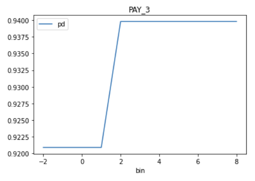

Getting Started with H2O Sonar
==============================

- :ref:`Getting Started with Predictive Models Interpretation`
    - :ref:`Running the Interpretation from the Command Line`
    - :ref:`Running the Interpretation from the Python`
    - :ref:`Running the Interpretation from the Jupyter Notebook`
- :ref:`Getting Started with Generative Models Evaluation`
    - :ref:`Running the Evaluation from the Python`

Getting Started with Predictive Models Interpretation
-----------------------------------------------------

H2O Sonar library explains models by running a set of :ref:`explainers<Explainers>`
within an interpretation.

Explainer creates an explanation of the model, such as the most important
features or decision tree describing the approximate model behavior. Explanations
created by explainers are stored in various formats (like JSon, CSV or
as images) in the interpretation results directory along with logs, interpretation
(HTML and JSon) overview and other artifacts.

H2O Sonar can explain models using:

- :ref:`Command line interface (CLI)<Running the Interpretation from the Command Line>`
- :ref:`Python API<Running the Interpretation from the Python>`
- :ref:`Jupyter Notebook<Running the Interpretation from the Jupyter Notebook>`

Running the Interpretation from the Command Line
~~~~~~~~~~~~~~~~~~~~~~~~~~~~~~~~~~~~~~~~~~~~~~~~
Check H2O Sonar CLI help:

.. code-block:: text

    h2o-sonar --help

List available explainers:

.. code-block:: text

    h2o-sonar list explainers

Explain your model by running an interpretation:

.. code-block:: text

    h2o-sonar run interpretation \
        --dataset=dataset.csv \
        --model=model.mojo \
        --target-col=SATISFACTION \
        --results-location=./interpretation-results

Open ``./interpretation-results`` directory and check model explanations. The best location where
to start is the **interpretation HTML report** which can be found in
``h2o-sonar/mli_experiment_<UUID>/interpretation.html``:

.. image:: images/interpretation-html-report.png
  :alt: Interpretation HTML report

Running the Interpretation from the Python
~~~~~~~~~~~~~~~~~~~~~~~~~~~~~~~~~~~~~~~~~~
Explain your model by running an interpretation:

.. code-block:: python

	# dataset

	import pandas

	dataset = pandas.read_csv(dataset_path)
	(X, y) = dataset.drop(target_column, axis=1), dataset[target_column]

	# model

	from sklearn import ensemble

	model = ensemble.GradientBoostingClassifier(learning_rate=0.1)
	model.fit(X, y)

	# interpretation

	from h2o_sonar import interpret

	interpretation = interpret.run_interpretation(
	    dataset=dataset_path,
	    model=model,
	    used_features=list(X.columns),
	    target_col=target_column,
	    results_location=results_path,
	)

	# result

	print(interpretation)  # or interpretation.to_html()

	# get the explanation created by the first explainer of the interpretation
	explanation = interpretation.get_explainer_result(
	    interpretation.get_finished_explainer_ids()[0]
	)

	# show explanation summary
	print(explanation.summary())
	# show explanation data
	print(explanation.data(feature_name="EDUCATION", category="disparity"))
	# get explanation plot
	print(explanation.plot(feature_name="EDUCATION"))
	# show explainer log
	print(explanation.log(path=results_path))
	# store all explanation artifacts as ZIP archive
	explanation.zip(path=archive_path)

Running the Interpretation from the Jupyter Notebook
~~~~~~~~~~~~~~~~~~~~~~~~~~~~~~~~~~~~~~~~~~~~~~~~~~~~
Explain your model from a Jupyter Notebook:

.. code-block:: python

    import pandas
    from sklearn.ensemble import GradientBoostingClassifier

    from h2o_sonar import interpret
    from h2o_sonar.lib.api.models import ExplainableModel
    from h2o_sonar.lib.api.datasets import ExplainableDataset

Specify path to the dataset, ``X`` and ``y``:

.. code-block:: python

    dataset_path = ./datasets/creditcard.csv"
    df = pandas.read_csv(dataset_path)
    target_col = "default payment next month"
    X, y = df.drop(target_col,axis=1), df[target_col]

Specify the model to be explained (or train one):

.. code-block:: python

    gradient_booster = GradientBoostingClassifier(learning_rate=0.1)
    gradient_booster.fit(X, y)

Specify where to store the interpretation results - explanations created by explainers:

.. code-block:: python

    results_location = "./results"

Explain your model by running an interpretation:

.. code-block:: python

    interpretation = interpret.run_interpretation(
        dataset=dataset_path,
        model=gradient_booster,
        target_col=target_col,
        results_location=results_location,
        used_features=list(X.columns),
    )

Check for successful explainers:

.. code-block:: python

    interpretation.get_successful_explainer_ids()

Retrieve result of the :ref:`PD/ICE explainer<Partial Dependence/Individual Conditional Expectations (PD/ICE) Explainer>`:

.. code-block:: python

    result = interpretation.get_explainer_result(PdIceExplainer.explainer_id())

Get explanation data of the feature ``EDUCATION``:

.. code-block:: python

    result.data(feature_name="EDUCATION")

Plot partial dependence plot explanation data of the feature ``PAY_3``:

.. code-block:: python

    result.plot(feature_name="PAY_3")

Open ``./interpretation-results`` directory and check model explanations.

See also:

- H2O Sonar :ref:`Jupyter Notebook examples<H2O Sonar Examples>`

Getting Started with Generative Models Evaluation
-------------------------------------------------

H2O Sonar library evaluates models by running a set of :ref:`evaluators<Evaluators>`
within an evaluation.

Evaluator creates a evaluation of the LLM models. Evaluations
created by evaluators are stored in various formats (like JSon, CSV or data frames)
in the evaluation results directory along with logs, evaluation (HTML and JSon) overview and other artifacts.

Running the Evaluation from the Python
~~~~~~~~~~~~~~~~~~~~~~~~~~~~~~~~~~~~~~
Evaluate your model by running an evaluation:

.. code-block:: python

	# LLM models to be evaluated

	model_host = h2o_sonar_config.ConnectionConfig(
		connection_type=h2o_sonar_config.ConnectionConfigType.H2O_GPT_E.name,
		name="H2O GPT Enterprise",
		description="H2O GPT Enterprise model host.",
		server_url="https://h2ogpte.h2o.ai/",
		token="sk-6FC...fX3g",
		token_use_type=h2o_sonar_config.TokenUseType.API_KEY.name,
	)
	llm_models = genai.H2oGpteRagClient(model_host).list_llm_model_names()

	# evaluation dataset

	# test suite: RAG corpus, prompts, expected answers
	rag_test_suite = testing.RagTestSuiteConfig.load_from_json(
		test_utils.find_locally("data/generative/demo_doc_test_suite.json")
	)
	# test lab: resolved test suite w/ actual values from the LLM models host
	test_lab = testing.RagTestLab.from_rag_test_suite(
		rag_connection=model_host,
		rag_test_suite=rag_test_suite,
		rag_model_type=models.ExplainableModelType.h2ogpte,
		llm_model_names=llm_models,
		docs_cache_dir=tmp_path,
	)
	# deploy the test lab: upload corpus and create RAG collections/knowledge bases
	test_lab.build()
	# complete the test lab: actual values - answers, duration, cost, ...
	test_lab.complete_dataset()

	# EVALUATION

	evaluation = evaluate.run_evaluation(
		# test lab as the evaluation dataset (prompts, expected and actual answers)
		dataset=test_lab.dataset,
		# models to be evaluated ~ compared in the evaluation leaderboard
		models=test_lab.evaluated_models.values(),
		# evaluators
		evaluators=[
		rag_hallucination_evaluator.RagHallucinationEvaluator().evaluator_id()
		],
		# where to save the report
		results_location=tmp_path,
	)

	# HTML report and the evaluation data (JSon, CSV, data frames, ...)

	print(f"HTML report: file://{evaluation.result.get_html_report_location()}")

