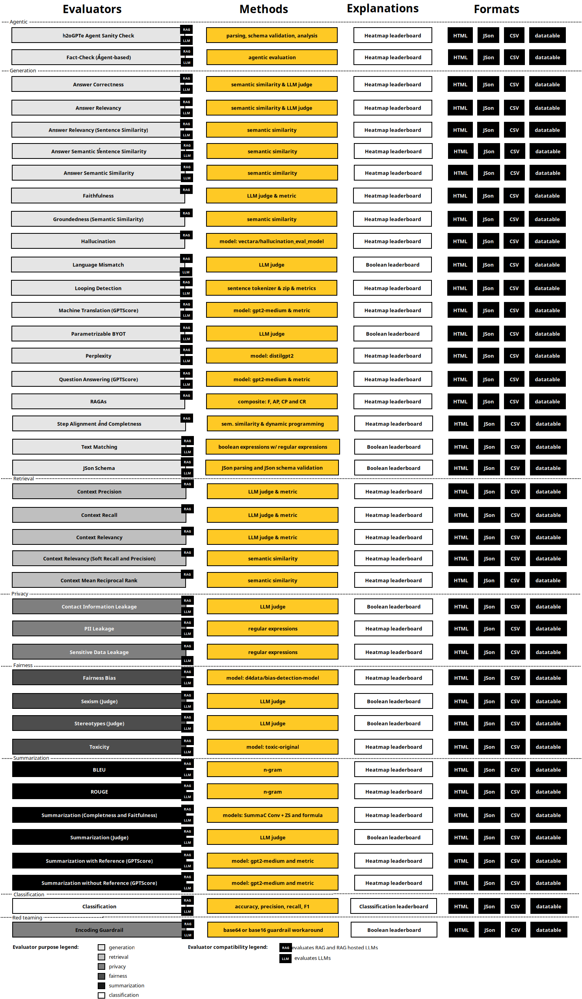

.. H2O Sonar documentation master file, created by
   sphinx-quickstart on Thu Jan  3 16:09:44 2019.
   You can adapt this file completely to your liking, but it should at least
   contain the root `toctree` directive.

H2O Sonar
=========
H2O.ai's ``h2o_sonar`` is a Python package for the introspection of machine learning
models by enabling various facets of **Responsible AI** for both **predictive** and
**generative** models.
It incorporates methods for model explanations to **understand**, **trust**, and
**ensure the fairness** - bias detection & remediation, model debugging for accuracy,
privacy, and security, model assessments, and documentation.

Predictive AI
=============

This package enables a new, holistic, low-risk, human-interpretable,
fair, and trustable approach to machine learning.
`H2O-3 <https://docs.h2o.ai/h2o/latest-stable/h2o-docs/welcome.html>`_,
`scikit-learn <https://scikit-learn.org/>`_
and `Driverless AI <https://docs.h2o.ai/driverless-ai/latest-stable/docs/userguide/index.html>`_
models are the first-class citizens of the package, but it will be designed
to accommodate several types of Python models. Specifically the product:

- :ref:`Explains<Explainers>` many types of models.
- Assesses the observational fairness of many types of models.
- Debugs many types of models.
- Integrates with `Enterprise h2oGPT <https://h2o.ai/platform/enterprise-h2ogpt/>`_
  for model insights and problem mitigation plans.

The functionality is available to engineers and data scientists through
a :ref:`Python API<H2O Sonar Python API>` and Command Line Interface API.

.. image:: images/explainers-overview.png
  :alt: Explainers overview

Supported environments & Python versions:

.. list-table::
   :header-rows: 1
   :widths: 25 75

   * - OS / Python
     - Python 3.11
   * - **Linux x86 64 bit**
     - `Driverless AI MOJO <https://docs.h2o.ai/driverless-ai/1-10-lts/docs/userguide/scoring-mojo-pipelines.html>`__,
       `Driverless AI REST <https://h2oai.github.io/dai-deployment-templates/local-rest-scorer/>`__,
       `H2O-3 <https://docs.h2o.ai/h2o/latest-stable/h2o-docs/index.html>`__,
       `scikit-learn <https://scikit-learn.org/stable/>`__

- Driverless AI MOJO runtime - ``daimojo library`` - supports Linux only.
- H2O Model Validation based explainers are not available on Python 3.11 as Driverless AI client is not available for this runtime.

Generative AI
=============

`h2oGPTe <https://h2o.ai/platform/enterprise-h2ogpte/>`_,
`h2oGPT <https://github.com/h2oai/h2ogpt>`_,
H2O LLMOps/MLOps, `OpenAI <https://platform.openai.com/docs/overview>`_,
`Microsoft Azure Open AI <https://azure.microsoft.com/en-us/products/ai-services/openai-service>`_,
`Amazon Bedrock <https://aws.amazon.com/bedrock/>`_, and `ollama <https://ollama.com/>`_ RAGs/LLMs hosts
are the first-class citizens of the H2O Sonar.

.. toctree::
   :maxdepth: 2
   :caption: Installation

   installation

.. toctree::
   :maxdepth: 2
   :caption: Getting Started

   getting_started

.. toctree::
   :maxdepth: 5
   :caption: Documentation

   doc

.. toctree::
   :maxdepth: 5
   :caption: Extensibility

   byoe

.. toctree::
   :maxdepth: 2
   :caption: Examples

   examples

.. toctree::
   :maxdepth: 10
   :caption: Python API

   python_api

.. toctree::
   :maxdepth: 2
   :caption: Resources

   resources

.. only:: html

   .. toctree::
      :maxdepth: 1
      :caption: Third-Party Notices

      docs-licenses/licenses

.. toctree::
   :maxdepth: 2
   :caption: Release Notes

   changelog

Indices and Tables
==================

* :ref:`modindex`
* :ref:`genindex`

Disclaimer
==========

``h2o_sonar`` is in active development and is in the **alpha** stage - its API may
be unstable and some of the core features might be incomplete and/or missing.
